# 分层状态图

## 跨会话资源等待

BT_Y120 为协调者的全局只读执行投影：WebService 按持久状态读取所有会话/任务/成员、真实操作启动、租约持有与等待依赖、待授权与未决核对、原窗口；WorkRunner 提供实时观察 getter，模型适配器在每次实际协调请求前重新读取。沿用已有协调意图的领取和协议，观察不产生新事件、授权或 I/O 调度；复验 BT_Y114 既有模型路径作为接线前门槛，不新增虚构 XState 状态。

BT_Y119 的归档删除反馈使用既有 `roomDeletionMachine` 的 preparing / waiting / paused / deleted 状态，不改变业务转移。界面确认提交后，HTTP 返回 WebRoom [尚未 deleted] / 保持确认弹窗并展示真实进度；返回 DeletedRoom [已持久确认] / 关闭弹窗并移除精确目标；主动关闭 [仍未完成] / 列表保留可重新打开的删除状态。刷新按持久状态恢复，切群不能使另一会话被目标响应覆盖。

BT_Y118 组合验收八份登录资料、四成员读取失败后的四条 CLI 等待；只有实际正文回执可满足资料获取。所有成员都资源等待时，监督仍识别资源阻塞，UI 在当前会话显示原操作核对；原窗口有界；窗口到期后等待明确续窗时，取消排队操作不会结算原冲突租约，当前会话仍保留实际旧操作核对入口，不能把等待续窗或后续 partial 当作已满足及时提示。

BT_Y117 的释放还覆盖归档删除准备中的 `LOCAL_RECONCILE`；与人类确认、后台核对共用通知。跨会话投影只观察当前目标的实际等待依赖；旧依赖被目标修改取消后不继续弹到新目标，停止/到期的最近任务保留原未决效果核对入口。

类型：真实 taskMachine 的本地操作上下文生命周期与 UI 投影；所有者为 `src/local-operation.ts`、`src/task/actions.ts`、`src/task/resilience.ts`，跨会话租约观察由 Store/Engine/WebService 负责。验收 BT_Y114–BT_Y117，不增加顶层状态。

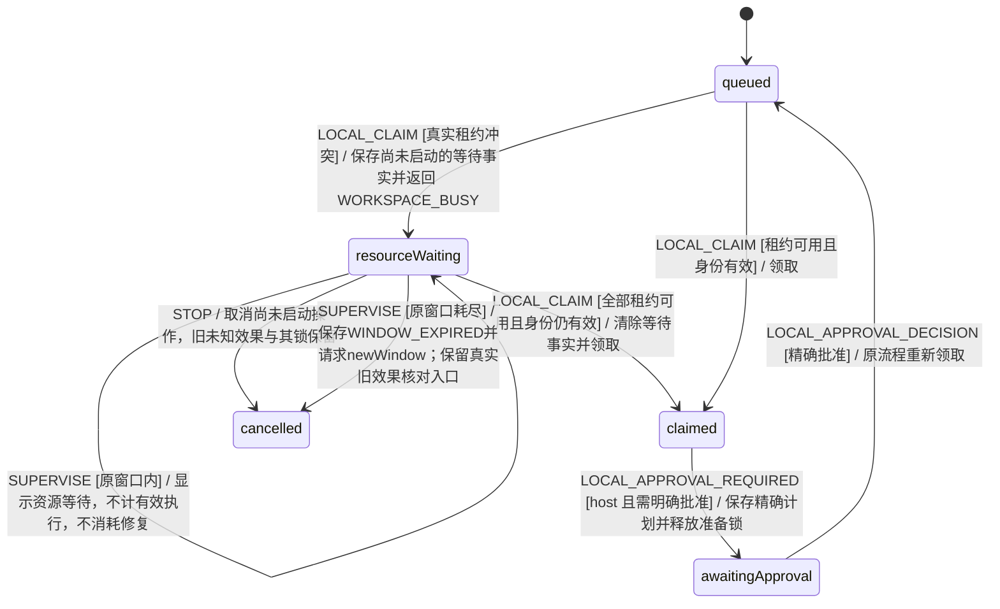
```mermaid
stateDiagram-v2
    [*] --> queued
    queued --> resourceWaiting: LOCAL_CLAIM [真实租约冲突] / 保存尚未启动的等待事实并返回 WORKSPACE_BUSY
    resourceWaiting --> resourceWaiting: SUPERVISE [原窗口内] / 显示资源等待，不计有效执行，不消耗修复
    resourceWaiting --> claimed: LOCAL_CLAIM [全部租约可用且身份仍有效] / 清除等待事实并领取
    queued --> claimed: LOCAL_CLAIM [租约可用且身份有效] / 领取
    claimed --> awaitingApproval: LOCAL_APPROVAL_REQUIRED [host 且需明确批准] / 保存精确计划并释放准备锁
    awaitingApproval --> queued: LOCAL_APPROVAL_DECISION [精确批准] / 原流程重新领取
    resourceWaiting --> cancelled: STOP / 取消尚未启动操作，旧未知效果与其锁保留
    resourceWaiting --> cancelled: SUPERVISE [原窗口耗尽] / 保存WINDOW_EXPIRED并请求newWindow；保留真实旧效果核对入口
```

`resourceWaiting` 为 queued 操作的持久等待事实，不是新 XState 节点。当前会话按真实冲突租约显示旧操作的来源会话/任务/工作/操作及核对入口；兼容读和无关资源不展示。界面只读租约，不能授权或解锁。等待续窗时，同一窗口与当前目标的已取消等待仍可解释实际冲突；明确续窗后不把旧取消项当成新的排队命令，目标变更也不能沿用旧等待。原操作经精确摘要核对或可信后台回执结算后才释放其租约，并通知 workspace 及 typed resources 等待者。多个阻塞者须全部结算，新 host 命令随后提出自己的授权，批准前不启动。普通资源竞争只显示等待，不能伪造待核对事项；重启按持久操作及现存租约重建。

设计依据见 [XState 八条原则](xstate-design.md)，真实任务主阶段见 [README](../README.md#状态模型)。任务阶段与执行子 actor 的组合见[多 actor 设计](task-actors.md)，外部执行继续遵守持久意图、领取和启动许可边界。

任务阶段、预算和结果交接由根 actor 拥有；每次执行尝试的启动、取消和结算由子 actor 拥有。BT_N06–BT_N15 对应[真实 actor 树与执行状态图](task-actors.md)，在一个存储事务内保存父子快照。此前 BT_N01–BT_N05 的[模块拆分](task-machine-refactor.md#模型组合图)保留为历史记录，既有业务约束继续有效。

| 层次 | 状态所有者与事实来源 | 读图方式 |
| --- | --- | --- |
| 真实 XState | `taskMachine`、`executionMachine`、`roomMachine`、两个 Inspector 模型 | 与源码节点、守卫和事件对应；业务 ended 不等于 final |
| 任务上下文 | `src/types.ts` 的枚举、`src/task.machine.ts` 的纯更新 | 是主任务拥有的持久化子生命周期，不是已启动的 actor |
| 执行与适配器 | `TeamEngine` / `WorkRunner` / 适配器与宿主 | 意图状态单独画；校验、HTTP、存储步骤使用 flowchart |
| 网页与观察 | React 状态、派生条件、本地纯布局和观察模型 | 明确 UI 投影与真实模型，布局和视觉约定分开 |

箭头按 `事件 [守卫] / 纯更新或保存意图` 阅读。同一事件的分支以源码顺序为准；真实机器的无 target 更新会标明“无target”，图上的回环不代表重新进入。流程节点不承诺可持久化或恢复。

- [任务拥有的上下文生命周期](#任务拥有的上下文生命周期)：输入、协助、评审、讨论、交付。
- [执行与适配器边界](#执行与适配器边界)：持久意图、本地操作、模型修正、网页工具和宿主。
- [房间与可信命令](#房间与可信命令)：路由、历史与归档。
- [网页与观察](#网页与观察)：群聊、导出、面板、调试和 Inspector。
- [验证模型与文档](#验证模型与文档)：模型回归、文档核对与验收报告边界。
- [KEJ-107/108 组合验证](#kej-107108-组合验证补充)：17 项的所有者、现有模型、有限抽象与宿主接线。
- [持续推进与安全删除](#持续推进与安全删除kej-113114)：KEJ-113/114 的处理窗口、人类门、取得凭证、失败重评与独立清理/删除责任。

## 事务与外部执行的共同边界

### 效果后宿主崩溃（KEJ-103）

图型：宿主恢复处理流程；所有者：`LocalRuntime / CliJournal / WebService`，业务决策仍属于真实 `taskMachine`。验收：BT_L06、BT_L14，模型边界复验 BT_L73、BT_L74；不引入新 XState 状态。

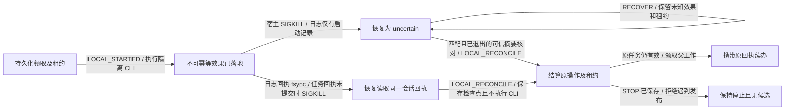
```mermaid
flowchart LR
    Claimed[持久化领取及租约] -->|LOCAL_STARTED / 执行隔离 CLI| Effect[不可幂等效果已落地]
    Effect -->|宿主 SIGKILL / 日志仅有启动记录| Unknown[恢复为 uncertain]
    Effect -->|日志回执 fsync / 任务回执未提交时 SIGKILL| Known[恢复读取同一会话回执]
    Unknown -->|RECOVER / 保留未知效果和租约| Unknown
    Unknown -->|匹配且已退出的可信摘要核对 / LOCAL_RECONCILE| Settled[结算原操作及租约]
    Known -->|LOCAL_RECONCILE / 保存检查点且不执行 CLI| Settled
    Settled -->|原任务仍有效 / 领取父工作| Resume[携带原回执续办]
    Settled -->|STOP 已保存 / 拒绝迟到发布| Stopped[保持停止且无候选]
```

父进程仅在真实 CLI 已写入隔离追加账本且退出后，于 `CliJournal.write(settled)` 前或该调用 fsync 返回后收到屏障，再 SIGKILL 宿主；不以 close/reopen 或抛异常模拟进程丢失。未知效果反复启动服务不能重新执行命令、释放租约或启动模型。匹配的公开宿主 `reviewOperation → acknowledgeOperation → LOCAL_RECONCILE` 接口结算；停止和迟到回执沿用现有模型守卫。测试在真实文件、SQLite 和实际进程边界执行，受控 CLI 后端不声称 OS 沙箱隔离或供应商恰好一次。

**图型：处理流程；所有者：`TeamEngine` / 持久存储 / `WorkRunner`。**

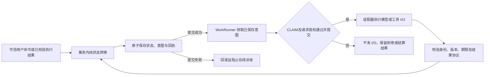
```mermaid
flowchart LR
    U["可信用户命令或已校验执行结果"] --> E["事务内纯状态转换"]
    E --> P["原子保存状态、意图与回执"]
    P -->|提交成功| C["WorkRunner 领取已保存意图"]
    P -->|提交失败| F["回滚且阻止后续派发"]
    C --> A{"CLAIM及请求授权通过并提交"}
    A -->|是| I["适配器执行模型或工具 I/O"]
    A -->|否| N["不发 I/O，保留拒绝或结算结果"]
    I --> V["校验身份、版本、期限及结果协议"]
    V --> E
```

| 横切边界 | 各图共同遵守的契约 |
| --- | --- |
| 预算与权限 | 首次 CLAIM 预占所属 bucket，额外请求先 CONSUME；评审/讨论及续办保留额度同样校验；拒绝后不得发 I/O |
| 停止 | 先保存取消意图，再由执行器传递 AbortSignal/取消；发出取消与实际结算分开，物理操作未知时保留锁与 uncertain |
| 失败与重试 | 有限重试共享原预算和期限规则；协议修正不放宽输出校验，存储失败后停止派发 |
| 身份与迟到 | 事件绑定工作、attempt/session、epoch/goalVersion及适用的讨论/评审 ID；旧结果只可结算自己的旧操作 |
| 重复与交接 | 命令回执、结果消费和后继意图在事务内去重；临时拒绝不把未消费结果永久封死 |
| 重启恢复 | 先校验配置、成员、权限、模型绑定和物理会话；已结算不重放，安全未完成操作可再领取，未知写入先核对 |
| 观察与 UI | 只观察提交后的状态；日志、历史、引用、工具输出和 Bot 发言不获得调度权限 |

### SQLite 写事务的进程丢失边界（KEJ-104）

**图型：持久存储处理流程；所有者：`SqliteStore.transact` / `TeamEngine.send`。验收：BT_A66，承接 BT_A03/A36 与 BT_C02 的提交、去重和版本隔离边界。**

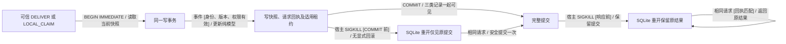
```mermaid
flowchart LR
    B["可信 DELIVER 或 LOCAL_CLAIM"] -->|"BEGIN IMMEDIATE / 读取当前快照"| T["同一写事务"]
    T -->|"事件 [身份、版本、权限有效] / 更新纯模型"| W["写快照、请求回执及适用租约"]
    W -->|"宿主 SIGKILL [COMMIT 前] / 无显式回滚"| U["SQLite 重开仅见原提交"]
    W -->|"COMMIT / 三类记录一起可见"| C["完整提交"]
    C -->|"宿主 SIGKILL [响应前] / 保留提交"| R["SQLite 重开保留原结果"]
    U -->|"相同请求 / 安全提交一次"| C
    R -->|"相同请求 [回执匹配] / 返回原结果"| R
```

该验证只补实际进程与 SQLite 接线证据，不改变 `taskMachine` 的 `DELIVER → checking`、`LOCAL_REQUEST → LOCAL_CLAIM` 或停止/版本守卫。实现前复验既有真实 XState core 与 delivery 纯模型门槛，模型不添加文件或进程操作。任何模型或工具 I/O 仍须在意图及领取事务提交后才由执行器启动；COMMIT 前宿主丢失不能凭未提交快照派发、发布候选或留下工作区锁。COMMIT 后重复请求只返回保存回执，不重建候选、不重新领取或消耗额度。

屏障仅存在于测试子进程：包装公开 `node:sqlite` 语句，在生产 `SqliteStore` 已完成真实写入后阻塞，父进程向自己拥有的进程组发送 SIGKILL。未调用 `close`、抛异常或显式 ROLLBACK。故障证据包含精确屏障、PID/退出信号、三表记录和清理结果。负对照仅在隔离子进程把回执提前提交，使跨记录原子性断言必须失败。此范围不证明硬件断电、磁盘损坏或外部效果恰好一次，也不执行 Pi Durable 的 BT_D06。

## 任务拥有的上下文生命周期

### 输入意图解析

对应 BT_I01–BT_I21。保留原执行内核，以 [Zod 运行时契约](https://zod.dev/basics)校验规则与模型结果；按 [XState 持久化](https://stately.ai/docs/persistence)的快照边界保存解析工作。结构化生成仍需宿主校验，参考 [AI SDK 结构化数据说明](https://ai-sdk.dev/docs/ai-sdk-core/generating-structured-data)，不引入该 SDK。项目继续固定 XState 5，不升级执行框架。

**图型：上下文生命周期；所有者：`taskMachine / InputAnalysis.status`。**

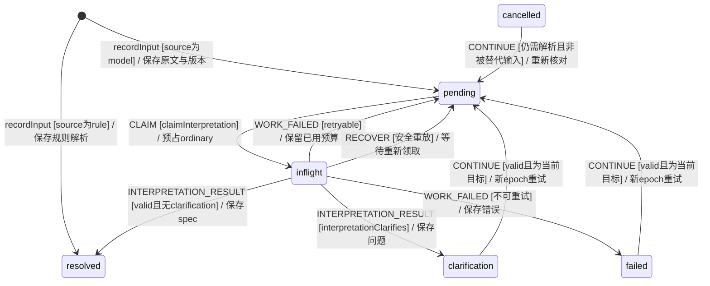
```mermaid
stateDiagram-v2
    [*] --> pending: recordInput [source为model] / 保存原文与版本
    [*] --> resolved: recordInput [source为rule] / 保存规则解析
    pending --> inflight: CLAIM [claimInterpretation] / 预占ordinary
    inflight --> resolved: INTERPRETATION_RESULT [valid且无clarification] / 保存spec
    inflight --> clarification: INTERPRETATION_RESULT [interpretationClarifies] / 保存问题
    inflight --> pending: WORK_FAILED [retryable] / 保留已用预算
    inflight --> pending: RECOVER [安全重放] / 等待重新领取
    inflight --> failed: WORK_FAILED [不可重试] / 保存错误
    clarification --> pending: CONTINUE [valid且为当前目标] / 新epoch重试
    failed --> pending: CONTINUE [valid且为当前目标] / 新epoch重试
    cancelled --> pending: CONTINUE [仍需解析且非被替代输入] / 重新核对
```

STOP 或目标变化把未完成解析记录置 `cancelled`；新输入有自己的记录，不把旧已解析记录重置。resolved 后的规划与执行是任务阶段和意图变化，不是 `InputAnalysis.status` 的额外枚举值。

当前有 interpreting 顶层状态、interpretation 操作种类、INTERPRETATION_RESULT 事件和可选 inputAnalyses 上下文。旧快照缺少该字段视为空，不强制迁移。每条记录保留输入 ID、原文、可信动作、来源、状态、epoch、goalVersion、解析结果与工作 ID；工作沿用 pending/inflight/done/cancelled、deadline、模型绑定、requestCount 和既有回执。所有模型 I/O 均在已提交并领取的操作上发起，解析禁用技能与网页工具，不获得新的调度权限。

规则只匹配直接输入的完整停止、继续和重试命令，点名只接受配置中的成员。引用、代码、否定句、历史和 Bot 内容不触发控制命令。模型仅解释 request/supplement/decision/review 中已由可信入口确定的动作，不能返回 stop/continue/retry、修改负责人或扩大直接用户指定的评审范围。Zod 契约严格拒绝额外字段；动作须与解析输入一致；每个引用须同时匹配实际提供的类型、ID 和 taskId。低置信度必须带澄清问题。原始 Goal、显式约束及完整消息始终独立保留，不能被模型摘要替换。

复杂补充先持久化为待应用输入，到没有在途工作且协助结果已消费的安全边界再解析；解析优先于后继负责人和旧交付检查，未解析或需澄清时不得发布完成结果。所有待解析输入处理完后，按原 review 队列或负责人流程继续，全部角色收到同一组已校验意图及原始输入。澄清和最终失败进入 waitingHuman，不执行猜测结果；用户补充或明确继续后重试未完成解析。

首次解析领取扣 ordinary，后续请求及格式修正继续通过 CONSUME 与 REGENERATE_MODEL_OUTPUT，重试共享 usage.retries；额度不足不得请求。STOP 保存取消意图并经原 AbortSignal 传递；停止、过期工作、epoch/goalVersion 不一致、已结算或重复结果都不能调度后继工作。目标改变取消旧解析；重启只恢复安全未完成工作，并重新检查模型绑定、配置和预算，已提交结果不重放。事务失败同时回滚输入、解析、后继操作和回执，并阻止本引擎继续请求。网页投影 interpreting 和 inputAnalyses，过程记录显示真实解析请求与结果，不展示隐藏推理。

当前产物与黑板正文同引用目录一起提供给解析模型，避免只有 ID 而缺少指代依据。自定义执行器即使绕过适配器仍须经状态机复核，非法当前结果进入 waitingHuman；未关联已领取解析工作的伪造事件不能改变阶段，迟到结果只结算自己的旧工作。澄清或失败后 CONTINUE 先重建解析操作，不直接安排负责人。解析期间追加的输入按顺序解释，全部完成后再规划；旧结果不得抢先发布。明确控制消息也随 STOP、CONTINUE 或 RETRY_ASSISTANCE 保存原文和回执。

网页等待用户时自动附加的 decision 分类不能盖过完整的直接停止或继续命令；显式 new、retry 等专用入口仍保留原语义。即使补充走规则路径，CHECK_RESULT 也不能在存在未应用输入时发布完成，必须先回到原安全边界应用补充。

### 协助重试与结果交接

对应 BT_H10–BT_H20、BT_U16；复用 running、waitingAssistance、waitingHuman、ended 顶层状态。以下为协助上下文及提交边界。原负责人保持任务所有权；网页仅提交命令，不直接调用成员。

**图型：上下文生命周期；所有者：`taskMachine / Assistance.status`。**

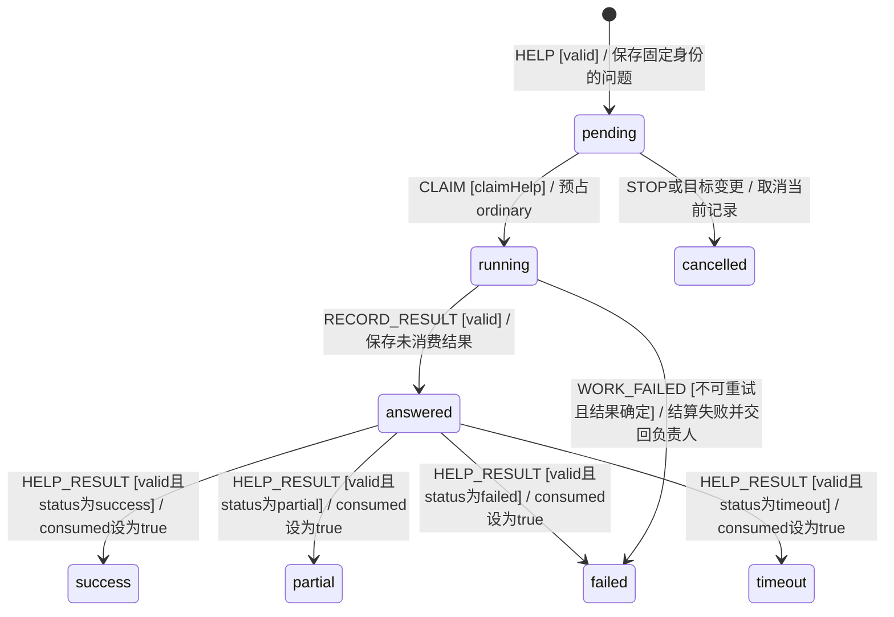
```mermaid
stateDiagram-v2
    [*] --> pending: HELP [valid] / 保存固定身份的问题
    pending --> running: CLAIM [claimHelp] / 预占ordinary
    running --> answered: RECORD_RESULT [valid] / 保存未消费结果
    answered --> success: HELP_RESULT [valid且status为success] / consumed设为true
    answered --> partial: HELP_RESULT [valid且status为partial] / consumed设为true
    answered --> failed: HELP_RESULT [valid且status为failed] / consumed设为true
    answered --> timeout: HELP_RESULT [valid且status为timeout] / consumed设为true
    running --> failed: WORK_FAILED [不可重试且结果确定] / 结算失败并交回负责人
    pending --> cancelled: STOP或目标变更 / 取消当前记录
```

**图型：处理流程；所有者：`taskMachine` 的 `RETRY_ASSISTANCE` / `acceptHelpResult`。**

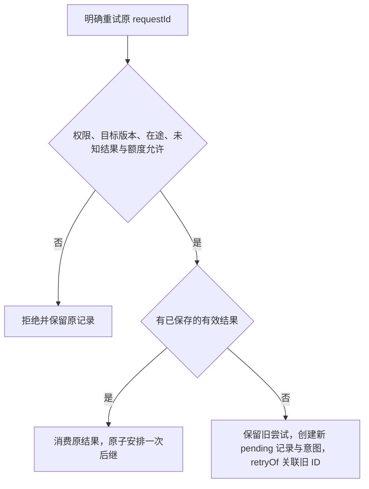
```mermaid
flowchart TD
    R["明确重试原 requestId"] --> G{"权限、目标版本、在途、未知结果与额度允许"}
    G -->|否| N["拒绝并保留原记录"]
    G -->|是| S{"有已保存的有效结果"}
    S -->|是| C["消费原结果，原子安排一次后继"]
    S -->|否| P["保留旧尝试，创建新 pending 记录与意图，retryOf 关联旧 ID"]
```

`pending / running / answered` 在 STOP 或目标变更时成为 `cancelled`；已答结果的 `RecordedResult.consumed` 单独记录是否消费。上图只画执行器常用的“先保存再消费”路径，受信任的有效 HELP_RESULT 也可直接结算允许的原记录。重试的新记录不是旧记录的回跳，`settled / interrupted / archived` 不是 Assistance.status 枚举值。

- 未结算的协助及有效待消费结果阻止用户补充抢先触发 BOUNDARY。读取和消费结果使用同一事务；普通结果消费、输入应用、负责人意图和“结果已交给负责人”的提示一起持久化。临时状态不允许消费时保留结果，不写永久拒绝回执；只有已停止、版本过期、已结算或重复结果可归档。
- 手动重试创建新协助 ID 和独立执行意图，记录 `retryOf`、原负责人和所需权限；保留失败记录，消耗重试及求助额度，并为负责人保留一次普通请求。核查额外请求、自动重试和恢复领取都不能使用该保留额度，触限按失败结算并交回负责人。停止或结束的任务在明确重试时才开启新 epoch；目标版本变化拒绝沿用旧问题。未结算的外部请求必须先结算，不能并发重放。
- 成员评审重试保留同轮其他成员结果，只重试选中成员；结果返回后接续未完成队列或负责人汇总，并重新计算失败缺口。属于旧评审轮次的协助不能用于恢复当前评审。
- WorkRunner 只执行通过 CLAIM 的持久化意图；重试与结果交接均由 XState 产生。失败和超时仍回到原负责人；停止、旧请求迟到及重复提交不能产生额外推进。

**图型：UI 投影；所有者：`网页协助重试入口及服务器快照`。**

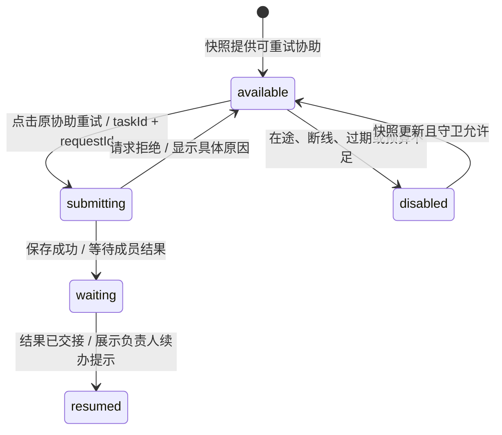
```mermaid
stateDiagram-v2
    [*] --> available: 快照提供可重试协助
    available --> submitting: 点击原协助重试 / taskId + requestId
    submitting --> available: 请求拒绝 / 显示具体原因
    submitting --> waiting: 保存成功 / 等待成员结果
    waiting --> resumed: 结果已交接 / 展示负责人续办提示
    available --> disabled: 在途、断线、过期或预算不足
    disabled --> available: 快照更新且守卫允许
```

“B 重试”只解析直接用户的完整重试指令；引用、历史、模型输出和任意包含该词的句子均不获得重试权限。路由保留原协助的成员身份，成员撤销后仍识别命令并由权限守卫拒绝。只有一个候选时提交同一命令；多个候选或没有候选时给出明确原因，用户可使用关联原协助的入口。事务保存失败回滚消息、意图和回执，禁止宣称重试成功或发起外部操作。

### 成员评审

对应 `TaskContext.review.status`。目标成员只由直接用户请求确定，促进者不能替换名单，也不能用 continue、assist、replan 或 finish 跳过待组织的评审。

**图型：上下文生命周期；所有者：`taskMachine / TaskContext.review.status`。**

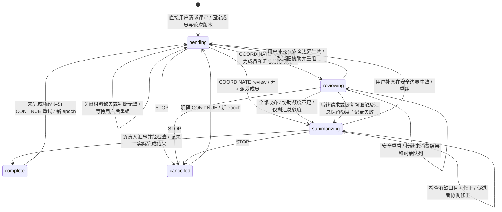
```mermaid
stateDiagram-v2
    [*] --> pending: 直接用户请求评审 / 固定成员与轮次版本
    pending --> pending: 关键材料缺失或判断无效 / 等待用户后重组
    pending --> reviewing: COORDINATE review / 可为成员和汇总分配额度
    pending --> summarizing: COORDINATE review / 无可派发成员
    reviewing --> reviewing: 成员结果保存并消费 / 派发下一位
    reviewing --> reviewing: 安全重启 / 接续未消费结果和剩余队列
    reviewing --> summarizing: 全部收齐 / 协助额度不足 / 仅剩汇总额度
    reviewing --> summarizing: 后续请求或恢复领取触及汇总保留额度 / 记录失败
    summarizing --> complete: 负责人汇总并经检查 / 记录实际完成结果
    summarizing --> summarizing: 检查有缺口且可修正 / 促进者协调修正
    reviewing --> pending: 用户补充在安全边界生效 / 取消旧协助并重组
    summarizing --> pending: 用户补充在安全边界生效 / 重组
    pending --> cancelled: STOP
    reviewing --> cancelled: STOP
    summarizing --> cancelled: STOP
    cancelled --> pending: 明确 CONTINUE / 新 epoch
    complete --> pending: 未完成项经明确 CONTINUE 重试 / 新 epoch
```

- `complete` 表示评审轮次结算，任务是否成功仍以 `outcome` 为准；成员失败、超时或队列未收齐会标记缺口，最终为 partial。
- 评审组织与收集阶段必须保留一次普通请求供负责人汇总。首次领取、额外模型请求、技能搜索、重试与恢复重新领取都检查这条限制；首次模型请求已由领取预占，不重复扣款。触及保留额度的成员操作按失败结算，推进汇总，不能直接耗尽该额度或继续重试。
- 完成检查使用独立 checks 额度；若用户配置的总额度连组织和汇总都不足，或停止、故障、检查额度不足，则可直接结束或等待用户，不能承诺完成汇总。
- 结果必须先 RECORD_RESULT 持久化，再以 HELP_RESULT 消费；结果 ID 防止重复消费，epoch/goalVersion 隔离迟到结果。用户补充在 HELP_RESULT 消费边界应用，已保存的成员意见保留为重新组织的上下文。配置撤销成员或权限时暂停恢复。初次评审直接进入组织阶段，避免负责人先回答一次才拉人。

### 工作期间的后台讨论

对应 BT_T01–BT_T17。沿用任务顶层状态，在 src/task.machine.ts 增加持久化 discussion 上下文和带 discussionId 的操作；主工作与讨论分别推进，讨论不能变更负责人或主目标。需求依据和替代方案见 [评估](background-discussion.md)。

**图型：上下文生命周期；所有者：`taskMachine / TaskContext.discussion.status`。**

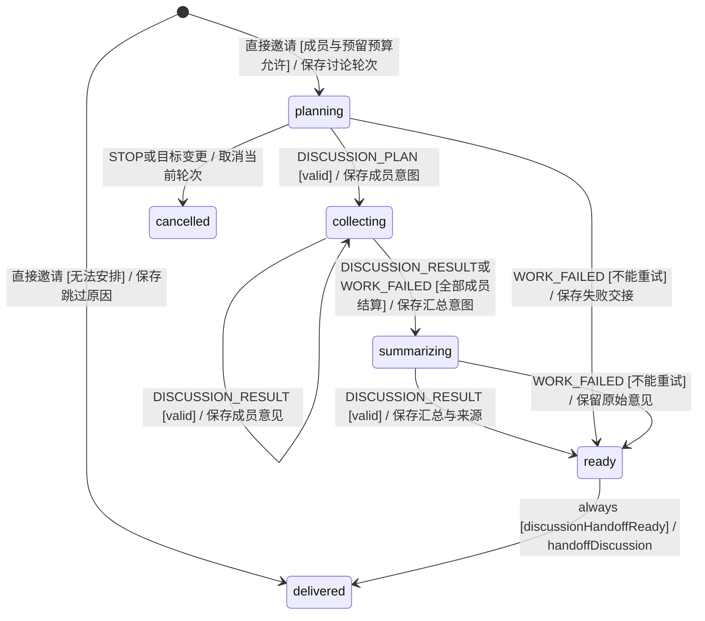
```mermaid
stateDiagram-v2
    [*] --> planning: 直接邀请 [成员与预留预算允许] / 保存讨论轮次
    [*] --> delivered: 直接邀请 [无法安排] / 保存跳过原因
    planning --> collecting: DISCUSSION_PLAN [valid] / 保存成员意图
    collecting --> collecting: DISCUSSION_RESULT [valid] / 保存成员意见
    collecting --> summarizing: DISCUSSION_RESULT或WORK_FAILED [全部成员结算] / 保存汇总意图
    summarizing --> ready: DISCUSSION_RESULT [valid] / 保存汇总与来源
    planning --> ready: WORK_FAILED [不能重试] / 保存失败交接
    summarizing --> ready: WORK_FAILED [不能重试] / 保留原始意见
    ready --> delivered: always [discussionHandoffReady] / handoffDiscussion
    planning --> cancelled: STOP或目标变更 / 取消当前轮次
```

`planning / collecting / summarizing / ready` 在 STOP 或目标版本改变时统一变为 `cancelled`；等待用户、主请求未结算或仍有待应用输入时，ready 保持不交接。它与主阶段可同时推进，但不是已实现的 XState parallel 或子 actor。

每次外部请求都先保存意图，再经 CLAIM 检查轮次、epoch、goalVersion、期限、成员互斥和预算，之后 CONSUME 才调用适配器。成员复用 assistance 协议但不进入主流程单一 assists 等待关系；协调员安排复用 facilitator 协议，汇总使用 discussionSummary 的只读 answer 协议。结果携带已领取 workId 与 discussionId，保存原文、报告、状态和下一步意图同事务提交，重复或旧结果拒绝。讨论无权重新邀请、修改目标、发起嵌套协助或提前发布最终交付。

主流程 running 的 DELIVER 在讨论尚未交接时只保存候选草稿，不进入 checking；其他需要负责人接续的结果也等待讨论。ready 且无主请求、无未结算主协助和待解析输入时交接一次，恢复原 running 工作，最后沿用 checking。等待用户不会被后台结果擅自解除。讨论失败和跳过原因进入交接，最终交付如实标为部分完成。

主请求在讨论期间报告 BLOCKED 或达到重复失败阈值时，保持 running 并保存阻塞原因和延后协调标记，等待正在收集的新依据；不另发可能提前结束任务的监督请求。讨论交接清除延后协调标记，将原阻塞与意见一起交给负责人。

取消、结束与硬约束变化覆盖全部操作，普通主工作切换只取消主操作。重启重新校验成员、权限、版本和模型绑定，仅恢复未完成安全意图；已提交意见不重放。网页执行器按具体工作启动有界异步请求，不再按整个群阻塞；调度资格始终来自状态机和事务领取，宿主不自行选择成员或修改讨论状态。

宿主中的在途工作以群 ID 与工作 ID 共同标识，避免不同群的相同输入编号互相阻塞。没有成功领取或消费结果时让出执行，等待已有请求结算、下一条命令或定时检查，不递归空转领取。宿主或存储故障暂停该群本进程中的后续派发，沿用 waitingHuman 与存储故障保护；这些是执行器互斥与生命周期规则，不新增业务 XState 状态。

讨论结果的拒绝边界对应 BT_V14：缺少 fence、错误讨论轮次、过期版本或将讨论结果关联到主工作时，只保存拒绝记录，不能结算当前有效在途工作。只有工作 ID、讨论轮次和工作自身版本边界完整匹配的真实完成事件，才可结算该工作；当前轮次内的协议错误按原失败分支结算，旧轮次的有效迟到完成只结算自身并留存历史。

**图型：结果处理流程；所有者：`WorkRunner / taskMachine`。**

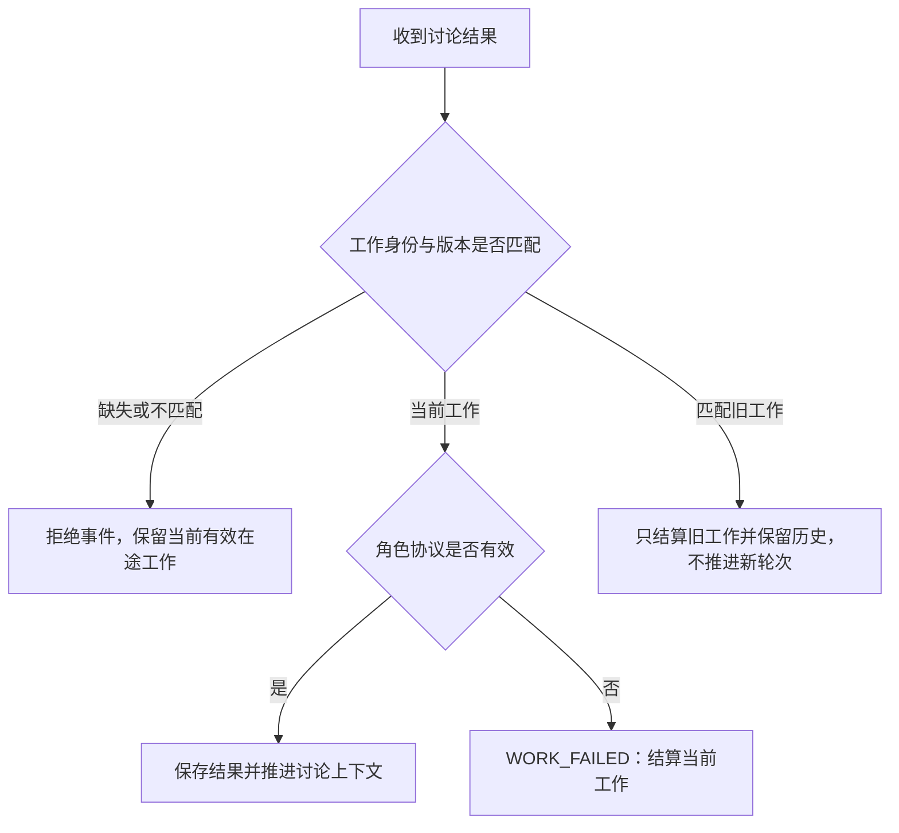
```mermaid
flowchart TD
    R["收到讨论结果"] --> I{"工作身份与版本是否匹配"}
    I -->|缺失或不匹配| N["拒绝事件，保留当前有效在途工作"]
    I -->|当前工作| P{"角色协议是否有效"}
    P -->|是| A["保存结果并推进讨论上下文"]
    P -->|否| F["WORK_FAILED：结算当前工作"]
    I -->|匹配旧工作| L["只结算旧工作并保留历史，不推进新轮次"]
```

### 简短结果与产物发布

对应 BT_A01–BT_A11。复用 running、waitingAssistance、checking、ended 和既有操作状态；摘要、报告和引用是同一结果的上下文，不增加顶层状态。新增行为先经以下结果事件事务，再由网页展示。

**图型：事务处理流程；所有者：`taskMachine / TeamEngine`。**

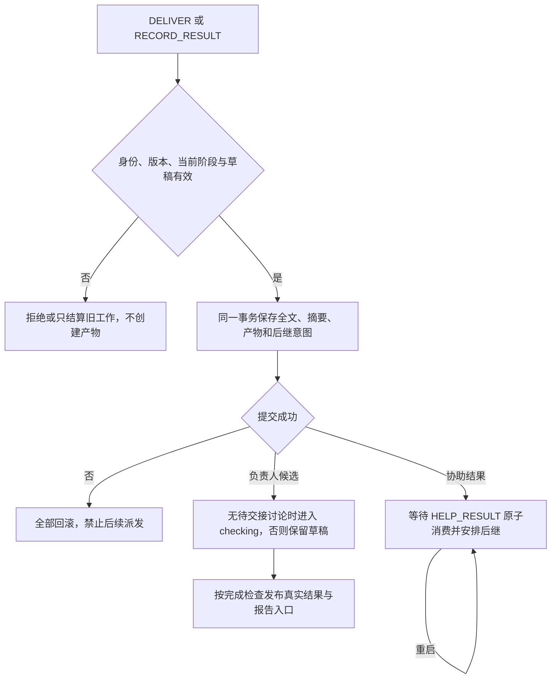
```mermaid
flowchart TD
    R["DELIVER 或 RECORD_RESULT"] --> V{"身份、版本、当前阶段与草稿有效"}
    V -->|否| N["拒绝或只结算旧工作，不创建产物"]
    V -->|是| T["同一事务保存全文、摘要、产物和后继意图"]
    T --> C{"提交成功"}
    C -->|否| X["全部回滚，禁止后续派发"]
    C -->|负责人候选| K["无待交接讨论时进入 checking，否则保留草稿"]
    C -->|协助结果| H["等待 HELP_RESULT 原子消费并安排后继"]
    H -->|重启| H
    K --> P["按完成检查发布真实结果与报告入口"]
```

检查与负责人接续使用完整候选、核查文本和产物，不使用展示摘要替代。报告按事件和工作确定身份，重复回执不重复保存。旧协议长结果可在同一结果事务中生成报告；旧快照新增字段均可省略。未生成报告的短答不创建空文档。首次与后续外部请求沿用现有预算，生成本地产物不调用额外模型。

**图型：UI 投影；所有者：`Workspace / Details 的固定 taskId 和产物引用`。**

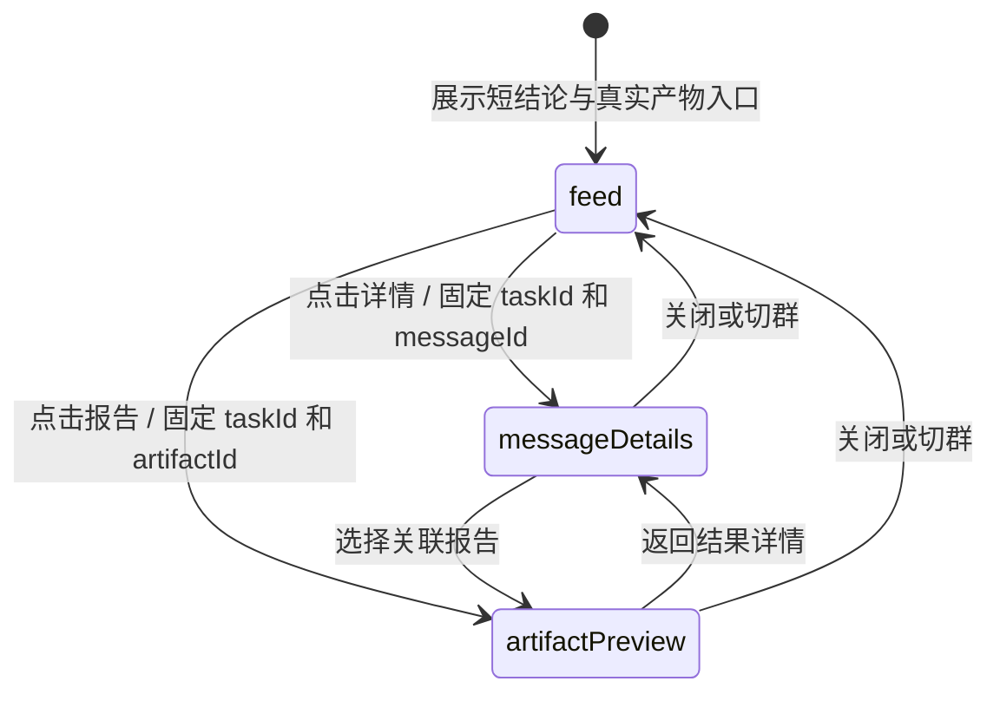
```mermaid
stateDiagram-v2
    [*] --> feed: 展示短结论与真实产物入口
    feed --> messageDetails: 点击详情 / 固定 taskId 和 messageId
    feed --> artifactPreview: 点击报告 / 固定 taskId 和 artifactId
    messageDetails --> artifactPreview: 选择关联报告
    artifactPreview --> messageDetails: 返回结果详情
    messageDetails --> feed: 关闭或切群
    artifactPreview --> feed: 关闭或切群
```

网页仅读取对应任务的全文、来源和可观察执行记录。报告预览复用安全 Markdown 渲染，下载使用相同持久内容。历史消息不能回退到当前任务的报告；不存在的引用显示不可用，不创建产物或调度。旧长消息只缩短主视图显示，其原文仍能在详情查看。

### 候选版本与当前交付

本图描述任务上下文生命周期，所有者为 `taskMachine`，持久化边界为 `TeamEngine` 事务。覆盖 BT_A22–BT_A26。

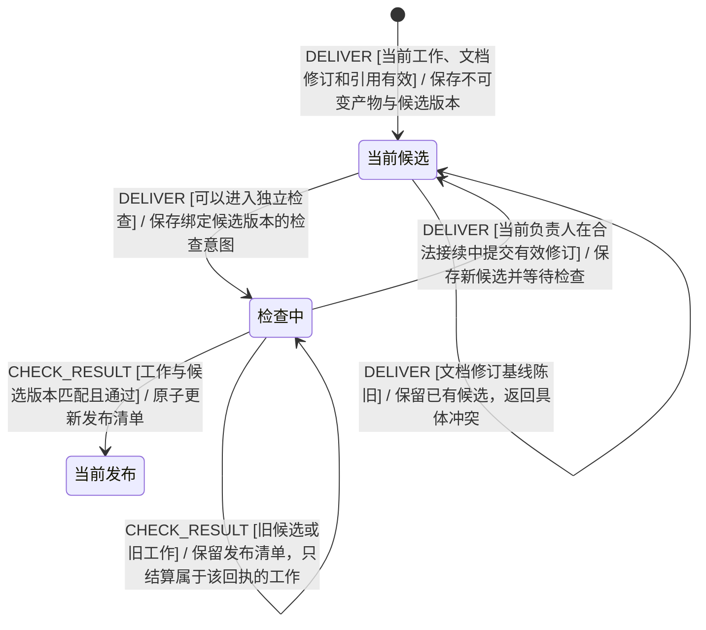
```mermaid
stateDiagram-v2
    state "当前候选" as Candidate
    state "检查中" as Checking
    state "当前发布" as Published

    [*] --> Candidate: DELIVER [当前工作、文档修订和引用有效] / 保存不可变产物与候选版本
    Candidate --> Checking: DELIVER [可以进入独立检查] / 保存绑定候选版本的检查意图
    Checking --> Published: CHECK_RESULT [工作与候选版本匹配且通过] / 原子更新发布清单
    Checking --> Candidate: DELIVER [当前负责人在合法接续中提交有效修订] / 保存新候选并等待检查
    Candidate --> Candidate: DELIVER [文档修订基线陈旧] / 保留已有候选，返回具体冲突
    Checking --> Checking: CHECK_RESULT [旧候选或旧工作] / 保留发布清单，只结算属于该回执的工作
```

文档身份独立于文件名，修订关联当前任务和目标中的明确产物。旧产物缺少版本关系时，各自作为独立文档。当前交付视图以最近通过的清单为准，原消息仍按原始 artifactId 定位。候选和文档版本均由宿主分配。独立检查意图固定候选版本，领取后才可发起检查。停止、额度耗尽、目标变化和恢复遵守既有工作、权限和版本约束。

执行阶段可用 `readArtifact` 查读获准的历史报告，仍按本地读取的任务、目标、游标和额度边界处理。独立检查在固定材料内获得对照所需的同任务同目标原报告正文，每份报告只放一次，其他任务的报告不进入检查输入，也不产生模型工具调用或读取额度。当前候选与发布指针继续由交付事件管理。

### 候选预检与独立验收

**图型　任务上下文生命周期。所有者　`taskMachine`；事务由 `TeamEngine` 保存，`WorkRunner` 执行。验收　BT_F03–F04、BT_F07–F08、BT_F10–F11、BT_F14–F21、BT_M30。**

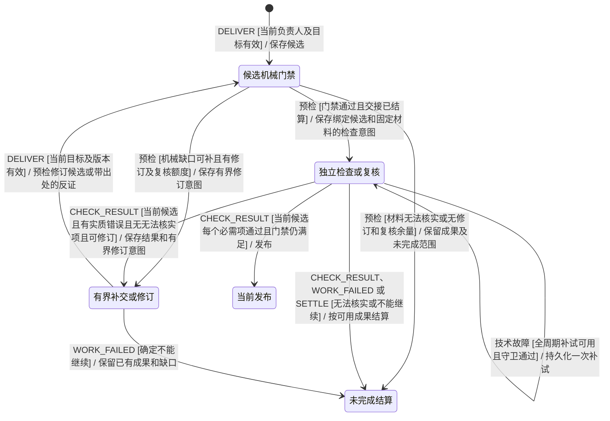
```mermaid
stateDiagram-v2
    state "候选机械门禁" as Candidate
    state "有界补交或修订" as Revision
    state "独立检查或复核" as Check
    state "当前发布" as Published
    state "未完成结算" as Incomplete
    [*] --> Candidate: DELIVER [当前负责人及目标有效] / 保存候选
    Candidate --> Revision: 预检 [机械缺口可补且有修订及复核额度] / 保存有界修订意图
    Candidate --> Incomplete: 预检 [材料无法核实或无修订和复核余量] / 保留成果及未完成范围
    Candidate --> Check: 预检 [门禁通过且交接已结算] / 保存绑定候选和固定材料的检查意图
    Check --> Check: 技术故障 [全周期补试可用且守卫通过] / 持久化一次补试
    Check --> Revision: CHECK_RESULT [当前候选且有实质错误且无无法核实项且可修订] / 保存结果和有界修订意图
    Check --> Published: CHECK_RESULT [当前候选每个必需项通过且门禁仍满足] / 发布
    Check --> Incomplete: CHECK_RESULT、WORK_FAILED 或 SETTLE [无法核实或不能继续] / 按可用成果结算
    Revision --> Candidate: DELIVER [当前目标及版本有效] / 预检修订候选或带出处的反证
    Revision --> Incomplete: WORK_FAILED [确定不能继续] / 保留已有成果和缺口
```

图中的门禁、修订和检查节点描述沿用的 running、checking、ended 阶段内的交付事实。已入队的宿主续办、必要协助、讨论及评审先按原交接边界处理，在途物理操作先结算或核对。检查只收到结算而没有验收结果时，先接续已入队的交接，否则本轮结束。只有现有的真实人工操作入口可进入等待。

原始可信用户输入形成带稳定 ID 的有效要求；保留主目标、必需产物、硬约束与验收项。机械门禁根据实际产物、可见材料与宿主验证回执判断，候选与发布历史分离。模型逐项返回结果和异常项所需的来源证据；宿主校验 ID 唯一且完整，引文属于所指来源，结合全部必需项与当前机械事实决定发布。首次检查和修订后的复核覆盖全部有效要求，使用同一证据快照。

BT_I04：检查意图只固定当前有效输入中已校验、可从本群历史按任务和记录 ID 定位的引用。历史材料可供核对引文，不能成为本轮产物或证明当前状态；无法取得已获准的材料则结束验收。复核沿用首次检查固定的原文。

首检与复核共授权至多 3 次普通检查；首次缺口达到 3 项时扩为至多 4 次，整个周期最多另一次技术补试，受既有 checks、retries 和截止时间约束。机械补交和语义修订共用按首次缺口分配的 2–3 次机会；排修订前同时确认普通额度、最终检查和适用的工程复核额度。记录跟随事务持久化，服务重启、重复事件、同周期候选更新或 epoch 变化均不重置。可信用户明确继续可开始有限新周期并保留历史用量。

`WorkRunner` 领取检查意图后从允许的持久化记录构造输入；检查不发工具请求。材料超限或不完整导致无法核实时保存具体缺口。旧目标的来源不进入检查材料，失败回执不得证明资料采集成功。当前有效版本的检查结果只有机械门禁仍成立才可发布；停止、目标变化或迟到结果只按原取消和结算边界处理。无法继续时有可用成果结算 partial，无可用成果结算 failed，用户停止仍按 stopped 结算。

## 执行与适配器边界

### 外部执行操作

对应 `Intent.status`。网页只提交用户命令；状态机产生操作意图，事务保存后由 `WorkRunner` 领取，只有领取成功的操作才可调用模型或工具。

**图型：上下文生命周期；所有者：`taskMachine / Intent.status；执行器为 WorkRunner`。**

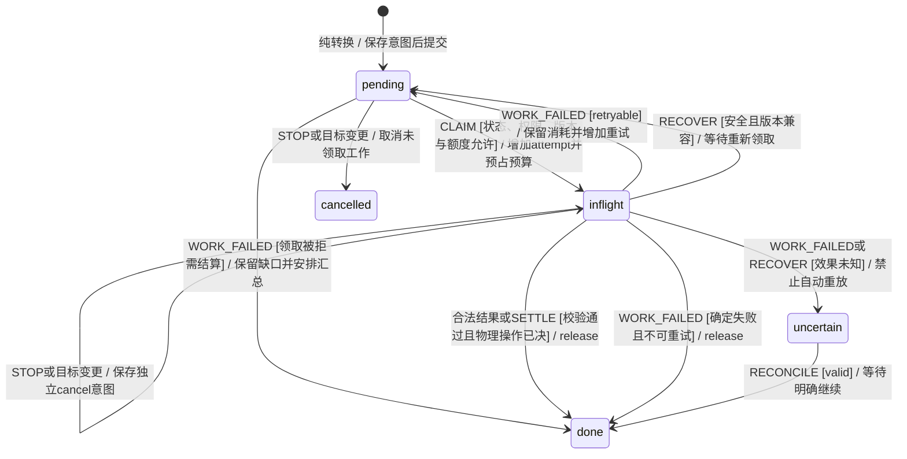
```mermaid
stateDiagram-v2
    [*] --> pending: 纯转换 / 保存意图后提交
    pending --> inflight: CLAIM [状态、权限、版本与额度允许] / 增加attempt并预占预算
    pending --> cancelled: STOP或目标变更 / 取消未领取工作
    pending --> done: WORK_FAILED [领取被拒需结算] / 保留缺口并安排汇总
    inflight --> inflight: CONSUME [valid] / 初次使用预占，额外请求扣额
    inflight --> inflight: STOP或目标变更 / 保存独立cancel意图
    inflight --> done: 合法结果或SETTLE [校验通过且物理操作已决] / release
    inflight --> done: WORK_FAILED [确定失败且不可重试] / release
    inflight --> pending: WORK_FAILED [retryable] / 保留消耗并增加重试
    inflight --> pending: RECOVER [安全且版本兼容] / 等待重新领取
    inflight --> uncertain: WORK_FAILED或RECOVER [效果未知] / 禁止自动重放
    uncertain --> done: RECONCILE [valid] / 等待明确继续
```

STOP 不会立即把原 inflight 置 done；cancel 意图发出或结算也不等于原工作已决。迟到结果只有在身份验证后才能结算自身，不能推动新目标。LOCAL_RESULT / LOCAL_RECONCILE 在证明子操作已决且目标有效时，还可能使原 uncertain 父意图回到 pending；见本地子操作图。

每个额外模型请求、技能搜索和网页工具调用都先经 CONSUME 检查。被拒后禁止发起 I/O。模型 HTTP 408、429、5xx 或网络故障可有限重试；协议错误与不可恢复故障按任务图转移。技能搜索不会安装技能。停止首先持久化并派发取消意图，AbortSignal 传入模型和工具；取消请求发出不等于原操作已结算。外部结果不确定时必须核对，不能直接重放。

OpenCode 会话标识只影响传输：网页使用群 ID，CLI 使用持久任务 ID，适配器哈希后添加请求头，不创建另一条调度路径。HTTP 错误只保留已校验的短代码；MissingSessionID 即使附带参数标识，也应提供缺少会话头的提示，仍沿用 WORK_FAILED 转移。瞬态故障到达重试上限时，等待原因应同时说明原错误和额度限制。执行日志是观察记录，不驱动业务转移。

### 本地技能与 CLI 子操作

对应 BT_L01–BT_L13。沿用主任务顶层阶段，子状态与检查点保存在父 Intent 内，由真实 taskMachine 纯转换验证。服务先建立有界共享目录，再恢复任务。listSkills 只读内存元数据免费；正文、资源、CLI 及宿主工程核验每次领取扣一次 ordinary；检查模型请求扣 checks。讨论、评审与负责人续办保留额度继续有效。

**图型：上下文生命周期；所有者：`taskMachine / Intent.localOperations[].status；src/local-operation.ts`。**

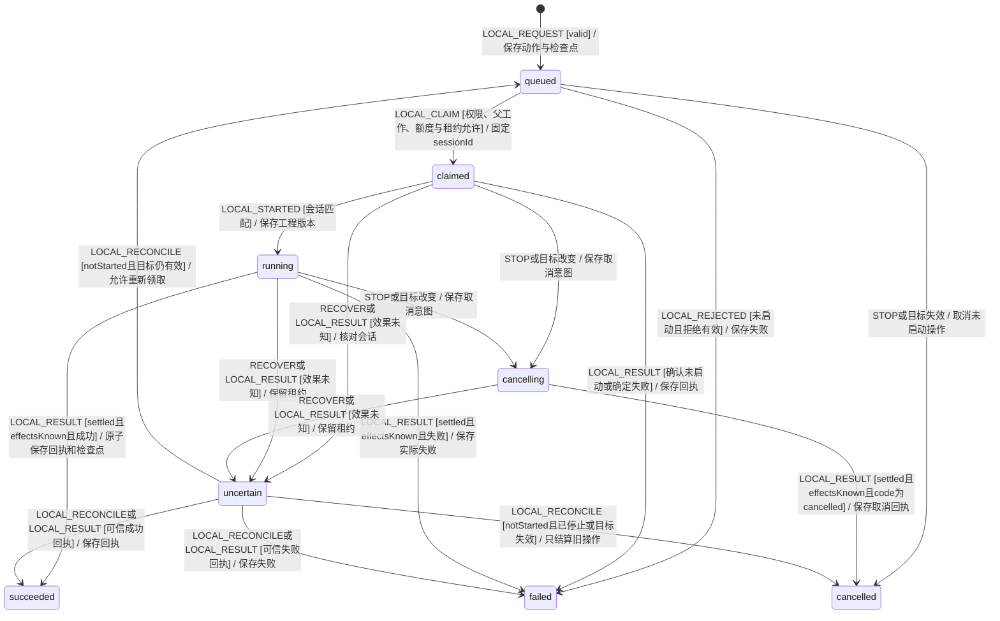
```mermaid
stateDiagram-v2
    [*] --> queued: LOCAL_REQUEST [valid] / 保存动作与检查点
    queued --> claimed: LOCAL_CLAIM [权限、父工作、额度与租约允许] / 固定sessionId
    queued --> failed: LOCAL_REJECTED [未启动且拒绝有效] / 保存失败
    queued --> cancelled: STOP或目标失效 / 取消未启动操作
    claimed --> running: LOCAL_STARTED [会话匹配] / 保存工程版本
    claimed --> failed: LOCAL_RESULT [确认未启动或确定失败] / 保存回执
    running --> succeeded: LOCAL_RESULT [settled且effectsKnown且成功] / 原子保存回执和检查点
    running --> failed: LOCAL_RESULT [settled且effectsKnown且失败] / 保存实际失败
    claimed --> cancelling: STOP或目标改变 / 保存取消意图
    running --> cancelling: STOP或目标改变 / 保存取消意图
    claimed --> uncertain: RECOVER或LOCAL_RESULT [效果未知] / 核对会话
    running --> uncertain: RECOVER或LOCAL_RESULT [效果未知] / 保留租约
    cancelling --> uncertain: RECOVER或LOCAL_RESULT [效果未知] / 保留租约
    cancelling --> cancelled: LOCAL_RESULT [settled且effectsKnown且code为cancelled] / 保存取消回执
    uncertain --> queued: LOCAL_RECONCILE [notStarted且目标仍有效] / 允许重新领取
    uncertain --> succeeded: LOCAL_RECONCILE或LOCAL_RESULT [可信成功回执] / 保存回执
    uncertain --> failed: LOCAL_RECONCILE或LOCAL_RESULT [可信失败回执] / 保存失败
    uncertain --> cancelled: LOCAL_RECONCILE [notStarted且已停止或目标失效] / 只结算旧操作
```

已知回执统一由 `finishOperation` 按实际结果结算：`code=cancelled → cancelled`，否则 `ok=true → succeeded`，其余 `→ failed`；适用于 claimed、running、cancelling 和 uncertain 中合法收到的结果，包括停止后才返回的真实成功或失败。停止、旧目标及版本不兼容阻止父工作续办，不把历史成功伪写成取消。

LOCAL_REQUEST 固定 operationId、请求摘要、父会话 attempt、技能版本与模型动作。LOCAL_CLAIM 与跨群共享的工作区租约在同一存储事务中提交；竞争者保持 queued，不消费预算。租约到期不是进程结束证明，不自动接管。实际执行前再次确认当前父工作、权限、取消和领取身份。回执只能结算自己的 operationId 与 sessionId；迟到回执不恢复候选或新目标。SETTLE、普通最终输出、重试、目标边界和新父工作均不能释放尚有未决子操作的工作锁。

停止会将已领取子操作置 cancelling 并发取消意图，执行器等待沙箱会话和后代退出；可能写入的取消/崩溃保留 uncertain，直到核对回执/效果。重启先核对本地会话日志与存储，再调度父工作；没有会话启动记录可证明未执行，已有回执可补交，缺少证据则保持 uncertain 和租约，不重放写入。旧任务缺失能力默认不授权；显式恢复核对通过后仅为兼容版本的新动作启用当前配置。

技能注册表固定启动 manifest；激活原子发布同版本只读快照，资源按包内相对路径读取；正文和资源不是调度权限。执行阶段的 Bot 默认获得四个本地接口；解析、纯汇总和独立检查模型不执行这些工具。宿主工程验证与后台讨论命令用隔离副本并标记工程 revision；主工作区仍为权威来源。执行后端不可用返回真实失败，不退回无沙箱进程。文件、日志、环境、网络和进程 I/O 在执行器完成，状态机不访问文件或启动进程。

可信 LOCAL_RECONCILE 或 uncertain 操作的 LOCAL_RESULT 回执全部结算后，若目标仍有效且未停止，返回原主工作的阶段（owner→running、assistance→waitingAssistance、facilitator→coordinating、check→checking），复用检查点继续。旧目标和停止任务只结算旧操作，不恢复执行。

BT_Y113 补充监督协调与上述恢复的交叉：若协调请求已经派发，原 owner 的可信核对先返回，则后续 `COORDINATE.continue [当前目标、安全pending检查点、全部效果确定、原期限有效] / 接续原owner并仅收紧期限`，不取消唯一回执持有者。原操作身份和时间不变，后续模型领取仍走原 CLAIM 额度及权限；[恢复细图](implementation/kej-113-task-resilience.md)记录该上下文流程。

BT_G02/BT_H17 的旧流程与新监督交叉见同一[恢复细图](implementation/kej-113-task-resilience.md)：空闲主流程中的直接评审请求回应普通材料询问；partial 后明确重试先归档旧冻结版本，再允许当前身份结果保存。不改原截止时间，也不以新评审请求回答仍在执行的后台讨论问题或命令授权。

BT_L14 的宿主 `local:operations` 命令读取未决会话与当前工作区清单，只有进程已退出、会话身份和审阅摘要匹配时才把操作者确认转换为 LOCAL_RECONCILE(receipt)。未退出、身份不明或摘要过期时不发事件。停止任务完成结算，活动任务由既有恢复守卫回到原工作阶段；此入口不重新执行命令。

工作区命名空间在 LOCAL_REQUEST 中固定为群 ID 与任务 ID 的宿主摘要；默认目录和核查副本均绑定此命名空间。即使两个群使用相同消息/工作 ID，也不会共用默认目录或副本。显式指定同一 canonical 工程时才共享工作区租约。

BT_L15 的调试模板沿用同一 taskMachine 与局部操作状态，不新增调度规则。LOCAL_* 模板绑定父工作、operationId、attempt、命名空间、会话身份和 fence；离线沙箱仍只进行纯转换，CLI 文本是合成资料。模板与形状校验属于图的输入投影，先复验上述真实模型后接入。

BT_L16：活跃后台讨论成员的 LOCAL_RESULT(uncertain) 只保留该子操作与成员锁，不改变仍在执行的主阶段。方案师照常将草稿存入 candidate，因讨论未完成而暂停最终检查；核对并完成讨论后再汇总交接。服务重启时仍统一先恢复未决物理会话，禁止重放未知写入。

BT_L17：在独立检查前，确定的工程验证命令经持久化、领取和回传在隔离副本执行。验证回执可用且独立检查通过时，发布前由宿主领取内部 verifyWorkspace 操作，沿用 LOCAL_REQUEST → LOCAL_CLAIM → LOCAL_RESULT、ordinary 额度及工作区租约；核对首次复制所绑定的源版本、当前权威工程与当前检查副本。源变化、回执过期、复核未完成或未知效果均阻止发布；仅明确允许的输出目录 dist/test-results/reports/coverage 不计入源版本。版本复核不重跑 CLI，恢复后仍要核对当前版本。

隔离验证仅允许输出目录与任务临时目录可写，源文件保持只读。即便受控执行夹具或外部编辑曾改变副本输入再恢复，每次 CLI 回执中的输入变化标记也会阻止发布。后台讨论可在副本试验，结果不合回权威工程。

工程副本保留包内工具的相对链接（包括 node_modules/.bin），解析后的目标必须在工程内；拒绝逃逸和循环。此为受领取后执行的文件副作用，沿用同一局部操作模型，不增加调度转移。BT_L09 同时运行真实 npm build，检验链接、可写输出与源版本复核的接线。

BT_L18：成功激活同时记录 TaskContext.localSkillVersions；新意图、领取和 LOCAL_REQUEST 都继承当前任务绑定，避免同一任务换 Bot/续办后改用重启时的新版本。来源 ID 与内容版本独立，名称先解析为来源 ID 再选择已固定版本。明确的用户目标版本变化或协调员 replan 可重建任务绑定；旧 Work 自身仍保留原绑定，用于结算和审计。

版本不兼容的恢复只允许核对并结算已存在的物理操作；LOCAL_RESULT/LOCAL_RECONCILE 必须保留不兼容原因，不将父工作重新置 pending，也不返回执行阶段。可信旧回执不授予新协议或新模型配置的执行权限（BT_L12）。

### 模型输出格式修正

对应 BT_M10–BT_M20、BT_M23–BT_M30。完整响应未通过 JSON/角色协议校验时，采用[校验反馈回路](https://docs.langchain.com/oss/javascript/langgraph/thinking-in-langgraph)：保留原任务和已取得的工具资料，指出字段校验问题后请求新结果；不把格式错误转为用户信息不足，也不放宽验证。兼容第三方服务，继续使用原响应格式配置，不强制供应商支持新的严格 schema 参数。

**图型：适配器处理流程；所有者：`WorkRunner / OpenAICompatibleAdapter；父 Intent.outputRepair`。**

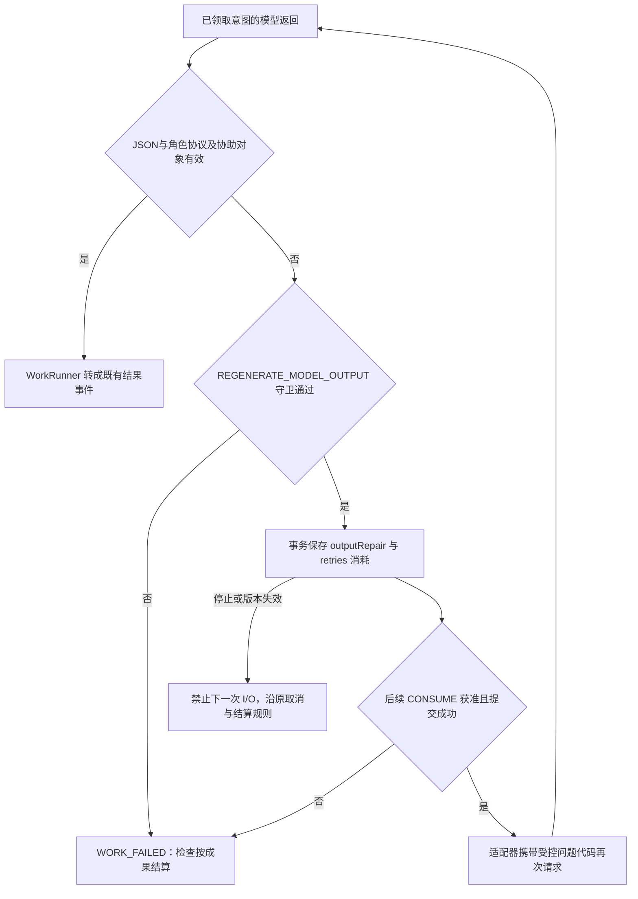
```mermaid
flowchart TD
    R["已领取意图的模型返回"] --> V{"JSON与角色协议及协助对象有效"}
    V -->|是| E["WorkRunner 转成既有结果事件"]
    V -->|否| A{"REGENERATE_MODEL_OUTPUT 守卫通过"}
    A -->|是| S["事务保存 outputRepair 与 retries 消耗"]
    S --> C{"后续 CONSUME 获准且提交成功"}
    C -->|是| H["适配器携带受控问题代码再次请求"]
    H --> R
    A -->|否| F["WORK_FAILED：检查按成果结算"]
    C -->|否| F
    S -->|停止或版本失效| N["禁止下一次 I/O，沿原取消与结算规则"]
```

执行阶段角色校验和修正期间父意图仍为 inflight。独立检查以 WORK_FAILED 结算失败尝试并持久化全周期补试，再领取同一检查意图与原候选、材料。重启按原安全边界恢复；已用次数保留。

保留 running、waitingAssistance、coordinating、checking 等既有业务顶层状态；使用 REGENERATE_MODEL_OUTPUT 事件及操作上下文 outputRepair。状态机只保存修正次数与受控校验代码，使用现有 usage.retries/config.limits.retries，不新增独立预算。后续模型请求仍通过 CONSUME，扣所属 ordinary 或 checks 额度；修正不重置本次工作截止时间，也不重新执行已完成的工具。停止、旧轮次/目标版本、非在途或非模型工作、额度耗尽时拒绝。重复事件回执不重复计数；重启保留修正信息，不绕过恢复和模型绑定校验。

检查请求明确声明顶层 `type:"check"` 和 `criteriaResults` 均为必填，不能因当前角色已是检查而省略类型标识（BT_M37）。缺失标识即使逐项结果完整也不得发布。首检和补试使用相同固定材料与协议说明，沿用 `checking → WORK_FAILED → 预留一次补试 → CLAIM/CONSUME → CHECK_RESULT` 路径；本次只加强适配器的协议说明，不新增 XState 状态、事件、守卫或预算。实现前以真实状态模型复验失败不发布、同候选补试、额度和停止拒绝路径。

检查协议只接受带有效类型标识的完整 `criteriaResults`。缺失、未知或重复的验收 ID，非法类型或错引文按检查协议错误处理；有效的不通过结论进入有界语义修订。格式修复与适用的瞬态网络补试共享一次全周期机会。补试或预算用尽后按已有成果结算，保留未核实范围。鉴权拒绝等不可补试故障直接结算。其他角色继续使用各自既有修正和故障路径。反馈仅含宿主生成的问题代码与协议约束；事务保存失败后禁止继续请求。

原始用户输入引用（BT_F31）沿用既有检查路径：`checking → CHECK_RESULT [冻结rawInputs中ID及逐字引文匹配] → running/一次语义修订`；未知ID或改写引文仍进入受限协议重试且不发布。检查适配器、执行器和状态机均只使用该check intent提交时冻结的rawInputs，不读取当前聊天记录补来源。旧快照缺少rawInputs时按空来源处理。此变更只扩大合法来源为已提供的可信原文，不新增状态、权限、预算或外部副作用。

### 协调决策校验与等待原因

BT_M23–BT_M29。**图型：真实 XState 的既有转移与执行器协议；所有者：`taskMachine / Intent.payload / OpenAICompatibleAdapter`；验收范围：当前负责人身份、受控重生成、最终拒绝与可见等待原因。**

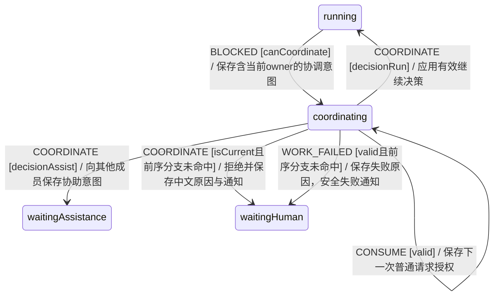
```mermaid
stateDiagram-v2
    running --> coordinating: BLOCKED [canCoordinate] / 保存含当前owner的协调意图
    coordinating --> coordinating: CLAIM [claimFacilitator] / 领取并补齐旧意图缺失owner
    coordinating --> coordinating: REGENERATE_MODEL_OUTPUT [valid] / 保存invalid_decision并消耗retries
    coordinating --> coordinating: CONSUME [valid] / 保存下一次普通请求授权
    coordinating --> running: COORDINATE [decisionRun] / 应用有效继续决策
    coordinating --> waitingAssistance: COORDINATE [decisionAssist] / 向其他成员保存协助意图
    coordinating --> waitingHuman: COORDINATE [isCurrent且前序分支未命中] / 拒绝并保存中文原因与通知
    coordinating --> waitingHuman: WORK_FAILED [valid且前序分支未命中] / 保存失败原因，安全失败通知
```

上图摘录现有状态和分支；没有新增状态或业务事件，完整分支仍以真实任务机器为准。适配器读取领取事务已经保存的当前 `payload.owner`，不能用 defaultBot、work.target 或历史消息猜负责人；新协调意图创建时写入，旧意图在 CLAIM 时补齐。恢复后的安全意图先重新领取再调用模型。已持久保存的负责人不能被模型输出改变，HANDOFF 仍遵守现有执行边界。自定义宿主若绕过领取直接调用适配器且缺少有效负责人，则在首次模型 HTTP 请求前以 COORDINATION_OWNER_MISSING 明确失败，不猜身份或消耗修正循环。

`assist` 的目标必须是已配置且不同于当前负责人的成员。违反这一输出协议时，在提交 COORDINATE 前请求既有 `invalid_decision` 修正；反馈只含宿主生成的安全规则，不保存或回显无效原文。模型可重新选择有效 continue 或 assist，不由程序强行改写判断。后台讨论仍遵守 review 协议及原授权目标，不能利用本次校验扩大讨论范围。

首次领取和后续请求沿用 ordinary 额度，修正另消耗共享 retries；停止、期限、旧目标版本、存储失败和无权限边界继续由既有模型校验，未获授权不得发出下一次 I/O。最终无效 COORDINATE 仍由 SELF_DEPENDENCY 等领域规则拒绝；中文等待原因只绑定当前协调结果回退到 waitingHuman 的分支，不让其它状态或迟到结果覆盖已有问题。后续 ACTIVITY 等命令可改写 reply，但必须保留 reason 和通知。网页使用既有 reason 和群消息投影，不把最近命令回执当作持久等待原因。结果未知或不安全重放的协调工作仍保留原有核对与结算要求；新增失败通知只覆盖已知安全的普通协调失败，不改变讨论或取消路径。

### 默认网页工具

对应 `BT_W01`–`BT_W14`，以下是已领取意图内部的一次请求循环，不是新增的任务顶层状态。状态机在 owner / assistance / facilitator 的 payload 中持久化 `capabilities.webSearch`、`capabilities.webFetch`。最终 check 不开放联网，保留原有 checks 预算语义。

**图型：适配器处理流程；所有者：`WorkRunner / CloudflareWebTools`。**

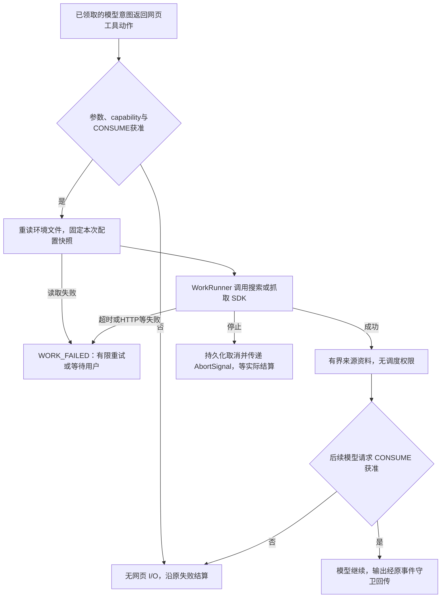
```mermaid
flowchart TD
    W["已领取的模型意图返回网页工具动作"] --> P{"参数、capability与CONSUME获准"}
    P -->|否| N["无网页 I/O，沿原失败结算"]
    P -->|是| E["重读环境文件，固定本次配置快照"]
    E -->|读取失败| F["WORK_FAILED：有限重试或等待用户"]
    E --> H["WorkRunner 调用搜索或抓取 SDK"]
    H -->|成功| R["有界来源资料，无调度权限"]
    H -->|超时或HTTP等失败| F
    R --> C{"后续模型请求 CONSUME 获准"}
    C -->|是| M["模型继续，输出经原事件守卫回传"]
    C -->|否| N
    H -->|停止| S["持久化取消并传递 AbortSignal，等实际结算"]
```

- 两种工具每次各消耗一次普通额度；分页续读是新的抓取。后续模型请求另外计费，评审汇总的保留额度同样适用。CONSUME 校验 inflight、epoch/goalVersion、期限、工具开关与工作类型，不能由适配器绕过。
- 使用 `agents/websearch` 的 HTTP source 和 `agents/webfetch` 的抓取、分页与渲染函数。Node 宿主用 Workers AI REST API 适配 Markdown 转换；密钥仅在运行时从环境读取，不写入任务配置、模型上下文或执行日志。
- BT_W11–BT_W14 沿用现有意图、CONSUME、WORK_FAILED、STOP 和 RECOVER，不修改 XState。每次工具调用前重载 `.env`，更新或删除仅由文件管理的值，保留进程环境和显式注入的优先级；文件不存在时清除旧文件值，其他读取错误使本次调用失败。单次调用的搜索选项、账号、令牌与错误脱敏共用开始时的快照，HTML/PDF 转换不得中途换用另一账号；下一次请求及恢复后的请求重新读取。
- 抓取沿用 SDK 的公共 URL、重定向、响应字节数与超时限制；正文使用 SDK 的不可信内容标记。搜索和网页内容不能改变评审名单或授予新调度权限。
- 只有工作被领取后才能发出工具请求；失败保留安全代码，不伪装为零条结果。工具暂时失败可按原 WORK_FAILED 规则重试整个只读工作，受原预算限制。未配置账号不会阻止普通聊天启动。
- 恢复时更新当前开关，并刷新 pending 和重新入队的 inflight 意图能力。途中尚未提交的模型循环可能重新搜索或抓取，重新调用可能收费；不承诺缓存或恰好一次外部请求。已结算意图不重放。
- 网页只观察工具开始、来源结果、失败与完成，不另建调度路径。

### 技能搜索结果解析

对应 BT_M21–BT_M22。沿用 `src/task.machine.ts` 的真实执行意图与顶层状态，无需修改 XState：来源格式是只读适配器的返回数据契约，不产生业务状态、事件或新的操作意图。以下细化图中的请求与解析阶段属于已领取的同一个 inflight 意图。

**图型：适配器处理流程；所有者：`WorkRunner.findSkills / src/skills.ts`。**

```mermaid
flowchart TD
    W["已领取的同一个 inflight 意图"] --> A{"findSkills 的 CONSUME 获准"}
    A -->|否| F["无搜索 I/O，WORK_FAILED"]
    A -->|是| H["WorkRunner 发搜索 HTTP"]
    H --> V{"HTTP 与返回数据契约有效"}
    V -->|是| R["排序只读资料，仓库或域名来源均可"]
    V -->|否| F
    R --> M{"后续模型请求 CONSUME 获准"}
    M -->|是| N["向模型提供资料，再校验模型输出"]
    M -->|否| F
    H -->|停止| C["持久化取消，传递 AbortSignal，等待实际结算"]
    N --> E["回传既有业务事件，仍受身份与版本校验"]
```

有效空数组仍是零结果；同批仓库与域名结果均保留，任何真正畸形项仍令搜索失败。来源不获得安装、命令执行或任务调度权限；链接固定为 skills.sh 的来源路径与编码后的技能标识。初次模型请求由 CLAIM 预占，每次搜索和后续模型请求各经一次 CONSUME 扣额；预算不足、停止和过期版本仍由原状态机拒绝。恢复只按现有安全意图规则重新领取，不保存供应商返回值为新调度依据。

2026-10-30 的故障复现：查询 `general purpose assistant skills` 返回 HTTP 200，包含 `source=skills.volces.com`，原仓库来源正则导致整批抛出 `Invalid skill search result`。一手依据：[实时搜索接口](https://skills.sh/api/search?q=general%20purpose%20assistant%20skills&limit=20)、[上游 CLI](https://github.com/vercel-labs/skills/blob/main/src/find.ts)。

### 模型消息风格

对应 BT_M07–BT_M09。以下是 `OpenAICompatibleAdapter` 内部的请求阶段，不是新增的 XState 状态。owner、assistance、facilitator 和 check 均沿用状态机已持久化的意图；只有 WorkRunner 领取成功后才构造并发送请求。

**图型：适配器处理流程；所有者：`OpenAICompatibleAdapter / WorkRunner`。**

```mermaid
flowchart LR
    C["CLAIM 成功"] --> P["构造角色协议与系统风格"]
    P --> M["已授权模型请求"]
    M --> V{"合法的返回类型"}
    V -->|工具动作且额外CONSUME获准| T["执行工具，保留资料"]
    T -->|后续模型请求获准| M
    V -->|角色输出| R["WorkRunner 回传既有事件"]
    V -->|协议错误| F["格式修正或 WORK_FAILED"]
    M -->|失败或停止| F
```

风格只约束可读文本：默认用简洁自然段落，短回复无需标题，减少装饰性排版；用户要求或内容确有需要时保留列表、表格、代码与来源链接。JSON 外层结构、动作枚举、工具参数和角色权限由现有协议决定，不受风格偏好覆盖。工具资料不能改写系统风格或取得调度权限；完成检查仍不开工具。

不增加状态、事件或调度入口。首次请求与后续模型/工具请求沿用原预算；失败、停止、迟到结果、目标版本隔离和恢复均使用「外部执行操作」的守卫与转移，安全重放时重新构造同一风格提示。可执行场景使用注入的模型传输核对各角色请求、工具后续请求及格式保留，不把预设响应当成真实模型的风格质量验收。

### 任务级证据读取

**图型　处理流程。所有者　`taskMachine / Intent.localOperations`，模型契约在 `src/local-operation.ts`，执行器为 `WorkRunner`。验收　BT_L38–BT_L43。**

```mermaid
flowchart TD
    Stored["已结算 CLI 回执"] -->|"生成工作上下文 [任务、目标和角色匹配] / 投影索引"| Index["证据索引"]
    Index -->|"LOCAL_REQUEST [父工作和动作有效] / 保存证据读取意图"| Queued["queued"]
    Queued -->|"LOCAL_CLAIM [当前权限、来源和额度有效] / 领取读取"| Claimed["claimed"]
    Queued -->|"LOCAL_REJECTED [来源不可见、引用失效或额度不足] / 保存拒绝原因"| Missing["未读取"]
    Queued -->|"STOP 或目标变化 [未领取] / 取消"| Missing
    Claimed -->|"LOCAL_RESULT [会话匹配且结算确定] / 保存分页回执"| Receipt["读取回执"]
    Claimed -->|"RECOVER [未保存回执] / 核对读取身份"| Recovery["核对原读取"]
    Recovery -->|"LOCAL_RECONCILE [目标有效] / 恢复同一读取意图"| Queued
    Receipt -->|"恢复 [已有回执] / 返回原分页结果"| Receipt
```

证据索引由已结算的 CLI 操作派生，正文只保存在原回执中。负责人和协调员在执行阶段可查读当前目标范围内获准的证据；协作者只接收宿主在分工时确认的证据引用。检查员获得已领取意图绑定的只读证据投影，首检和复核使用同一来源 ID 和内容摘要，每份已保存的相关原文只投影一次。材料超限时明确结算无法核实。查读请求及领取阶段均以当前权限、父工作、fence 和来源为准。无法访问的引用不提供正文或来源细节；失败、缺失和截断的回执分别提供可核实的状态。

查读仍走保存、领取、回传的子操作契约。读取范围限于存储中已保存的脱敏正文，不访问日志路径、启动进程或触发远程采集。每个新的分页读取只在第一次成功领取时消耗一次 ordinary；恢复读取仍使用同一操作身份。分页游标绑定来源操作、内容摘要及输出流，失效游标返回明确缺口。

同目标旧 epoch 的已结算回执带原采集时间并标为历史观测。显式刷新使用新的真实外部操作意图，遵循原有额度与审批；当要求确认当前工程修订时仍需 `verifyWorkspace` 等当前验证。未决及未经核对的执行结果不进入证据索引。停止、过期或旧 fence 的结果最多结算原操作，不能推进当前工作。

### 宿主命令按次授权

BT_L35–BT_L37增加当前任务会话授权（任务拥有的上下文生命周期，所有者taskMachine / hostSession）。用户明确选择会话后，范围为同任务、epoch、目标版本、工作区、命名空间及同一宿主账号和环境；包括当前任务全部Bot。页面刷新保留，任务结束、停止、版本/epoch改变、服务RECOVER或用户撤销时清除。每条命令仍先准备具体计划，再由纯模型判断是否复用，重新领取后运行时重核完整digest；不自动将sandbox改为host。模型与工具内容不能创建授权。

```mermaid
stateDiagram-v2
    [*] --> 按次审批
    按次审批 --> 会话有效: LOCAL_APPROVAL_DECISION [approveSession] / 保存范围并批准匹配计划
    会话有效 --> 会话有效: LOCAL_APPROVAL_REQUIRED [范围匹配] / 固定本条计划并排队
    会话有效 --> 按次审批: 结束、停止、版本变化、RECOVER、REVOKE_HOST_SESSION / 清除授权
```

撤销只影响尚未启动的操作；已开始的命令仍按原取消/结算规则处理。等待中及未领取的匹配操作可复用授权；撤销后排队命令重新等待批准，已领取但未启动的操作必须在LOCAL_STARTED重核授权。范围不匹配仍显示按次审批，未知效果不重放。会话不跨任务继承，不绑定某一CLI或参数；授权说明明确它允许本任务后续所有宿主命令。单条工程/可执行文件/环境指纹及额度、租约校验不变。

BT_L23–BT_L30。在 `runCli` 上显式请求 `execution: host` 和 `reason`，只表达申请，不能批准。默认仍使用沙箱；普通失败不自动重跑。审批生命周期属于 `src/local-operation.ts` 的持久上下文，由真实 `taskMachine` 的 LOCAL_* 事件驱动，不另造顶层任务阶段。

**图型：任务拥有的上下文生命周期；所有者：`taskMachine / LocalOperation`。**

```mermaid
stateDiagram-v2
    queued --> claimed: LOCAL_CLAIM [当前工作与租约有效] / 准备命令
    claimed --> awaitingApproval: LOCAL_APPROVAL_REQUIRED [尚未启动] / 保存命令与期限，释放租约
    awaitingApproval --> queued: LOCAL_APPROVAL_DECISION [当前用户批准且标识匹配] / 保存一次批准
    awaitingApproval --> failed: LOCAL_APPROVAL_DECISION [用户拒绝] / 拒绝回执
    awaitingApproval --> failed: LOCAL_APPROVAL_EXPIRED [过期] / 过期回执
    awaitingApproval --> cancelled: STOP 或版本撤销 / 使批准失效
    queued --> awaitingApproval: RECOVER [存在未消费批准] / 换批准标识，重新确认
    claimed --> running: LOCAL_STARTED [批准与实际命令仍匹配] / 保存进程身份
    claimed --> failed: LOCAL_RESULT [命令或工程改变且未启动] / 失效回执
    running --> succeeded: LOCAL_RESULT [退出且效果确定] / 保存结果
    running --> uncertain: LOCAL_RESULT 或 RECOVER [效果不明] / 保持租约待核对
```

宿主预备读取也在已持久化领取之后执行；预备不启动进程、不扣 CLI 执行额度。等待保持原模型检查点，释放工程租约，通过通知唤醒，不重复请求模型或促进者。宿主真正执行前再次领取、扣一次 ordinary、核对可执行文件、完整 argv、真实 cwd、工程内容、宿主环境及工作版本；任一变化返回失效，不自动扩大批准范围。批准使用不可替换的请求标识，重复命令有事务回执；模型、技能、日志和普通消息不能产生批准事件。

拒绝返回原 Bot；停止、过期、权限撤销与旧目标不能执行。重启后未消费的批准回到等待，并更换标识；已领取或运行的操作沿原持久日志核对，不重放宿主副作用。确认未启动而重新入队的宿主操作同样换批准标识，再次等待用户。保留执行身份、取消后代、额度与未知效果约束。宿主环境指服务所在机器及账号，使用真实 HOME 和认证环境，不承诺继承其他机器、其他账号或尚未授予的系统权限。

**图型：UI 投影；所有者：`HostApprovals / WebService`。**

待批准快照触发授权对话框；关闭只收起提示，待处理卡片仍可重新打开。允许本次或拒绝通过同源 JSON HTTP 命令提交任务、工作、操作和批准标识，不接收替换命令参数。提交失败保留请求并可重试；切群后的旧响应不更新当前群。可信命令经 TeamEngine 事务及状态机守卫提交后通知原运行器；服务端没有从网页绕过状态机启动进程的路径。

### 失败命令的宿主续办

图型为任务上下文生命周期。业务所有者为 `taskMachine / hostRetryRequests / hostRetryBatch`，可信入口为 `TeamEngine`。验收覆盖 BT_L31–BT_L37 和 BT_L45–BT_L55。顶层阶段沿用现有任务机器，逐条授权与执行沿用 `LocalOperation`。

```mermaid
stateDiagram-v2
    state "待安全边界" as Pending
    state "续办中" as Active
    state "待核对" as Uncertain
    state "已交接" as HandedOff
    state "无法续办" as Unavailable

    [*] --> Pending: REQUEST_HOST_RETRY [来源、权限、目标与最低额度有效] / 保存固定请求
    Pending --> Pending: REQUEST_HOST_RETRY [同一来源] / 返回已保存请求
    Pending --> Active: 安全边界 [主线已结算且最低额度满足] / 固定顺序并保存首条操作意图
    Pending --> Unavailable: 安全边界 [最低额度不足] / 记录未执行原因
    Pending --> Unavailable: 停止、目标变化或到期 [尚未启动] / 结算并保留原因
    Active --> Active: LOCAL_RESULT 或批准决定 [本条已确定结算] / 保存回执并生成下一条意图
    Active --> Uncertain: LOCAL_RESULT [本条效果不明] / 冻结后续外部操作
    Uncertain --> Active: LOCAL_RECONCILE [核对完成且目标有效] / 继续当前批次
    Active --> HandedOff: 批次结算 [各项效果均确定] / 交给一次负责人综合
    Active --> Unavailable: 停止或目标变化 [后续项未启动] / 取消后续项
    Uncertain --> Unavailable: 核对完成 [任务已停止或目标失效] / 仅结算已启动项
```

失败记录入口只提交任务、工作、操作标识与原请求摘要。可信用户命令通过时，活动任务只登记请求，保留当前 epoch、已保存候选、协助结果及仍有效的会话授权。已正常结束的任务在首次明确续办时重新激活，隔离旧 epoch 并清除失效授权。等待审批、未决物理效果、已停止、旧目标、其他活动任务、权限关闭、伪造参数和截断的写入清单仍按原边界拒绝请求。隔离检查或讨论的失败记录需保留原副本范围，普通负责人的续办入口拒绝这些记录。原成员的本地工具权限也会在审批、领取及启动时复核。

安全边界要求主线结果保存并结算，且已有协助、讨论、评审和用户输入按原流程完成交接。交付、检查和协调结束分支在最终发布前检查续办集合。待办登记不消耗或预留额度，安全边界才原子核对并预留每条执行、一次负责人综合及一次独立检查的最低额度。启动批次保留候选历史，发布须等待吸收回执后的候选重新通过检查。未达最低额度时记录每项未执行原因并按现有部分完成或失败路径结束。

领取端只执行已保存的固定操作意图。命令分别准备、审批、领取和结算，批准前释放工作区租约。已保存回执驱动状态机生成下一条意图。批次内新的有效请求进入后续待办。请求期限按登记时钟固定，单条执行受请求与父工作中较早期限约束。未启动到期保留未执行原因，已启动到期按原取消和结算处理。未知效果保留租约且等待核对，后续项保持未启动。

重启保持顺序及已结算回执，未消费批准和会话授权失效。停止、目标变化和权限撤销使适用的未启动项失效，迟到回执只能结算自己的操作。会话批准沿用 BT_L35–BT_L37 的匹配范围，每条命令仍重核完整计划及 digest，启动前再次核对撤销和期限。

**图型：批次占用的上下文生命周期。所有者：`taskMachine / hostRetryBatch`。验收：BT_L53–BT_L55。**

```mermaid
stateDiagram-v2
    state "批次占用" as Held
    state "批次占用解除" as Released
    [*] --> Held: 安全边界 / 保存批次、负责人工作和首条操作
    Held --> Held: 普通事件、RECOVER 或定时检查 [负责人工作仍活动或效果未确认] / 保留批次
    Held --> Released: always [负责人工作已终止且效果可确认] / 记录解除原因并保留回执
    Released --> Held: always [有待办且满足原安全边界与额度] / 保存下一批意图
```

批次占用随负责人工作结束而解除，包含被拒绝的负责人输出、正常完成、已确认失败或取消。旧快照中的遗留占用也按同一事实核对，服务恢复和现有定时检查均可触发。若负责人记录缺失，仅在批次没有效果未确认或可能已执行的请求时解除。解除时保留候选，已有回执按原结算时间核对，确定未执行的项记录原因，批次与触发事件写入任务轨迹。其他排队请求仍按原期限、版本、额度和授权边界处理。待批准的活动批次和未核对的执行效果继续保留。新的续办回执交回负责人后，仍需提交候选并重新通过检查。

自动转移由纯守卫判定。清除占用时显式重置上下文字段，使守卫立即失效。定时检查只发送事件，运行器继续从已保存并领取的意图执行。[XState 自动转移](https://stately.ai/docs/eventless-transitions)

网页投影已保存的排队、待批准、执行中、已取得结果和无法续办原因。刷新恢复同一请求，重复点击返回原请求。批准、拒绝和撤销在键盘及窄屏下均可操作。

### 本地工具宿主启动与平台边界

对应 BT_L19–BT_L22。沿用 `src/task.machine.ts` 与 `src/local-operation.ts`，无业务转移变更：进程身份、沙箱包装和系统路径别名是宿主实现契约；只有已持久化、领取并再次校验的 LOCAL_* 意图可以触发 I/O。以下启动状态由宿主管理，不加入任务 XState。

**图型：宿主启动流程；所有者：`LocalRuntime / NativeCliBackend / 服务锁`。**

```mermaid
flowchart TD
    E{"本地工具显式开启"} -->|是| P["探测原生进程身份"]
    E -->|否| D["不启动本地执行后端"]
    P -->|失败或平台不兼容| N["启动失败，不创建锁"]
    P --> I{"现有锁的身份"}
    I -->|仍活跃或未知| N
    I -->|无锁或证明旧进程退出| L["原子领取服务锁并持久化完整身份"]
    L --> M["规范化技能根目录并固定清单"]
    M --> R["核对会话日志与持久化任务"]
    M -->|失败| F["只清理本次token持有的锁"]
    R --> S["宿主就绪；可执行性仍由任务与操作守卫决定"]
    S -->|关闭| C["只删除本次token匹配的锁"]
```

宿主就绪不代表某项 CLI 已执行或未知写入已解决。并发工作及 uncertain/租约属于各自的持久化子操作，见[本地子操作图](#本地技能与-cli-子操作)，不把整个宿主画成一个 executing/uncertain 任务状态。

macOS 身份通过 `/usr/bin/python3 -I` 调用系统 libproc 的 `proc_pidinfo(PROC_PIDTBSDINFO)`，采用微秒启动时间与 `kern.bootsessionuuid`；不使用秒级 ps 时间或裸 PID 证明身份。Linux 保留 PID 命名空间、启动 ticks 与 boot_id，并兼容原有未带平台字段的 Linux 回执。平台不匹配、查询异常或畸形身份是 unknown，不能发送恢复信号或接管锁；当前平台下明确缺失或启动身份不符才视为旧身份已退出。

macOS 复用固定版本 SRT 的 Seatbelt 后端，Linux 保留命名空间探测。最小子进程环境不继承宿主密钥；macOS 仅读取系统运行依赖、工作区与技能快照，网络仍默认拒绝，check 源文件只读。取消继续终止所属进程组并等待会话结算，效果未知则保留 uncertain；没有静默改成宿主执行的分支。

技能边界先将根目录规范为 realpath，再与资源真实路径比较；`/var` 与 `/private/var` 等同源别名不再触发误报，包外链接与 `..` 仍拒绝。此变化不增设调度事件，沿用技能版本、快照与领取守卫。

一手依据：[Apple proc_bsdinfo](https://github.com/apple-oss-distributions/xnu/blob/main/bsd/sys/proc_info.h)、[SRT 原生后端](https://github.com/anthropic-experimental/sandbox-runtime)。本地固定版本源码为核验依据，不升级依赖。

### 任务快照协议与回退

**图型　恢复流程。所有者　`taskMachine` 管理恢复守卫与续办，`TeamEngine` 管理快照封装。验收　BT_A27–BT_A28。**

```mermaid
flowchart TD
    Legacy["旧协议快照"] -->|"RECOVER [旧任务仍活动] / 保留旧协议并要求核对"| Blocked["恢复阻塞"]
    Blocked -->|"LOCAL_RECONCILE [匹配可信回执] / 结算原操作"| Blocked
    Legacy -->|"启动读取 [旧任务已结束] / 原样保留"| Archived["可读的历史交付"]
    Archived -->|"CONTINUE 或 REQUEST_HOST_RETRY [用户明确请求且已结算] / 采用当前配置并增加 epoch"| Upgraded["当前协议任务"]
    Upgraded -->|"事务提交 [当前协议] / 保存 v3 封装"| Stored["当前执行器领取"]
```

旧协议的活动任务按原规则阻塞，未决物理效果仍可核对。核对只更新原记录。已结束任务在服务启动时保持原快照和交付历史。宿主只在可信继续入口提供当前配置。任务模型允许已结算的 `team-v1/tools-v1` 或 `team-v2/tools-v2` 任务升级到 `team-v3/tools-v3`。续办沿用同一目标、任务额度和历史用量，采用当前成员、模型和权限，并在独立 epoch 下开始一次新的有限交付周期。旧检查结论保留在历史记录中，本轮通过条件来自当前候选的逐项结果。

存储层接受 v1、v2 与 v3 封装，按快照所属协议写入对应版本。旧执行器拒绝 v3 封装。不同协议的执行器只有原物理操作的结算权限，领取、模型授权和工作结果仍受版本围栏约束。上线前应结算或暂停未决操作并保留快照，回退时只向旧执行器提供其支持的快照。发布历史保存在原消息和不可变产物中。

模型验证使用真实 XState，在受控时间下逐步持久化并恢复。轨迹覆盖旧活动任务 `running → waitingHuman → waitingHuman`，以及已结束任务 `ended → running` 时增加 epoch 并保存新配置。

```bash
node node_modules/vitest/vitest.mjs run tests/task-protocol-model.unit.test.ts tests/local-operation-model.unit.test.ts tests/host-retry-model.unit.test.ts --maxWorkers=1
```

BT_A27–BT_A28 接线使用实际 SQLite、受控真实子进程和保存的进程回执，验证旧封装、恢复阻塞、两条可信续办入口及领取隔离。

```bash
TSX_TSCONFIG_PATH=tests/bdd/tsconfig.json node --import tsx node_modules/@cucumber/cucumber/bin/cucumber.js features/33_snapshot_protocol.feature --import tests/bdd/task-protocol.steps.ts --format progress
```

## 房间与可信命令

### 群历史与消息路由

以下是 `TeamEngine.submit` 的单次事务处理路径，节点是处理阶段，不另行持久化为任务状态。

**图型：事务处理流程；所有者：`TeamEngine.submit`。**

```mermaid
flowchart TD
    U["直接用户命令"] --> I{"事务内检查回执指纹"}
    I -->|同ID同内容| O["返回已保存回执"]
    I -->|同ID不同内容| N["拒绝"]
    I -->|新请求| R{"可信路由与活动任务"}
    R -->|空闲的新请求| T["初始化新任务，附同群有界历史"]
    R -->|活动任务补充| S["USER_INPUT 或 HUMAN_DECISION，等待安全边界"]
    R -->|明确继续或重试| G["原任务的 CONTINUE 或 RETRY_ASSISTANCE 守卫"]
    R -->|不符合路由条件| N
    T --> C["原子提交任务、消息、意图和回执"]
    S --> C
    G -->|允许| C
    G -->|拒绝| N
    C --> O
    C -->|提交失败| F["全部回滚并停止后续派发"]
```

历史仅来自同群其他任务，保留来源 taskId，限制消息、产物、黑板和目标摘要数量及总文本量。历史只作为模型上下文，不计为本轮交付产物，不复活已结束任务，不从历史中的指令发起调度。成员评审识别仅处理直接用户文本及编辑器实际选中的点名；代码、引用和 Bot 消息不触发全员评审。

HANDOFF 沿用 running 的状态内转移：先确认边界和新成员权限，再记录原负责人、新负责人、目标版本及产物/黑板引用，取消旧待执行意图并准备新负责人输入。群提示与持久记录必须能还原交接双方，不能只保存接任者。

### 群聊归档

BT_G15–BT_G22 解决普通列表随群聊积累变长的问题。归档是可逆的列表整理，复用原群聊和全部任务，不复制或删除数据。用户已确认在途工作继续；新消息沿用原路由、保持归档。与禁止新活动的频道关闭不同，此处不改变执行权限或增加停止/恢复工作。

**图型：真实 XState；所有者：`roomMachine（room-organization）；RoomData.archive`。**

```mermaid
stateDiagram-v2
    [*] --> active
    active --> archived: ARCHIVE [valid] / changed
    archived --> active: RESTORE [valid] / changed
```

`valid` 只检查时间与 revision 可递增，可信命令权限由 TeamEngine 入口负责；重复目标事件没有转移，revision 不变。新群和无 archive 字段的旧群默认 active，已保存状态按原值恢复；任务事件不发送给此机器。

归档模型位于 `src/room.machine.ts`，持久化到原 RoomData 的可选字段；未携带该字段的旧数据解析为active，无需修改任务快照或搬迁历史。`src/task.machine.ts` 无需增加任务状态。房间归档命令与现有引擎命令共用事务和请求指纹：同一请求重放不再次转移，不同内容复用标识拒绝；恢复之后重放旧归档回执也不重新归档。存储故障原状态与回执一并回滚，重新打开存储后才能重试。

**图型：UI 投影与提交过程；所有者：`Workspace.showArchived / roomAction / useWorkspace`。**

```mermaid
flowchart TD
    T["用户切换群聊或已归档列表"] --> L["showArchived 决定筛选，独立保留选中群与草稿"]
    L --> A["用户归档或恢复指定群"]
    A --> P["roomAction 等待可信 HTTP 命令提交"]
    P -->|失败| F["保留原列表、选择和草稿，反馈错误"]
    P -->|归档成功| C["按 revision 合并元数据，普通列表移除该群"]
    P -->|恢复成功| R["按 revision 合并元数据，移回普通列表并选择原群"]
    C --> S["返回普通列表；若移出当前群，选其他普通群或空页"]
    R --> S
    L -->|打开归档群| H["查看历史或发送消息，仍保持归档"]
```

网页通过明确归档/恢复按钮发送可信HTTP命令，不从消息内容、Bot或工具结果获得归档权限。数据先经Room XState纯转换，再由TeamEngine事务保存；这是房间元数据更新，没有外部模型/工具操作意图，不调用执行器。所有群（包括已归档）仍参与原有启动恢复、唤醒和WorkRunner领取；停止、失败、额度、迟到结果和任务版本隔离均沿用任务状态机，归档不改变这些边界。归档列表只筛选显示，不允许过滤掉后台调度源。

两类列表互斥、状态与服务器重启持久化；列表和快照按单调归档revision合并，避免旧响应覆盖已确认的归档或恢复。切群隔离轮询返回，草稿继续按roomId保存；失败不提前隐藏群。模型层须先验证真实房间模型全部转移、版本和恢复，及真实任务在途/停止路径的状态、意图与预算隔离，通过后才接入存储、HTTP与界面。

模型版本、既有门槛轨迹和集成证据见[归档验收记录](room-archive-verification.md)。

## 网页与观察

### 网页原契约的浏览器验收

图型：UI 投影与真实依赖接线验证；所有者：`Workspace/useWorkspace/Details`，业务事件所有者仍为 `taskMachine`。验收：BT_U01/U02/U03/U09。保留原 Gherkin 编号及业务要求，补齐执行中输入、等待原因、停止/继续/协助重试、产物来源版本、活动刷新与回执丢失重试。没有新增业务状态、事件、守卫或操作意图，无需改变 XState。

```mermaid
stateDiagram-v2
    state "同一任务状态行" as Row
    state "连接中断且保留旧记录" as Offline
    Row --> Row: 快照更新 [taskId相同] / 更新执行、等待协助、等待用户或终态
    Row --> Row: 直接用户补充、停止、继续或重试 [既有守卫通过] / HTTP提交可信命令
    Row --> Offline: 轮询失败 [宿主不可用] / 禁用发送且不伪造进展
    Offline --> Row: 自动重连 [同库恢复] / 同步同一任务及已保存记录
    Row --> Row: 页面刷新或丢失回执后重试 [原请求身份] / 读取快照及返回原命令回执
```

输入与恢复复验沿用 `USER_INPUT → BOUNDARY`、`STOP → SETTLE → CONTINUE`、`RETRY_ASSISTANCE → RECORD_RESULT → HELP_RESULT`，以及已保存意图经 `RECOVER → CLAIM → CONSUME` 的安全接续。模型门槛先运行真实任务机器的 BT_C01–C08 与 BT_H10–H15；浏览器接线通过后才撤销四项 `manual_browser` 登记。时间线只投影实际消息，同一状态行持续更新；任务/成员/产物入口共用 Details，工具明细默认折叠。真实 Chromium、HTTP 与 SQLite 提供直接依赖证据；中文字体、截图、trace、构建源码摘要及清理结果随运行保存。受控模型只替换提供方 HTTP，不直接改 React 或数据库。

### 网页交互

对应 React 状态和服务器快照的投影，不直接修改业务状态或调用模型。连接、发送与详情面板分别变化，分为三张图；它们不是一个实际 XState parallel 机器。

**图型：UI 投影；所有者：`useWorkspace 的连接标志与快照`。**

```mermaid
stateDiagram-v2
    [*] --> loading
    loading --> connected: 群列表或快照读取成功
    loading --> disconnected: 读取失败
    connected --> disconnected: 轮询失败
    disconnected --> connected: 自动重试成功
```

**图型：UI 投影；所有者：`Workspace` 的 sending 与按 roomId 保存的草稿。**

```mermaid
stateDiagram-v2
    [*] --> drafting
    drafting --> sending: 用户发送 [连接与输入有效] / 必要时先创建群
    sending --> drafting: 成功 / 清空本群草稿
    sending --> drafting: 失败 / 保留草稿与重试身份
    drafting --> drafting: 切群 / 切换独立草稿
```

**图型：UI 投影；所有者：`Workspace` 的 detailOpen、selectedAgent 与 detailTarget。**

```mermaid
stateDiagram-v2
    [*] --> closed
    closed --> agentDetails: 用户选择成员、作者、头像或正文点名
    closed --> taskDetails: 用户选择任务或消息详情
    agentDetails --> taskDetails: 用户选择任务或消息
    taskDetails --> agentDetails: 用户选择成员
    agentDetails --> agentDetails: 选择另一成员
    agentDetails --> closed: 关闭或切群
    taskDetails --> closed: 关闭或切群
```

品牌展示对应 BT_U14：页面与浏览器使用一致的本地品牌资源，品牌名称应能被识别；资源格式、比例及文字的视觉呈现见[界面样式规范](ui-style.md)。展示沿用 loading / connected / disconnected 及原有消息、详情状态，不产生业务事件或外部操作意图，因此无需新增 XState 状态或转移。

消息正文的 Markdown 语义、换行和安全渲染仍由 BT_U10–BT_U13 验收。原 BT_U15 只规定静态字号与文字颜色，已退出 Gherkin；样式规范、检查和历史浏览器证据见[界面样式规范](ui-style.md)。这些静态规则不生成业务状态、事件或操作意图。

界面精简对应 BT_U17–BT_U19：导航、成员、消息和输入区通过分组、间距与明确的操作名称区分；欢迎区只保留品牌、主标题和快捷提问。消息作者保留可访问的过程入口，替代每条消息底部重复的过程按钮；侧栏与头像入口继续可用。详情空状态只显示简短状态，正常连接不重复解释自动同步，离线时保留提示。连接状态、等待回复、发送失败、停止与继续、协助重试原因、执行身份和预算等影响操作的信息仍然显示。

上述调整只改变原有 loading / connected / disconnected、drafting / sending 和详情状态的渲染，不新增 XState 状态或转移，也不改变 HTTP 命令与副作用边界。测试直接渲染视图和详情组件，验证内容、可访问入口与禁用状态；完整浏览器交互仍按原有待验收项单列。

快照提供群消息、任务状态、评审进度和成员执行日志。消息经 Markdown/GFM 渲染，跳过原始 HTML，代码和已有链接不转成成员按钮。等待用户时发送消息映射 HUMAN_DECISION；继续按钮提交 CONTINUE，停止按钮提交 STOP，均通过 HTTP 服务进入 TeamEngine。HTTP 不接受客户端任意状态机事件。产物下载只读取实际持久化内容。

### 沙箱失败提示

**图型：UI 投影。所有者：`Workspace` 和 `Details`。验收：BT_L59。**

```mermaid
stateDiagram-v2
    [*] --> hidden
    hidden --> visible: 收到快照 [当前任务有符合条件的失败命令，且尚未成功交付] / 显示输入区提示
    visible --> hidden: 收到快照 [任务成功交付] / 收起输入区提示
    visible --> hidden: 收到快照 [没有符合条件的失败命令] / 收起输入区提示
```

输入区沿用任务机器的 `outcome === 'complete'` 判断成功交付。成员执行记录继续按工作读取原始失败命令，符合条件时可按 BT_L32 续办。显示变化只读取快照，无需增加 XState 转移、执行意图或授权。

### 详情复制与导出

对应 BT_A12–BT_A21。当前详情可以复制全文、依据和折叠过程，或导出文件。采用常规的浏览器[剪贴板写入](https://developer.mozilla.org/en-US/docs/Web/API/Clipboard/writeText)与[Blob文件下载](https://developer.mozilla.org/en-US/docs/Web/HTML/Reference/Elements/a#download)，不引入导出服务或格式选择菜单。Clipboard API可能因非安全上下文或浏览器权限失败，必须等待写入确认；[对象URL](https://developer.mozilla.org/en-US/docs/Web/API/URL/revokeObjectURL_static)使用后回收。

**图型：UI 投影；所有者：`DetailActions 的文档身份、pending、copying、feedback`。**

```mermaid
stateDiagram-v2
    [*] --> ready: 当前文档可用
    ready --> copying: 用户复制 [同视图无待完成请求] / 捕获文档身份
    copying --> copied: 剪贴板成功 [仍是当前视图与请求] / 成功反馈
    copying --> copyFailed: 写入拒绝或不可用 [仍是当前视图] / 错误反馈
    copying --> ready: 文档身份变化 / 隔离旧回执
    copyFailed --> copying: 用户重试 [文档可用]
    copied --> ready: 提示到期或文档变化
    copyFailed --> ready: 文档变化
    ready --> unavailable: 当前目标不存在
    unavailable --> ready: 有效文档加载
    copying --> disposed: 卸载 / 旧回执不再反馈
```

**图型：浏览器处理流程；所有者：`DetailActions.exportFile` / `downloadDetailDocument`。**

```mermaid
flowchart LR
    D["用户导出当前文档"] --> A{"文档可用"}
    A -->|是| B["创建 Blob 与对象 URL，发起下载"]
    B --> S["提示已开始导出，回收节点和对象 URL"]
    B -->|异常| F["清理资源，错误反馈，允许重试"]
    A -->|否| N["入口禁用"]
```

复制的 pending、copying、feedback 和文档身份独立于导出，复制等待不禁用导出；以上是派生交互状态，不是新的 XState 机器。任何视图都可关闭，卸载只隔离反馈，不宣称撤销了系统剪贴板写入。

复制与导出共用一个纯文档选择器，读取当前已加载快照，禁止从 DOM.innerText 截取可见摘要而遗漏折叠记录。消息详情包含原始全文、该消息关联的真实报告、该任务的依据与来源、执行事件完整内容及调度记录；不混入其他任务或未关联报告正文。任务详情带任务资料和同任务记录；成员执行过程与产物页签分别按成员筛选。缺失指定任务、消息或产物时返回不可用，禁止回退新任务；只有成员资料但暂无工作记录时仍可导出当前资料。普通详情使用 Markdown，产物预览复制原文并保留原文件格式，顶栏复用导出入口，不重复放置同一文件下载按钮；产物列表仍可单独下载各文件。建议文件名清理路径及控制字符，保留合法点文件名；浏览器仍可能调整实际下载名称。正文不截断、不改写。

本次浏览器 I/O 仅由用户点击触发，不发送模型、工具或任务命令，不生成新的黑板产物，也不修改额度。读取快照期间不会执行新的业务，因此沿用现有任务 XState，无需修改 src/task.machine.ts。文档身份、复制等待、反馈和资源清理均为页面状态。导出提示只确认已发起下载，不声称文件已保存到磁盘。反馈短暂显示并可被感知，窄面板保留原关闭入口与可访问按钮；静态尺寸见[界面样式规范](ui-style.md)。

<a id="页面侧栏与字号"></a>

### 页面面板交互

对应 BT_P01–BT_P09、BT_P11–BT_P19、BT_P21。采用常规可调整分隔条，提供键盘和可访问尺寸；参考 [WAI Window Splitter](https://www.w3.org/WAI/ARIA/apg/patterns/windowsplitter/)。桌面拖宽详情触及聊天区下限时预览收起导航，保持拖拽连续。保留现有 Grid 与窄屏抽屉，只使用本地布局状态，无需额外布局依赖或业务 XState 状态。

BT_P21：连接状态可见，从导航查看成员仍进入现有成员详情；关闭详情、选择任务和移动抽屉沿用原状态。去除重复成员入口不改变操作能力。原 BT_P20 的标题栏尺寸检查已移至[界面样式规范](ui-style.md)，不再列为交互转移。

**图型：UI 投影；所有者：`usePanelLayout / PanelSeparator / panel-layout 纯转换`。**

```mermaid
stateDiagram-v2
    [*] --> idle: 加载有效偏好 / 存储异常回退默认
    idle --> dragging: 按下已展开面板分隔条 / 捕获指针并保存起始偏好
    dragging --> dragging: 指针移动 / 在可用宽度内临时调整
    dragging --> autoCollapsed: 桌面右栏增宽且聊天区触及可用下限 / 预览收起导航，保持指针捕获
    autoCollapsed --> autoCollapsed: 继续或反向拖拽 / 保持收起并限幅右栏
    autoCollapsed --> idle: 松开 / 一并保存右栏宽度和收起偏好
    autoCollapsed --> idle: Escape、取消、失焦、关闭或窗口变化 / 恢复保存布局并清理
    autoCollapsed --> idle: 手动展开导航 / 取消拖拽并应用展开选择，忽略迟到松手
    autoCollapsed --> disposed: 卸载 / 释放捕获与全局样式
    dragging --> idle: 松开 / 提交偏好并释放捕获与样式
    dragging --> idle: Escape、取消、失焦、关闭或断点变化 / 回退临时调整并清理
    dragging --> disposed: 卸载 / 释放捕获与全局样式
    idle --> idle: 方向键或Home、End / 限幅并保存偏好
    idle --> idle: 收起导航 / 提供品牌标识，释放桌面空间并增大详情上限
    idle --> idle: 展开导航 / 隐藏顶栏品牌图形，恢复导航宽度并临时限幅详情
    idle --> idle: 关闭再开详情 / 恢复保存宽度
    idle --> idle: 从导航选择成员详情 / 显示对应成员的记录与操作
    idle --> idle: 窗口变化 / 仅计算有效宽度，不覆盖偏好
```

保存偏好与当前有效宽度分开：拖拽、键盘和展示模式共用工作区可用空间；临时限幅不覆盖保存值。分隔条提供可聚焦的 separator 语义、尺寸和目标引用，具体边界样本在 `web/src/panel-layout.ts` 及其测试中。

自动收起只由桌面已打开详情的右栏增宽拖拽触发；不由左栏拖拽、键盘调整、加载偏好或窗口缩窄触发，覆盖层也不修改桌面导航偏好。一次拖拽中收起后不会因反向拖拽反复展开；松手后保留收起偏好，用户可手动恢复。预览不写 localStorage，取消时同时恢复导航与右栏；手动导航操作可中止当前拖拽。`autoCollapsed` 是页面手势预览态，沿用全部业务 XState 状态。先以 `web/src/panel-layout.ts` 的纯布局转换验证阈值、连续拖拽、边界和非触发路径，再接入 React；可重复命令为 `node node_modules/vitest/vitest.mjs run tests/panel-layout.unit.test.ts tests/panel-layout-simulation.test.ts --maxWorkers=1`。DOM验收另外验证捕获、提交、取消和顶栏同步。

导航状态与品牌可识别性同步，群聊标题及操作入口保持可用；尺寸、位置和资源比例归[样式规范](ui-style.md)。这些行为只读写本地偏好，不产生业务事件。

桌面收起偏好与移动导航打开状态独立；移动端选群或遮罩点击关闭导航，不修改桌面偏好。详情打开状态沿用原页面状态，不因记住宽度而自动打开历史报告。拖拽、键盘和收起不会发出模型、工具、任务或取消请求，也不修改群聊、草稿、任务状态和预算，因此沿用所有已有业务 XState 状态，无需修改 src/task.machine.ts。localStorage 拒绝访问或数据无效时不阻止交互。

静态字号、颜色、标题栏高度和品牌资源比例由[界面样式规范](ui-style.md)及专门样式测试维护；原 BT_P10、BT_P20 不再作为 Gherkin 执行，编号保留在迁移登记中。布局模型和交互仍按上述场景直接执行，真实浏览器验证与模拟 DOM 结果分别报告。

### 浏览器状态机调试

对应 BT_V01–BT_V26、BT_V32–BT_V35。这是观察与沙箱界面，沿用 src/task.machine.ts 的全部业务状态、守卫、意图和拒绝边界，包括 interpreting、协助、额度、停止、版本隔离与恢复；不新增正式业务调度状态。默认当前运行视图呈现主工作及讨论等待事项、顺序轨迹与步骤解释；稳定 SVG 图和转移规则共享选择，官方 Inspector 是可选高级入口。官方资料：https://stately.ai/docs/inspector 。

**图型：UI 投影；所有者：`TaskDebug 的模式、运行选择与沙箱`。**

```mermaid
stateDiagram-v2
    [*] --> 不可用
    不可用 --> 关闭: 宿主显式开启调试
    关闭 --> 实时观测: 打开面板 / 选择群任务
    关闭 --> 沙箱: 无真实任务 / 创建初始输入
    实时观测 --> 实时观测: 已提交的有序事件与快照
    实时观测 --> 重新同步: 会话变化或历史被裁剪
    重新同步 --> 实时观测: 加载当前基线和可用历史
    实时观测 --> 沙箱: 复制当前快照到独立内存
    沙箱 --> 沙箱: 合法事件 / 真实纯转换并保存历史
    沙箱 --> 沙箱: 参数错误 / 保留当前快照和显示错误
    沙箱 --> 沙箱: 回看 / 返回最新 / 重置
    沙箱 --> 独立沙箱: 显式从历史步骤分叉 / 保留源轨迹
    独立沙箱 --> 沙箱: 选择源沙箱
    沙箱 --> 实时观测: 切换观测模式
    实时观测 --> 关闭: 关闭或Escape
    沙箱 --> 关闭: 关闭或Escape
```

**图型：事务处理流程；所有者：`TeamEngine 的提交观测 / WebService 调试日志`。**

```mermaid
flowchart TD
    A["可信命令或执行结果"] --> B["事务内计算状态与暂存观测"]
    B --> C{"SQLite提交"}
    C -->|失败| D["丢弃观测 / 沿用存储故障处理"]
    C -->|成功| E["发布到有界调试日志"]
    E --> F["网页读取事件顺序和当前快照"]
    E --> G["原有意图领取及执行器"]
```

调试回调在提交后执行，抛错不得让已提交命令失败或令引擎进入存储故障；未保存的暂时拒绝不发布。一个事务内多次纯转换逐项保留，并与最终提交对应。日志只保留当前进程的最近记录，达到数量或字节上限时裁剪；游标失效及进程会话变化明确标记重新同步，历史不是跨重启的完整审计日志。状态同名但上下文变化也需记录，重复命令不产生新观测。

调试读取端点只在宿主开启时提供完整快照，客户端不能向真实任务发送任意机器事件。沙箱复用真实任务模型的纯转换与诊断投影、独立快照、受控时钟与合成结果，不连接 SQLite、WorkRunner、模型或网页工具。外部操作仍只能由正式引擎在事务中保存意图，执行器领取校验后执行并回传；状态图中的虚线或候选事件不表示守卫已通过。停止、错误、额度耗尽及恢复的结果均由原状态机决定，界面不补造通过结果。

#### 调试图的结构与所选步骤

BT_V32–BT_V35。**图型：UI 投影；所有者：`StateGraph / task-chart`；验收范围：图的筛选、规则选择与证据解释，不改变业务调度。**

```mermaid
stateDiagram-v2
    [*] --> 阶段概览
    阶段概览 --> 聚焦图: 聚焦所选状态 / 保持节点位置
    聚焦图 --> 阶段概览: 取消聚焦 / 恢复局部连线
    阶段概览 --> 分支列表: 选择连线 / 列出全部事件和条件
    聚焦图 --> 分支列表: 选择连线 / 列出全部事件和条件
    分支列表 --> 规则详情: 选择具体分支 / 关联原始规则标识
    阶段概览 --> 所选步骤路径: 查看所选步骤 [结构一致且有证据]
    所选步骤路径 --> 阶段概览: 返回概览
    所选步骤路径 --> 所选步骤路径: 历史选择变化 / 只读更新诊断路径
```

阶段概览按来源与目标聚合局部跨状态连线，降低箭头密度；每条连线的所有事件、守卫和原始分支顺序均可展开，不能用首分支冒充整条边。聚焦图仅显示所选状态的局部相邻转移，并明确隐藏数量。两者都不宣称是经过守卫求值后的可达状态图。全局规则可能从局部处理回退后进入任意阶段，例如 `analysisReady` 进入输入解析；概览不将其画成无条件可达连线，集中提供全局目标和全部规则入口。内部更新、自环、拒绝与空处理也有独立入口，不因没有跨状态连线而消失。`ended` 是可继续的本轮结束状态，不画成 XState final。

所选步骤路径只使用 `DebugEvidence.microsteps` 中的阶段顺序，兼容版本的 `evaluations` 仅用于说明实际命中的规则。保持原始自动微步与同状态更新；不根据事件名称推断轨迹，不把拒绝或未评估条件标成通过。没有证据或结构指纹不同则显示原因，不产生实际路径高亮。图选择、缩放和历史回看都不发送业务事件，不改变执行头、预算或持久化。

该变更复用真实 `src/task.machine.ts`，无需新增 XState 状态。具体界面实现前，先在真实 `TaskSandbox` 复验求助、停止自动微步、拒绝与结束后继续，并验证纯图投影保留分支和证据边界；网页接线另经 Gherkin 与真实浏览器验收。这不是 TLA+ 检查或所有事件序列的形式证明。

设计参考：[pstack Statechart](https://github.com/backnotprop/pstack/blob/main/skills/statechart/SKILL.md) 的读者用语、条件说明、少量箭头与路径保真原则。这里复用已有 XState 证据，不引入 TLC，不标注未经不变量验证的错误状态。

#### 官方 Inspector 观察通道

BT_V27–BT_V31 使用官方 [Inspector 手动发送接口](https://stately.ai/docs/inspector)和独立标签页。401 来自托管 `machines.getDigraphConfigs` 的认证检查，实测响应为 `Sign in to view hosted work`；新标签页允许顶层登录和第一方会话，不声称匿名请求因此获得权限。沿用现有 SDK 与官方实际可用的 `/inspect` 地址，不引入 API 密钥、代理或 SDK 迁移。观察模型位于 `src/inspector.machine.ts`，业务 `src/task.machine.ts` 不增加状态或改变转移。

**图型：真实 XState；所有者：`inspectorWindowMachine（inspector-window）`。**

```mermaid
stateDiagram-v2
    [*] --> closed
    closed --> opening: OPEN / open意图
    blocked --> opening: OPEN / open意图
    opening --> open: OPENED
    opening --> blocked: BLOCKED
    open --> closed: WINDOW_CLOSED / disconnect意图
    open --> disposed: DISPOSE / disconnect意图
    disposed --> [*]
```

**图型：真实 XState；所有者：`inspectorMachine`（`inspector-observer`）。**

```mermaid
stateDiagram-v2
    [*] --> waiting
    waiting --> connected: CONNECT [trusted] / register
    waiting --> closed: CLOSE
    connected --> closed: CLOSE / disconnect
    closed --> [*]
```

| 模型与范围 | 事件 | 状态与更新 |
| --- | --- | --- |
| 标签页所有非 final 状态 | DISPOSE | 根级转移到 disposed，生成 disconnect；图中以 open 为代表 |
| 标签页 open | OPEN | 无 target，保持 open，生成 focus 意图 |
| 观察 waiting | UPDATE / SELECT | 无 target，remember 最新帧 |
| 观察 connected | UPDATE | 无 target，update 并生成发送意图 |
| 观察 connected | SELECT | 无 target，先 remember 再 register，发送前注册新身份 |
| 观察 connected | CONNECT [trusted] | 无 target，重发当前身份注册 |
| 观察 waiting / connected | CONNECT [不可信] | 无转移、无发送 |

两张图对应两个真实模型，不是任务机器下的两个区域。观察连接的终态名为 `closed`，标签页机器的 `closed` 则允许重新 OPEN；只有观察 `closed` 与窗口 `disposed` 是真正 final。非可信 CONNECT 无转移，未消费的旧异步返回由控制器隔离。

点击事件中先通过纯标签页模型生成open意图，再立即执行 `window.open('about:blank', '_blank')`，不等待动态导入或React effect，避免丢失用户激活。不开启 popup 特性；保留官方接收器使用的 opener。同步获得目标窗口后，先装监听，再导航到官方页面。窗口来源与origin均须校验；数据发送固定为 `https://stately.ai`。页面load不参与握手守卫，保留BT_V27的早握手修复。

重复点击只聚焦，不覆盖正在登录的页面；切换实时任务或沙箱身份沿用同一观察连接，在新身份首帧前注册新元数据actor，不重载标签页。窗口关闭检测只停止旧通道，下次点击创建新窗口；被阻止时没有发送、导航或业务副作用，重试使用最新选择。关闭面板或卸载组件解除监听和关闭检测，迟到握手或异步加载均不得再发送。已打开的官方标签页保留给用户，不强制关闭。

两层模型只产生瞬时观察/窗口意图，由浏览器适配器执行，不写业务SQLite、不领取任务工作，不调用WorkRunner。观察只读取持久化快照或纯内存沙箱结果，元数据业务actor从不start或send。停止、失败、额度耗尽、任务版本与重启恢复沿用原业务机器；打开或重连不会重放业务I/O或修改预算。模型层先验证打开/被阻止/重试/聚焦/关闭/释放、身份切换前注册与来源拒绝，再接入网页。真实登录需要用户在官方页面完成，匿名401与协议验证单独报告。

标签页模型版本、门槛轨迹与真实官方协议证据见[Inspector 验收记录](inspector-verification.md)。

#### 当前运行与可信解释

BT_V16–BT_V26 沿用八个业务状态，只增加调试证据契约和本地交互状态。模型层先验证同一真实机器定义的诊断投影：每次纯转换只计算一次，命名守卫复用原函数，保留分支顺序，自动微步来自 XState 的 getMicrosteps/getInitialMicrosteps。诊断使用独立 collector 及正确绑定的快照，不向业务上下文注入字段；返回的业务快照重新绑定原机器。与原 initialTransition/transition 的持久化结果等价后才接入引擎与 UI。采集不启动 actor 或执行外部动作；诊断失败降级为原转换和未采集证据，不能改变提交结果。

**图型：UI 投影；所有者：`当前运行的执行头与历史选择`。**

```mermaid
stateDiagram-v2
    [*] --> 跟随最新
    跟随最新 --> 查看历史: 选择步骤 / 保留执行头
    查看历史 --> 查看历史: 新记录抵达 / 保留选择与草稿
    查看历史 --> 历史缺口: 所选步骤被裁剪或会话变化
    查看历史 --> 跟随最新: 返回最新
    历史缺口 --> 跟随最新: 返回最新
    查看历史 --> 独立实验: 从此步新建沙箱 / 标明来源基线
    独立实验 --> 跟随最新: 选择源运行
```

**图型：UI 投影；所有者：`沙箱事件草稿与预演结果`。**

```mermaid
stateDiagram-v2
    [*] --> 编辑草稿
    编辑草稿 --> 参数错误: 预演或执行 / 形状校验失败
    参数错误 --> 编辑草稿: 修改参数
    编辑草稿 --> 预演有效: 纯计算 / 绑定执行头和草稿
    预演有效 --> 编辑草稿: 头或草稿变化 / 预演失效
    预演有效 --> 编辑草稿: 单步执行 / 从头追加轨迹
    编辑草稿 --> 编辑草稿: 单步执行 / 从头追加轨迹
```

顶部始终显示最新已提交状态或实验头，历史状态仅显示在步骤详情和图的历史标记中。顺序使用稳定步骤 ID，不按事件时间重排；一次外部事件下可展开自动微步，单事务多次转换拥有同一提交分组。前后上下文用于差异，实际守卫结果来自当次计算；未评估、被局部无条件处理遮蔽、规则待判断及旧记录未采集分开呈现。空处理不能沿用上一事件的 reply 判定当前失败。动作定义、上下文计算、生成意图和外部完成分别解释。

预演不改变快照或历史，绑定实验头及草稿；回看不改变 send 的起点。分叉创建新沙箱且保留源沙箱，复制首帧为基线而非任务创建。沙箱帧数、分支数量与总字节数均有上限；裁剪与重启产生明确缺口，不伪造连续历史。实时模式点击规则不切换模式，也不发送业务事件。

稳定图按结构布局而非当前状态布局，聚焦仅隐藏节点；全局、内部更新及同事件的全部分支均有计数与规则入口。筛选显示隐藏数量。等待事项来自 intents、discussion、review、outcome 等真实上下文；ended 结合完成结果显示，继续通过原守卫验证。观察游标、草稿和图形选择属于交互模型，无需增加业务 XState 状态；业务层复验 STOP 自动微步、拒绝、额度、版本与讨论领取后再进行界面验收。

模型层门槛于 2026-10-29 通过后进入具体接入：受测业务模型为 main `94a045e8651cdda343056905ab5fdd760eaf9222` 的 `src/task.machine.ts`（本次未改业务转移）。命令 `node node_modules/vitest/vitest.mjs run tests/task-inspection.test.ts tests/discussion-simulation.test.ts --maxWorkers=1` 完整退出0，5项断言通过，包含144种因果合法返回顺序及生命周期边界；`tsc -p tsconfig.json --noEmit` 退出0。关键轨迹：`running → stopping → ended`；`claimOwner=false → claimDiscussion=true`；`retryReviewContinues=false → retryHasResult=true` 后不评价 valid；ended 的 STOP 为空处理且没有新拒绝。该记录只证明模型层，UI 与提交接线由后续集成检查覆盖。

后台讨论仿真对应 BT_V10–BT_V14。DISCUSSION_PLAN 模板绑定已领取的讨论协调员工作；DISCUSSION_RESULT 模板绑定本轮在途成员或协调员汇总工作，携带 workId、discussionId、工作自身的 fence 和角色协议。DELIVER、HELP 等主工作模板从主执行流程选取工作，不会因较新的并行成员工作而串错身份。CLAIM 模板只优先选择当前可领取的工作；未经过领取的结果仍受真实守卫限制。缺少必要字段时先报告参数错误，保留沙箱快照与历史。沿用现有业务状态；仅修正模板与事件形状校验，不增加另一套调度规则。

批量仿真枚举主草稿、四位成员结果和协调员汇总的全部144种因果合法返回顺序，逐步检查成员互斥、预算、交接唯一性以及最终检查；另外覆盖在各讨论阶段停止、版本变更、错误身份、失败、超时和恢复。该有限枚举检查明确边界内的执行结果，不构成任意事件序列或真实模型输出质量的证明。

BT_V15 校验图的守卫分支投影：局部事件只有带守卫的分支时，失败后仍可能由父级全局转移处理，状态详情必须保留这些全局分支，例如 running 的 CLAIM 还可领取讨论和取消工作。局部存在无条件分支时才完全遮蔽同名全局事件，例如 stopping 的 STOP。该修正只读取真实机器结构，沿用 XState 的原有事件冒泡语义，不改变业务转移。

## 验证模型与文档

本次原则与图示重构的模型版本、117 项回归、35 个图的解析渲染及核对限制见[重构核对记录](state-diagrams-verification.md)。

### 验收执行与覆盖报告

这是测试宿主的处理流程，不增加业务 XState 状态。群历史与评审对应 BT_G01–BT_G14，模型传输对应 BT_M01–BT_M06，Markdown 对应 BT_U10–BT_U13；前述业务状态和交互状态继续复用。协调判断应在转移时保留选择原因及所依据记录，供 BT_O02 核查；监督输入及负责人接续输入应携带已保存的重复失败记录，供 BT_O01、BT_E02 核查。上述修正沿用既有状态转移，仅补齐上下文和记录。

**图型：测试处理流程；所有者：`run-bdd.mjs / spec-coverage.ts`。**

```mermaid
flowchart TD
    D["发现全部 feature 与展开用例"] --> V{"编号、绑定和排除登记有效"}
    V -->|否| F["检查失败"]
    V -->|是| A{"已登记待验收"}
    A -->|是| G["保留原因及数量"]
    A -->|否| E["直接执行全部步骤"]
    E -->|步骤缺失或断言失败| F
    E -->|通过| R["报告直接执行结果"]
    G --> R
    R --> S["分别列出回归关联、已执行与待验收范围"]
```

## 执行测量

**图型：处理流程；所有者：`WorkRunner`、`OpenAICompatibleAdapter` 和 `WebService`；验收范围：BT_Z01–BT_Z05。**

沿用既有工作领取、额度、结果及本地操作的转移。观测只读取执行边界和已提交结果，失败由观测边界吸收，因此无新增 XState 状态、事件、守卫或副作用意图。模型层复验原有格式修复、预算、取消及本地回执契约，传输和日志核对由执行层测试负责。

```mermaid
flowchart TD
    A["额度授权"] -->|"传输 [客户端调用 transport] / 记录发起"| B["模型传输"]
    B -->|"响应 [收到结果] / 记录 HTTP 状态及响应体读取，报告可用用量"| C["协议判断"]
    B -->|"中断或失败 [没有可用响应] / 记录错误类型"| F["持久执行记录"]
    C -->|"校验 [合法工作结果] / 交现有结果入口"| D["结果提交"]
    C -->|"校验 [格式无效] / 记录安全错误码"| F
    D -->|"提交 [已采纳或拒绝] / 记录实际决定"| F
    D -->|"交付已提交 / 记录预检、检查或发布身份"| F
    E["本地操作及回执"] -->|"执行边界 [操作身份已知] / 记录阶段和时间"| F
```

各阶段以任务、目标版本、执行 epoch、工作尝试以及请求或操作 ID 关联。只在实际子进程边界记录启动和结束，重复读取回执不产生新执行区间。运行身份区分仓库修订和每次服务启动。单调耗时只适用于同一服务运行，跨运行事件使用墙钟关联。按区间并集计算重叠时长，缺失端点或用量保留未知。记录仅包含观测所需标识及数值，写入失败不重新执行工作。

查读原操作、固定批次续办和候选验收使用宿主已保存的关联身份。交付以提交事务后的事实区分结构预检、独立检查和发布，不根据模型自报的通过状态推断发布。预检和检查的记录可包含验收项标识及缺口类型；不保存资料正文或缺口描述。

汇总按房间及服务运行分组。请求以工作尝试与请求 ID 配对，子进程及命令准备以执行会话 ID 配对，人工决定以同一批准 ID 配对。创建到启动和完整检查时段单列为综合口径。由已知细分阶段计算观测并集，其余窗口时长保留为未分类。窗口是现有记录的覆盖范围，记录以外的任务时长或因果路径仍须结合业务日志核对。


### 宿主能力发现

对应 BT_L56–BT_L58。图型：上下文生命周期；所有者：真实 `taskMachine` 的 `Intent.localOperations` 与 `src/local-operation.ts`。复用既有 `LOCAL_REQUEST → LOCAL_CLAIM → LOCAL_RESULT`，新增 `discoverHost` 动作；不新增顶层状态或调度者。

```mermaid
stateDiagram-v2
    [*] --> queued: LOCAL_REQUEST [当前授权与有界命令名有效] / 保存发现意图
    queued --> claimed: LOCAL_CLAIM [父工作、目标和权限有效] / 固定会话且元数据免费
    claimed --> succeeded: LOCAL_RESULT [会话匹配且读取成功] / 保存能力回执与模型检查点
    claimed --> failed: LOCAL_RESULT [确定读取失败] / 保存失败原因
    queued --> cancelled: STOP或目标失效 / 取消未启动发现
    claimed --> cancelling: STOP或目标失效 / 取消读取
    cancelling --> cancelled: LOCAL_RESULT [取消已确认] / 只结算旧操作
```

执行器在领取后读取平台、技能目录完整性、沙箱状态和已发布的完整工具目录，并核对所有显式指定裸命令在各环境中的存在性，不再限制20个。服务启动与后台刷新会静态枚举有效 PATH 及本机用途资料；决策读取不会重新扫描或启动命令。它不执行版本命令，不读 MCP 配置或密钥，不自动安装；目录之外未查询的命令不能判定不存在。相对/绝对路径和 shell 片段都不是发现参数。存在性只是当次观察，不能证明 CLI 可正常运行、已授权或已执行；实际 `runCli` 继续重新解析并遵循原沙箱/宿主审批、额度与工作区边界。MCP 明确为当前服务未接入，不能据此推断整台机器没有 MCP。

发现回执是资料，不改变调度权限。停止、过期、旧目标、禁用成员及恢复兼容性均由已有模型守卫处理；重启后无启动日志可按既有只读操作恢复规则重新领取。发现无需工作区租约，且与 listSkills 相同不消耗执行额度。模型层先以真实 taskMachine 的持久化往返验证以上边界，再接入文件系统和提示词。
## 并行分片生命周期

类型：真实 XState 的上下文生命周期，复用 discussion 并行执行通道；所有者为 src/task/reducer.ts、src/task/map-reduce.ts 与 src/task/discussion.ts。顶层仍为 running，不新增虚构状态。验收 BT_Q01–BT_Q06。

```mermaid
stateDiagram-v2
  [*] --> recognized: INTERPRETATION_RESULT [契约与当前版本合法] / 保存分片描述
  recognized --> collecting: 安全输入边界 [至少一名空闲成员且基础额度足够] / 保存全部分片队列并按并发上限派发
  recognized --> fallback: 安全输入边界 [成员或额度不足] / 说明原因并保留全部任务给负责人
  collecting --> collecting: DISCUSSION_RESULT [当前已领取分片] / 保存原始结果且不重派已完成项
  collecting --> summarizing: 最后分片结算 / 保存归并意图
  summarizing --> ready: DISCUSSION_RESULT [当前归并工作] / 保存汇总及未完成标志
  ready --> delivered: DISCUSSION_HANDOFF [主通道安全边界] / 原始分片与汇总交回负责人一次
  delivered --> checking: DELIVER [当前目标且交付守卫通过] / 冻结成员分片记录和候选并保存检查意图
  collecting --> cancelled: STOP 或目标变更 / 取消全部工作并隔离迟到结果
  summarizing --> cancelled: STOP 或目标变更 / 取消全部工作并隔离迟到结果
```

解释只提出相互独立的只读分片和归并要求，不能选择成员、调用工具或改写原始条件。分片身份与宿主分配成员的对应表随轮次持久化，归并不靠猜测数组顺序。既有成员各有独立 intent、领取回执与 execution actor，执行器可以同时领取不同成员；同一成员仍互斥。分配前检查剩余普通额度至少可覆盖每个分片、一次归并和一次负责人续办的基础请求，并核对协助额度；不足时全部回退，不漏掉尾部分片。启动时检查全部首轮分片的基础额度；后续请求守卫继续为未派发分片、归并和负责人续办保留额度。工具调用、重试和格式修复共享剩余额度，耗尽时保留明确未完成结果。

普通输入与旧快照缺少分片字段时行为不变。每条输入记录一次分片应用，重复事件及恢复不会重派。存在新待解析输入、评审或已有并行轮次时不另开并行计划。共享原始用户要求与目标版本，分片答案只是证据而非新指令。成员失败、超时或 partial 保留未完成标志，即使归并文本声称成功，交付守卫仍不能将其标为完整完成。停止、目标更新、进程恢复、预算耗尽和物理操作未结算沿用既有 discussion/执行生命周期，外部 I/O 只能由持久化且领取成功的操作意图发起。

### 讨论取消与恢复（KEJ-106）

图型：父任务拥有的上下文生命周期；所有者为 `taskMachine` 的 `Intent` 与 `DiscussionRound`，转移位于 `src/task/facts.ts`、`src/task/reducer.ts` 和 `src/task/operations.ts`，宿主恢复入口为 `src/engine.ts`。不是新的顶层状态、parallel 区域或独立 actor。BT_Q19–BT_Q24 复用 BT_Q04/Q05 与后台讨论的取消/恢复契约。

```mermaid
stateDiagram-v2
  current: 当前有效轮次工作
  cancelled: 旧轮次已取消但完成尚未确认
  retired: 旧逻辑工作已退休
  uncertain: 物理效果未知，保留占用
  current --> cancelled: STOP/目标变化/轮次结束 / 保存取消意图
  current --> current: RECOVER [当前有效且可重放] / 恢复未完成工作
  cancelled --> retired: RECOVER [safe且没有物理未决操作] / 退休本体及对应取消意图
  cancelled --> uncertain: RECOVER [物理效果未决或unsafe] / 保留核对与成员占用
  uncertain --> retired: LOCAL_RESULT或LOCAL_RECONCILE [精确会话且效果已知、旧轮次safe] / 结算并退休旧逻辑工作
  retired --> retired: RECOVER/旧回执 [旧身份] / 不重排、不推进新轮次
```

“旧轮次”包括当前轮次已取消或已交接、轮次身份不匹配，以及 epoch/目标版本失效；状态为 pending 的历史幽灵工作也在恢复清理范围。只有 safe 且没有 claimed/running/cancelling/uncertain 本地操作的待领或在途工作可退休。共享判定同时用于恢复兼容性检查及纯状态更新，已废弃的安全工作不再因成员权限变化阻塞当前任务；真实未决或 unsafe 工作仍接受原兼容性和核对规则。

普通运行中的 STOP 仍只请求取消，在原执行器确认前保留占用。这里的 RECOVER 是宿主重建后的恢复边界；不能把发送取消请求等同外部效果已结算。恢复先处理本地操作，再退休安全旧逻辑工作，保存状态、取消意图结算与后继资格仍在同一事务内。已知物理效果的可信回传若将旧工作恢复为 pending，应在同一状态更新中退休；不能依赖未来旧模型回执清理占用。新讨论仅在当前任务/成员/额度守卫允许时派发，旧结果不得生成旧归并、发布候选或改变新轮次。

已结束任务若仍含可退休的旧安全讨论工作，宿主恢复也须发送 RECOVER 清理这些工作；保持 ended、原 outcome、费用和候选，只有用户 CONTINUE 后才可创建新工作。没有此类旧工作时保持既有跳过结束任务的规则。物理未决成员在恢复时仍需核对；已核对后可继续，不因同轮其他安全成员的残留占用再次阻塞。


### 原生沙箱运行时可见性（BT_L22）

图型：执行器处理流程；所有者：`SandboxCliBackend`。沿用 `LOCAL_CLAIM → running → LOCAL_RESULT` 的既有 XState 操作生命周期，不新增状态或绕过领取。领取后构造只读运行时视图，再执行并回传：Linux x64/arm64 仅恢复固定依赖包的当前架构 `apply-seccomp` 文件；不恢复安装目录、仓库或 HOME，不允许修改辅助程序。缺失或不支持的平台依赖仍按原失败路径结算。停止、额度、迟到与恢复继续遵循既有本地操作模型。

本变更修正执行器文件视图，不改变业务转移。实现前复验 `tests/local-operation-model.unit.test.ts`，实现后以 BT_L22 的真实文件/网络/取消边界和只读运行时回归验收。


### 只读输入下的可写输出挂载（BT_L22）

图型：执行器处理流程；所有者：固定版本 SRT 的 Linux 文件视图。沿用现有本地操作模型，不改变事件、额度或恢复：`领取 → 恢复只读输入 → 恢复明确输出写挂载 → 应用拒写与敏感文件掩蔽 → 执行并回传`。父目录只读恢复不得覆盖已授权输出子目录；子路径或祖先的显式拒写必须仍为最终限制。依赖补丁仅调整已校验挂载的相对顺序，不增加读写路径。版本或哈希不符时安装失败。实现前复验本地操作模型，集成以生成 argv 与 BT_L22 真实沙箱门槛验证。

BT_L22 的工作区 `.git/hooks` 与 `.git/config` 拒写使用明确 literal 路径，不依赖 Linux 不支持的写 glob 或仓库 HEAD 已存在。沿用同一模型和领取路径；空 hooks 子目录被列为输出也不能获得写权。生产策略通过 SandboxManager 的实际参数转换回归，避免仅用理想的低层 deny 列表替代接线验收。

### 技能资料证据边界（BT_F22）

类型：真实 XState 既有转移的证据投影；所有者为 `src/task/evidence.ts`，状态所有者仍为 `src/task.machine.ts`。无需新增 XState 状态或调度。

```mermaid
stateDiagram-v2
  running --> running: LOCAL_RESULT [当前领取的读取已结算] / 保存资料、版本和读取状态
  running --> checking: DELIVER [交付门禁通过] / 固定当前目标读取回执及正文摘要
  checking --> ended: CHECK_RESULT [全部验收通过] / 发布
```

只把当前目标的已结算 `readSkillResource` 回执加入交付证据；它与 CLI 回执使用不同操作类型。正文只有成功、从偏移 0 开始且无续页时作为完整来源传入。分页、缺失正文和失败保留不可证明完整读取的状态；旧目标排除。完整正文复用 SkillRegistry 已核验的整文件 SHA-256，分页不冒充页摘要。DELIVER 同时冻结正文、版本、偏移和读取状态的精确快照，后续任何差异都失败关闭；旧技能引用缺少快照也拒绝，不能从当前正文事后补入，旧 CLI 引用不受影响。纯状态层不依赖 Node 密码学或 Buffer，因此网页检查器仍使用同一真实模型。读取仍经已有意图生成、领取和 LOCAL_RESULT 校验；停止、迟到结果和恢复守卫不变。模型层先验证这条既有路径，再验证 WorkRunner 的检查材料接线。

### 输入解释与执行协议隔离（BT_I22）
类型：既有真实 XState 路径的适配器输入边界；所有者 `src/task.machine.ts` 与 `src/model-adapter.ts`。
沿用 `interpreting --INTERPRETATION_RESULT [合法且匹配当前输入] / 保存意图并生成 owner 工作--> running`。
不新增状态、事件或 I/O；解释器只解析直接用户要求，不接收产物创建/替换执行指令；负责人继续接收该协议。
模型层复验 `tests/input-intent.test.ts` 的输入结果绑定、去重、失败恢复与角色上下文路径后，才修改适配器。
这避免将 host 的 replacesArtifactId 指令混入用户约束，不保证消除模型自行虚构条件；原始输入仍为验收权威。

BT_I23 沿用上述 interpreting → running 及 DELIVER → checking 路径，状态模型与冻结原文不变。仅调整解释和检查的指令边界：保留“无需”与“禁止”的不同语义，不从资料齐备说明推导额外执行审计；解释加强了条件时，检查仍按对应 ID 核验原文实际要求，不丢弃用户明确禁令或明确要求的审计证据。先复验真实 XState 的输入绑定、冻结交付与引用路径，再验证两类请求均收到此边界。受控提示接线不证明自然语言判断正确；语义效果须另行真实模型验收。
BT_I24 反向验证明确“必须离线、不得联网、禁止发送及外部写入、必须提供审计证据”保持在原文与冻结要求中；CHECK_RESULT 含 unverified 仍沿用 ended(partial)，不能因“无需”语义规则或其余业务结果正确而发布。

### 协议字段诊断与输出容量失败（BT_M31、BT_M32）
类型：现有真实 XState 转移与适配器边界；源码所有者 `src/task.machine.ts`、`src/model-adapter.ts`。
- `running --REGENERATE_MODEL_OUTPUT [合法在途工作且有重试额度] / 增加既有修复计数--> running`：仅追加白名单字段名和固定规则，不保存或回显无效正文，不补字段、不改变校验与额度。
- `checking --WORK_FAILED [transient=false] / 保存 CHECK_OUTPUT_LIMIT，不发布候选--> ended(partial)`：供应商明确 finish_reason=length 属确定容量失败，不用同样的固定输入与容量自动重试。其他瞬时网络失败仍沿用原重试路径。
不增加状态或调度入口；适配器只分类已有事件。先用真实状态模型验证永久失败与有界修复路径，再接入 HTTP 响应分类。停止、迟到结果和恢复继续沿用既有守卫。

BT_M15同步保留HTTP401、输出截断、无效响应三条既有分支：认证拒绝与确定长度截断不自动重试；无效供应商响应仍按既有瞬时故障策略处理。此更新明确替代原场景对截断检查自动补试的预期。

### 用户条件与资料解释边界（BT_F23）

类型：适配器指令边界，沿用真实XState交付路径；所有者 `src/model-adapter.ts` 与 `src/task.machine.ts`。负责人和协作者以明确用户约束限制资料解释；检查员同时检查报告规则与结构化结果，不能仅因给定样本输出相同而判定规则相同。

```mermaid
stateDiagram-v2
  running --> checking: DELIVER [机械门禁通过] / 保存候选并生成检查意图
  checking --> running: WORK_RESULT [内容冲突且可修订] / 保存缺口并生成有界修订意图
  checking --> ended: WORK_RESULT [内容冲突且无修订机会] / 保留部分结果
  checking --> ended: WORK_RESULT [所有要求通过] / 发布候选
```

无新增状态、事件、I/O或业务规则计算器。仍由领取后的WorkRunner调用模型并校验结果，停止、额度、旧版本隔离和重启规则不变。实现前复验 `delivery-acceptance-model.unit.test.ts` 与 `delivery-version-model.unit.test.ts` 的真实模型路径。指令接线测试只能证明模型收到边界要求；模型是否遵守必须用真实任务另验，不能把合成响应当作语义正确性证明。

### 协作记录交付快照（BT_F24）

类型：真实XState上下文投影；所有者 `src/task/reducer.ts` 的 DELIVER 与 WorkRunner 固定检查材料构造。沿用 `HELP_RESULT / 保存并消费成员结果 → DELIVER [有效候选] / 冻结当前目标已完成审查记录并保存check意图 → checking`。无新状态/调度入口。

冻结内容包括请求ID、成员、状态、目标/epoch、完整问题（含草稿）、期望、答复、结果ID及关联审查附件正文。只纳入当前goalVersion已消费且有结果ID和答复的success/partial/failed记录；旧目标、pending/running/cancelled、尚未消费的记录排除。partial/failed保留原状态，绝不提升为通过。记录可证明成员实际返回了什么，不能证明其业务判断正确；仍独立逐项检查。

快照在DELIVER时写入持久化意图，执行和技术补试使用同份内容；不会重新发起协作或读取外部资料。旧检查意图没有此字段时视为空集，不补入后来记录。停止、迟到结果、版本隔离、额度与恢复沿用已有规则。模型门槛先验证快照、恢复、旧目标与未完成隔离，再接入runner和引用校验。

BT_Q25–Q26：同一冻结投影也纳入当前 goalVersion、已 delivered 的 Map-Reduce 轮次。每条记录保存宿主分配的分片与成员、轮次身份/epoch、原始问题与期望、结果状态、完整答复和关联附件。只从已保存轮次派生，不把普通产物文件名当作协作来源 ID；旧目标、取消或尚未交接的轮次排除。记录证明分工及结果交接，不证明业务内容正确或外部效果成功。沿用 DISCUSSION_RESULT → DISCUSSION_HANDOFF → DELIVER → checking 的真实状态路径，变更仅为 DELIVER 的纯数据投影，无新状态、调度或 I/O；先用真实模型检验冻结/恢复/目标隔离，再验证适配器检查材料与逐字引用。

### 引用失败诊断（BT_F25）

类型：已有检查协议边界；所有者 delivery-acceptance.ts、model-adapter.ts 与 task/delivery.ts。沿用 checking 的技术失败有界补试/partial路径，不新增状态或调度。未知来源返回 CHECK_SOURCE_NOT_FOUND；已知来源但非逐字正文返回 CHECK_SOURCE_QUOTE_MISMATCH。错误只包含固定码，不含被拒绝ID、引文或响应正文。引用真实性规则不变。实现前复验交付状态模型路径。

### 交付检查定向诊断（KEJ-109）

类型：真实 XState `checking` 的上下文生命周期；所有者 `src/task/reducer.ts`、`src/task/delivery.ts`、`src/delivery-acceptance.ts`。验收 BT_F60–F62；复用现有状态、事件、一次技术补试和固定材料，不新增调度器。

```mermaid
stateDiagram-v2
  checking --> checking: WORK_FAILED 或 CHECK_RESULT [引用协议错误且可补试] / 保存定向诊断并预留一次补试
  checking --> checking: CLAIM 和 CONSUME [补试授权有效] / 使用固定材料及已保存诊断
  checking --> ended: CHECK_RESULT [全部验收通过] / 发布候选
  checking --> ended: WORK_FAILED [补试耗尽] / 保留成果并标明检查未完成
  checking --> stopped: STOP / 取消工作并拒绝迟到诊断
```

定向诊断只保存已核实的验收项和已知来源编号、引用字符数、来源字段、字符偏移与匹配前缀长度。偏移按 JavaScript UTF-16 索引，供模型在同份固定来源定位并重新选取逐字原文。未知来源编号、被拒绝引文及模型响应正文不得保存或回显；公开错误文本仍只有 BT_F25 的固定码。诊断是宿主生成的数据，不授予工具或调度权限。无部分原文可匹配时只给出已知来源和零前缀；不得猜测来源或放宽逐字校验。

领取后 WorkRunner 调用检查适配器，校验失败经事件保存到当前工作；重启后复用该诊断。每个检查意图只记录本轮有界请求对应的诊断，目标、候选或执行轮次变化不得混入旧诊断。成功采集的工具回执与候选保持原状；引用补试失败是交付检查未完成。停止、预算、迟到结果和恢复沿用既有门禁。实现前先以真实 XState 及合成检查事件跑通保存、持久化往返、一次补试、耗尽和停止路径，再接入适配器。

### 审查原文引用（BT_F26）
类型：DELIVER固定材料的纯投影；沿用BT_F24状态路径。JSON元数据之外同时冻结question/expected/answer及附件正文的原文片段视图，供逐字引用。模型引文不做转义修复、去空白或模糊匹配。旧意图无原文视图时不事后添加。相关真实模型路径先复验再接入。


## 跨任务产物引用（KEJ-98）

类型：房间可信命令事务处理图；所有者 `src/engine.ts` 与 `src/source-artifact.ts`。验收 BT_A29–BT_A39，来源正文不授予调度或工具权限。

```mermaid
flowchart TD
  U[直接用户提交] --> C{明确控制或结构化冲突}
  C -->|控制无引用| O[既有停止继续重试人工决策路由]
  C -->|引用与控制互斥| E[拒绝并提交回执]
  C -->|可信文件目标或结构化引用| B{房间空闲}
  B -->|否| E
  B -->|是| S[同事务遍历同群成功结束任务的当前发布清单]
  S -->|普通文件无匹配| N[既有新任务路由]
  S -->|歧义| Q[只返回候选元数据 不创建任务]
  Q -->|用户明确选择 新请求ID| U
  S -->|缺失失效空正文超限非Markdown或显式发布目标不符| E
  S -->|唯一且负责人有效| F[固定身份发布信息原文及SHA256]
  F --> T[原子提交新任务 用户消息 首个意图和回执]
  T --> R[WorkRunner领取与执行许可后调用适配器]
```

输入仅携带 sourceTaskId/artifactId，服务端复核当前发布资格，旧版本选择失效须重新选择；创建后 sourceArtifact 与 history 分离，后续发布或历史刷新不影响固定正文。直接目标允许反引号和引号名称；引用段、代码、闲聊及明确路径不触发。等待用户的引用请求也不追加 decision。相同 ID 和完整载荷返回原回执，变更载荷拒绝；事务回滚无任务、回执或外部执行。

BT_A31 的显式发布权威约束：当已保存 `publishedDelivery` 时，只能使用该记录的当前目标文件选择；其目标与当前目标不符时来源不可用，不能回退到更早 final/candidate。只有没有显式发布记录的合法旧快照才能按原最终消息恢复发布选择。此为 R02/R31 原来源资格的细化，不新增执行状态；真实 taskMachine 的完整发布前缀及持久快照恢复先验证当前显式、失配显式、空显式和缺记录旧格式四种输入，再修纯选择函数。

类型：沿用真实 XState 任务阶段的上下文与交付事实图；所有者 `src/task/context.ts`、`src/task/operations.ts`、`src/task/delivery.ts`。没有新增任务阶段或执行入口。

```mermaid
stateDiagram-v2
  [*] --> running: 初始化 [可信来源已固定] / 克隆sourceArtifact 要求新Markdown
  running --> interpreting: 待解析输入 / 保存固定来源和原始用户要求的解析意图
  interpreting --> running: INTERPRETATION_RESULT [合法] / 保留同一可信来源
  running --> running: HELP与回传 [合法工作] / 传递只读原文与现有作用域
  running --> running: DELIVER [缺少本任务非空Markdown或引用旧ID] / 有界修订或失败
  running --> checking: DELIVER [机械门禁通过] / 固定候选和同版本来源原文
  checking --> ended: CHECK_RESULT [新增要求与保留内容全部通过] / 仅发布本任务文档
  checking --> running: CHECK_RESULT [可修订] / 沿现有有界修订
  running --> stopping: STOP / 取消工作和拒绝迟到结果
  stopping --> ended: 既有结算 / 保留固定来源
```

sourceArtifact 为可选只读输入，旧快照缺字段维持原行为；规则和模型解析均使用同一来源，模型不能覆盖来源。UTF-8 原文上限32768字节，角色输入完整传递，历史排除同份原文；上下文超限明确失败，不截断摘要或依赖宿主CLI。独立检查固定本轮原始要求、同份来源和候选，正文作为数据而非指令。旧来源 ID 不能成为本轮候选、背景或 replacesArtifactId；产物由本任务保存并生成新 artifactId/documentId，至少一份非空Markdown通过既有检查才能发布。停止、失败、重试、重启、迟到结果、epoch/goalVersion 与执行意图提交领取回传均沿既有边界。源任务的快照、历史、发布指针和下载内容不修改。


## MapReduce 分片容量（KEJ-99）

类型：真实XState任务中理解意图与讨论上下文的生命周期细化；所有者 `src/task/input.ts`、`src/task/map-reduce.ts`、`src/task/reducer.ts`，验收 BT_Q07–BT_Q12 并复验 BT_Q02–BT_Q05。不增加任务阶段、成员授权或并发机制。

```mermaid
flowchart TD
  P[待理解输入] --> I[prepareInterpretation / 生成持久理解意图和预扣本次费用的容量]
  I --> C[CLAIM / 核对并扣理解费用 刷新只读maxPartitions]
  C --> M[CONSUME与执行许可 / 调用模型 保留完整输入]
  M -->|容量至少2| G[将全部独立输入分为2到maxPartitions片 每片可含多份文档]
  M -->|容量0或1| N[省略分解 保留目标引用验收条件]
  G --> V{协议与固定容量校验}
  V -->|超限| R[既有有界修复 不应用不截断旧计划]
  R --> M
  V -->|合法结果| B[安全派发边界 按当前资源重算容量]
  B -->|不能容纳全部片| O[记录原因 全部交给负责人]
  B -->|完整容纳| D[宿主持久化全部分片队列并按并发上限分配成员]
  N --> O
  D --> A[CLAIM及执行许可后执行 / 原始结果回传]
  A -->|全部结算| S[一次归并 再一次负责人续办]
```

有空闲成员时，总容量为 `max(0,min(8,剩余协助额度,剩余普通额度-2))`，没有空闲成员则为零。`maxConcurrentPartitions` 单独限制同时占用成员数，见[独立分片队列](#独立分片队列bt_q27bt_q33)。可用成员排除本任务pending/inflight/uncertain的非cancel工作。预留2次普通额度对应归并与负责人续办；不承诺覆盖后续工具或修复额外请求。理解初次费用在CLAIM扣除，prepare阶段预扣1，CLAIM后用实际余额刷新；重试/修复仍走既有扣费入口。快照只读，模型不能写回容量或挑选成员。校验使用调用固定容量，派发另按当前资源重算，容量下降时保留完整计划并给出可观察原因，不slice输入或部分启动。

旧意图缺maxPartitions时维持原协议范围与恢复兼容，派发必须通过当前共享守卫。普通输入无分解仍走负责人；0/1容量不发明分片。停止、目标版本、评审、讨论、迟到结果与重启边界沿用原真实XState路径。新增材料、成员派发与归并仍是事务持久化意图后领取和回传，输入理解没有执行或工具权限。模型提示要求完整分配全部文档；语义覆盖由独立检查及逐文集成断言验证，不以容量数值本身证明内容完整。


## 模型成功响应资源边界（BT_M46–BT_M49）

**图型：适配器传输处理流程；所有者：`OpenAICompatibleAdapter`。任务生命周期仍由真实 `taskMachine` 管理，`WorkRunner` 只执行已持久化且领取通过的意图。**

```mermaid
flowchart LR
    I[持久化模型意图] -->|CLAIM / 校验版本与预算| C[已领取]
    C -->|CONSUME / 保存请求计费| R[读取成功响应]
    R -->|完整结束且实际字节不超过上限 / 解析完整协议| V[既有结果事件]
    R -->|实际字节超过上限 / 取消读取| F[WORK_FAILED transient=false]
    R -->|STOP / 取消读取并丢弃部分内容| S[既有停止结算]
    R -->|期限到达 / 取消读取| F
    F -->|owner 失败 / 保留明确原因| H[waitingHuman]
    F -->|check 失败 / 不发布候选| E[ended partial]
```

上限覆盖 HTTP 成功体的实际解压后字节；`Content-Length` 仅是供应方声明，缺失、夸大或压缩长度都不能替代实际计数。每服务 `maxResponseBytes` 为正安全整数，缺省 8 MiB，环境参数 `MODEL_MAX_RESPONSE_BYTES` 与各角色前缀可配置；它与 `maxTokens` 分别约束宿主资源和模型输出期望，不互相推导。读取不完整内容不能生成结果、产物、候选或格式修复请求，超限明确报告 `MODEL_RESPONSE_TOO_LARGE`，且不是可自动重试的瞬时故障。

这次不新增 XState 状态或调度：复验真实模型的非瞬时 `WORK_FAILED`、`STOP` 和迟到结果守卫。预算和重启仍沿用既有领取/CONSUME/RECOVER；已结算超限请求不会重放，未完成安全请求恢复时重新领取并受相同配置签名检查。若配置上限改变，旧绑定由现有配置版本守卫拒绝，需可信恢复。
<a id="kej-107108-组合验证补充"></a>

## KEJ-107／108 组合验证补充

下表是六组 KEJ-107 与十一组 KEJ-108 的状态所有权索引。TLA 节点是声明域内的验证投影，不是新增 taskMachine 状态、parallel 区域或 actor。完整运行与独立读回入口见[有限形式化验证](formal-verification.md#kej-107108-组合覆盖)；Gherkin、TLC、双存储回放、真实进程和浏览器分别报告。

| 范围 | 图型与源码所有者 | 细化图与场景 |
| --- | --- | --- |
| KEJ-107 #1 本地效果 | 上下文与日志协议：taskMachine/localOperations、TeamEngine、CliJournal | [可信回执与工程独占](#本地效果可信回执与工程独占)，BT_L90–L93 |
| KEJ-107 #2 宿主续办 | 上下文：taskMachine/hostRetryRequests/hostRetryBatch | [失败命令的宿主续办](#失败命令的宿主续办)，两个来源、两批的有限验证 |
| KEJ-107 #3 工程验证 | 上下文与执行流程：task/verification、WorkRunner、checkDisposition | [工程验证与发布](#工程验证与发布)，BT_F50–F51 |
| KEJ-107 #4 共享预算 | 上下文：task/budget、discussion、map-reduce、review与hostRetry预留 | [协作预算、输入与取消恢复](#协作预算输入与取消恢复)，BT_J01–J02 |
| KEJ-107 #5 输入边界 | 上下文：task/input、assistance、delivery、生命周期守卫 | [输入意图解析](#输入意图解析)及[组合边界](#协作预算输入与取消恢复)，BT_J03 |
| KEJ-107 #6 取消恢复 | 上下文：task/facts、reducer、operations与engine.recover | [讨论取消与恢复](#讨论取消与恢复kej-106)及[组合边界](#协作预算输入与取消恢复)，BT_J04 |
| KEJ-108 A1 交付周期 | 上下文：候选、检查意图、publishedDelivery与历史final | [连续交付周期](#连续交付周期)，BT_F52 |
| KEJ-108 A2 协助重试 | 上下文：assistance、results、retryOf与TeamEngine可信命令 | [重试的结果选择](#协助重试的结果选择)，BT_K01–K02 |
| KEJ-108 A3 评审队列 | 上下文：task/assistance、review.targets/completed与汇总意图 | [成员评审](#成员评审)及[组合边界](#协作预算输入与取消恢复)，BT_J05 |
| KEJ-108 A4 延期协调 | 上下文：task/policy、guards、deferredCoordination与进展事实 | [延期协调义务](#延期协调义务)，BT_J06 |
| KEJ-108 A5 授权组合 | 真实XState与上下文：executionMachine、LocalOperation、hostSession | [授权组合图](authority-composition.md#状态域与共同边界)，BT_N30–N32 |
| KEJ-108 A6 冻结来源 | 房间事务与上下文：engine.submit、resolveArtifactSource、sourceArtifact | [直接来源与冻结原文](#直接来源与冻结原文)，BT_F53 |
| KEJ-108 B1 网页回执/快照 | UI投影：Workspace每群草稿/身份、useWorkspace轮询 | [跨群发送回执与快照](#kej-108-b1跨群发送回执与快照隔离)，BT_U20–U21 |
| KEJ-108 B2 服务 | 宿主控制器：WebService的startup/closing、登记与故障范围 | [启动关闭与泵](#kej-108-b2服务启动关闭与泵调度隔离)，BT_K03–K07 |
| KEJ-108 B3 准备 | 宿主流程：SkillRegistry快照、LocalRuntime隔离副本 | [准备重入](#技能与隔离副本准备重入)，BT_L81–L84 |
| KEJ-108 B4 会话 | 适配器流程：WorkRunner、OpenAICompatibleAdapter消息与资料 | [混合工具和格式修正](#模型工具会话和格式修正)，BT_M50–M51 |
| KEJ-108 B5 观察器 | 已有两个真实XState的I/O适配：generation、bridge与消息端口 | [两代装载](#kej-108-b5两代-inspector-装载隔离)，BT_V41 |

### 本地效果、可信回执与工程独占

类型：持久化上下文/日志协议的有限验证投影；所有者：`taskMachine` 的本地子操作、`TeamEngine` 事务、`CliJournal`。验收 BT_L90–L93；真实进程窗口继续由 KEJ-103/104 承担。

```mermaid
flowchart LR
    Q[已保存待领取] -->|LOCAL_CLAIM / 原子占工程| C[已领取]
    C -->|journal prepared / 保存准备日志| P[可能启动且没有确定回执]
    P -->|宿主丢失后RECOVER / 保留占用| U[效果未知]
    C -->|可信notStarted且无日志 / 更换领取身份| Q
    P -->|journal settled / 保存原回执| R[原确定回执已保存]
    U -->|可信原回执| R
    R -->|LOCAL_RESULT或LOCAL_RECONCILE / 原子保存检查点和释放工程| D[原操作已结算]
    R -->|提交失败 / 全部回滚| R
```

准备日志不证明未启动，未知效果不重放；停止后只结算原命令，错误session不能推进检查点。主图只追踪一个原命令、一个竞争工程的任务、至多一次丢失/提交失败；无日志重新领取是独立公开实例。宿主续办的[既有批次图](#失败命令的宿主续办)另以两个来源、两批及排队/成功/拒绝/未知四种前缀组合，不能把批次退休视为物理效果消失。确定回执后的进展依赖恢复/提交公平，未知效果允许一直等待。

### 工程验证与发布

类型：任务上下文与执行器流程；所有者：`task/verification`、`WorkRunner.prepareCheckVerification/finishCheckVerification` 与检查处置。验收 BT_F50–F51。判断暂存是执行器本地输出，不是新增任务节点。

```mermaid
stateDiagram-v2
    [*] --> validationRequired
    validationRequired --> validationRequired: CONSUME [没有成功隔离回执] / 拒绝且不扣检查请求
    validationRequired --> validationReady: LOCAL_RESULT [当前隔离CLI成功] / 保存工程版本
    validationReady --> checking: CONSUME [回执绑定当前检查] / 请求独立模型检查
    checking --> heldJudgment: 模型返回 / 暂存判断
    heldJudgment --> versionChecked: LOCAL_RESULT [verifyWorkspace成功] / 保存复核版本
    heldJudgment --> incomplete: CHECK_RESULT [缺少最终复核] / 保留未完成原因
    versionChecked --> published: CHECK_RESULT [版本相同且逐项通过] / 原子发布
    versionChecked --> incomplete: CHECK_RESULT [工作区版本变化] / 拒绝发布
```

外部版本变化用一个不相等值代表。验证回执、请求许可、模型返回、版本复核与发布是不同步骤，不把它们合成一个事务。真实回放使用公开本地操作 API 的受控回执，不执行CLI或证明文件系统散列；调用真实工程的接线沿用原验收。

### 连续交付周期

类型：上下文生命周期；所有者：`CONTINUE/DELIVER/CHECK_RESULT`、`boundCheckProblem` 与 `operations.finish`。验收 BT_F52。

```mermaid
stateDiagram-v2
    published --> working: CONTINUE [原工作已结算] / 新epoch和交付周期，保留原发布
    working --> checking: DELIVER [当前版本有效] / 固定新候选和检查
    checking --> checking: 旧检查或candidateRevision不符 / 拒绝且保留原发布
    checking --> working: CHECK_RESULT [可修正] / 保留旧文档和final
    checking --> published: CHECK_RESULT [当前绑定全部通过] / 新发布和新final
    published --> published: 重复或迟到回执 / 不改历史选择
```

Cycles 只覆盖一个任务、三个发布周期、四个文档修订、跨周期一次自动修正及一次回滚/重开；历史artifact/final逐步保持相同身份和正文。活性假设持续可用的Draft/Pass/Reopen最终被调度，不保证无限周期或供应商永远成功。

### 直接来源与冻结原文

类型：房间可信事务与任务上下文；所有者：`engine.submit/resolveArtifactSource`、任务固定来源和交付。验收 BT_F53，沿用[跨任务产物引用](#跨任务产物引用kej-98)的真实阶段。

```mermaid
flowchart LR
    A1[A第一版已发布] -->|submit / 固定原文及元数据| B1[B冻结A第一版]
    B1 -->|STOP / 保留来源| BS[B已停止]
    BS -->|A继续并发布新版| A2[A新版取代旧选择]
    A2 -->|新请求选择A旧版 / 拒绝| A2
    A2 -->|CONTINUE B / 来源仍为A第一版| BR[B继续冻结来源]
    BR -->|独立检查通过| BP[B独立发布]
    BP -->|submit直接引用B| C[C只标记直接来源B]
```

来源全文、哈希与元数据创建时冻结，不随A后续发布漂移；原请求重放不能换来源。有限域为同群三个任务，A两版、B停止后继续、C引用B；一次重开与特定安全位置的公开RECOVER。它不证明任意来源图、跨群权限或正文保留语义。

### 协助重试的结果选择

类型：任务上下文生命周期；所有者：`task/assistance`、`results`、`retryOf` 以及 `TeamEngine.submit` 的可信命令事务。验收 BT_K01–K02，原子消费仍复用[协助结果交接](#协助重试与结果交接)。

```mermaid
flowchart TD
    U[直接用户RETRY_ASSISTANCE] --> G{当前负责人和权限允许}
    G -->|否 / 拒绝且状态不变| N[不产生新核查或交接]
    G -->|是| R{已有有效待消费结果}
    R -->|是 / 原子消费原结果| H[负责人收到一次结果]
    R -->|否且可重试 / 保存retryOf| A[至多一个新核查]
    A -->|重复新命令 / 不重复新尝试| A
    A -->|当前重试结果有效 / 原子交接| H
```

已保存与失败前缀分别建模；失败后的原结果是迟到结果，不能伪装成当前成功。有限域含一个逻辑协助、一个重试后继、一次恢复、两种负责人及一次权限变化；不保证无限重试。合法的旧成功命令回执重放与新的错误资格请求分别处理，不把回执`ok`误当新增权限。

### 协作预算、输入与取消恢复

类型：真实任务拥有的上下文投影；所有者：`task/budget/input/assistance/discussion/map-reduce/facts/operations` 与生命周期守卫。验收 BT_J01–J05，沿用原输入、协助、评审和讨论图。

```mermaid
stateDiagram-v2
    [*] --> promised: 直接邀请 [成员与基础余额充足] / 保存协作义务
    promised --> collecting: CLAIM [仍保留后继费用] / 一次计费
    collecting --> synthesis: 最后成员结算 [回执有效] / 保存唯一汇总
    synthesis --> owner: DISCUSSION_HANDOFF [主通道与物理效果已结算] / 唯一负责人续办
    collecting --> retired: STOP或目标变化后RECOVER [效果已知] / 退休废弃工作
    collecting --> uncertain: RECOVER [效果未知] / 保留占用并拒绝继续
    uncertain --> retired: LOCAL_RESULT [匹配且可信结算] / 保存原回执
```

额外请求复用原计费接口，不得耗尽已承诺的成员、汇总、负责人和检查费用。输入在旧协助/检查结算后才解释，旧检查不能忽略未处理补充。评审修复保留其余成员结果，已完成成员集合去重，完整收集只生成一个当前汇总。

DiscussionBudget/ReservedRequests、InputBoundary、CancelledDiscussion、ReviewQueue 是独立小模型：分别有两成员、四种预留前缀、一次补充/恢复、分片或讨论×三种取消×两种物理效果，以及两评审者/一次显式修复等各自上限。取消域还保留主通道的 `primaryBusy`：旧成员退休不代表旧负责人已结算，新邀请须同时满足两者。公开回放检查真实模型及双存储；输入域、有限实例和TLC探索不混计。不知道效果何时能核清时，只保证保留边界，不保证后继最终执行。

直接发送任务 `RECOVER` 与重新打开房间后的宿主恢复选择分别建边。已结束任务若安全旧同伴已退休、只剩物理效果未决的成员，房间恢复可能零提交并保持原占用；不能将此路径画成已发生任务 `RECOVER` 或效果已知。可信结算与旧负责人返回仍分别核对，模型不承诺该历史下 WebService 自动启动物理核对。

### 延期协调义务

类型：任务上下文生命周期；所有者：`task/policy`、`guards`、进展/活动/重复失败事实及 `deferredCoordination`。验收 BT_J06，复用[协调决策与等待原因](#协调决策校验与等待原因)。

```mermaid
stateDiagram-v2
    [*] --> monitoring
    monitoring --> deferred: 重复失败达到阈值 [边界尚不安全] / 保存协调义务
    deferred --> deferred: 普通活动 / 不抹除协调义务或伪造真实进展
    deferred --> deferred: 新证据 / 更新真实进展及重复检测事实
    deferred --> coordinating: 安全边界 [无旧在途或未知效果] / 保存唯一协调意图
    deferred --> stopped: STOP / 停止并保留历史
```

验证域只有一条安全工具工作、两个失败指纹、阈值2、一次真实进展/普通活动和一次恢复；履行义务依赖声明的安全边界与弱公平。这里不增加产品状态，也不声称所有时间和失败序列的活性证明。

### 技能与隔离副本准备重入

类型：宿主准备处理流程；所有者：`SkillRegistry` 的快照发布和 `LocalRuntime` 的隔离副本准备。验收 BT_L81–L84。完整流程、真实rename/marker屏障和准备义务见[准备状态图](preparation-composition.md#准备状态与所有者)。

成功路径要求同一固定版本的正文、资源和脚本完整；已有最终路径仍须补足只读目录，合法marker仍须核对本次使用的HOME、TMPDIR与适用检查输出目录准备。复制失败或源变化不能交给执行器，同一工作可重试。原图不将可解析marker等同为整个准备步骤原子完成。检查输出目录的重入场景通过既有生产流程，无新增产品修复。真实SIGKILL只证明声明窗口的进程重入，不证明硬件断电或任意外部篡改；模型/工具I/O仍从已保存并领取的意图发起。

### 模型工具会话和格式修正

类型：执行器/适配器处理流程；所有者：`WorkRunner`、`OpenAICompatibleAdapter` 的当前工作消息与资料。验收 BT_M50–M51，沿用[格式修正](#模型输出格式修正)及本地操作领取/回执边界。

```mermaid
flowchart LR
    W[当前工作与固定身份] --> T[按已授权请求取得工具资料]
    T --> M[模型请求保留当前工作已取得资料]
    M -->|输出不合规 / 保存诊断而非回显无效原文| R[有界格式修正]
    R -->|不自动重跑工具| M
    M -->|合法角色动作 / 回传现有状态机| D[真实结果提交]
    D --> N[另一工作从独立资料上下文开始]
```

有限短序列交错网页搜索、抓取、公共技能、本地技能读取与格式修正；真实适配器/执行器处理消息，网络回应受控，本地资料是真实不可变快照。只证明这些声明序列中的资料保留、无隐式重跑与工作隔离，不证明任意长度会话、模型语义或所有协议输入。格式修正和已付请求仍受既有预算、停止、期限与版本规则约束。

### KEJ-108 B2：服务启动、关闭与泵调度隔离

类型：宿主控制器生命周期；所有者：`WebService` 与 `serviceLifecycleMachine`。服务阶段以文末显式五态模型为准，`running/failedRooms` 仍保存工作与房间事实。验收BT_K03–K09。实际意图、领取、预算、停止与恢复继续由真实taskMachine及其executionMachine子actor和TeamEngine事务拥有。

```mermaid
stateDiagram-v2
    [*] --> recovering
    recovering --> running: startup完成 [未关闭] / 允许kick
    recovering --> closing: close / 禁止新的核对与执行，等待已开始核对返回
    running --> closing: close / 禁止排队微任务启动，结算已开始工作
    closing --> closed: startup与登记工作结算 / 释放timer与SQLite
    running --> roomFailed: 非存储hostError / 暂时隔离本房间并保存真实监督原因
    roomFailed --> roomFailed: 下次监督前提交或finally / 保留输入但不启动本房间外部操作
    roomFailed --> roomFailed: 其他房间有效工作 / 其他房间继续独立调度与结算
    roomFailed --> running: 下一次监督 [engine健康且RECOVER成功] / 核对原事实后清隔离并按原窗口和预算kick
    roomFailed --> storageFault: 存储故障 / 所有房间拒绝新事务许可
    running --> storageFault: 任一存储提交失败 / 同engine所有房间拒绝新的事务许可
    storageFault --> storageFault: 定时、提交、微任务 / 无新外部执行
    storageFault --> closed: close / 释放故障实例
    closed --> recovering: 新实例打开同库 / 依既有RECOVER核对持久事实
```

```mermaid
stateDiagram-v2
    [*] --> absent
    absent --> registered: kick [持久化pending且该room/work未登记] / 先保存执行Promise
    registered --> registered: timer或重复提交 / 不重复登记
    registered --> started: 执行微任务 [未关闭] / runOne领取与一次性许可后调用适配器
    registered --> settled: 执行微任务 [关闭] / 不调用执行器
    started --> settled: 结果或失败返回 / 原状态机结算
    settled --> absent: finally / 释放登记并按新意图重新kick
```

不新增XState业务状态：startup、close与微任务/定时器是宿主资源与调度控制，不能伪装成任务状态。实现前复验真实taskMachine的RECOVER将未决物理操作保留unknown、STOP拒绝旧工作领取、重复提交保持同一回执；保存模型版本和轨迹。接线测试使用真实SQLite、公开WebService与TeamEngine API建立前缀，不读取私有Map；用公开LocalRuntime.reconcile实例方法的受控Promise阻塞外部依赖，用Node受控setInterval驱动实际回调。ESM加载器仅在独立诊断进程观察公开WorkRunner.runOne或在该宿主边界抛出非存储错误，不把适配器WorkFailure当成hostError，不新增生产测试开关。存储故障使用真实SqliteStore.failNextCommit回滚。重开必须关闭旧连接并打开同一路径，不复制预期数据库状态。有限序列与接线证据不声称是TLC证明或真实OS进程恢复验收。

KEJ-113修订BT_K07：非存储宿主故障是需要监督推进的暂时房间事实，不是本实例永久停办的权限。真实`SUPERVISE(hostFailure)`留下原因，下一次实际定时回调经`Engine.recover`重核，再沿原硬截止和既有预算调度；未知物理效果继续由原任务模型保留，不因此重放。K07直接检验错误发生在适配器之前、监督前隔离、其他房间完成、同实例恢复完成及同库重开不重复完成结果。K06的存储故障全实例fail-stop断言保持不变。

### KEJ-108 B1：跨群发送回执与快照隔离

类型：UI 投影。所有者：`Workspace` 的每群草稿、来源与待核对发送身份；`useWorkspace` 的当前群与轮询。验收：BT_U20、BT_U21。

```mermaid
stateDiagram-v2
    [*] --> editing
    editing --> sending: 发送 [连接且输入有效] / 捕获群、完整载荷和请求身份
    sending --> receiptUnknown: 网络回执丢失 / 按群保留草稿、来源和身份
    receiptUnknown --> receiptUnknown: 切群并在另一群发送成功 / 不清除此群身份
    receiptUnknown --> sending: 重试 [同群同载荷] / 复用原身份
    sending --> editing: 提交成功 / 仅清本群草稿、来源和身份
    sending --> editing: 明确拒绝 / 保留本群输入并使本次身份失效
```

```mermaid
stateDiagram-v2
    [*] --> pollingCurrent
    pollingCurrent --> pollingCurrent: 切群 / 取消旧请求并以新群开始轮询
    pollingCurrent --> pollingCurrent: 快照成功 [未取消且仍为当前群] / 更新当前快照和连接
    pollingCurrent --> pollingCurrent: 快照失败 [未取消且仍为当前群] / 显示连接中断
    pollingCurrent --> pollingCurrent: 旧请求成功或失败 [已取消或群不同] / 忽略且不再安排旧群轮询
```

不增加业务 XState 状态或转移：UI 只提交既有可信 HTTP 消息命令，业务请求指纹与回执继续由 `TeamEngine.submit` 同一事务拥有。实现前以真实 taskMachine/TeamEngine 内存模型复验提交、重复标识、不同内容拒绝及两个群隔离，不模拟网页调度为业务机。真实 Chromium 验收只在生产服务已提交后丢弃传输回执；SQLite 只读核对消息/任务，所有产品写入经网页。旧快照来自实际 HTTP 读取，通过传输屏障控制交付顺序；不注入React状态或伪造业务成功。

### KEJ-108 B5：两代 Inspector 装载隔离

类型：已有真实 XState 的浏览器适配器异步生命周期；所有者：`createInspectorWindow` 的 generation、target、bridge、watcher；真实协议模型仍为 `inspectorWindowMachine` 和 `inspectorMachine`。验收：BT_V41。

```mermaid
stateDiagram-v2
    [*] --> loadingCurrent
    loadingCurrent --> loadingCurrent: 关闭旧窗并重新打开 / 释放旧监听并增加generation
    loadingCurrent --> waitingHandshake: 装载成功 [token等于当前generation且窗口未关闭] / 连接、先监听后导航
    loadingCurrent --> loadingCurrent: 旧装载成功或失败 [token过期] / 不导航、不发送、不改变反馈
    waitingHandshake --> connected: 握手 [source和origin可信] / 先注册最新身份再发快照
    connected --> connected: 选择身份变化 / 同窗先注册新身份再发快照
    loadingCurrent --> disposed: DISPOSE / 增加generation并释放资源
    waitingHandshake --> disposed: DISPOSE / 释放资源
    connected --> disposed: DISPOSE / 最多一次断连通知并释放资源
```

沿用真实两张XState模型，不改业务模型；实现前用纯 initialTransition/transition 复验 OPEN/OPENED/WINDOW_CLOSED/OPEN/DISPOSE 与可信/不可信握手、SELECT先注册的路径。随后有限枚举两代装载先后×旧代成功/失败，在生产控制器和真实 bridge 上通过受控 host、deferred loader、消息端口验证；不接官方网络，不把浏览器端口替身当作真实官方登录验收。关闭前后的迟到回调不得重新创建监听；允许关闭时协议要求的一次 disconnected 消息。


## 同任务 CLI 调用经验投影

类型：上下文只读投影；所有者 `src/task/tool-knowledge.ts`，输入为真实任务 XState 已保存的 `localOperations`。验收 BT_L109–L110。复用原有 LOCAL_REQUEST → LOCAL_CLAIM → LOCAL_STARTED → LOCAL_RESULT 生命周期，不新增任务状态、操作或调度权。

```mermaid
stateDiagram-v2
  [*] --> 未验证
  未验证 --> 已验证: LOCAL_RESULT [succeeded且exitCode为0] / 保存原命令回执
  已验证 --> 可见经验: 模型请求 [同任务当前epoch与goalVersion且成员有工具权限] / 投影命令参数和回执标识
  可见经验 --> 独立读取: LOCAL_REQUEST [成员自行选择命令且原授权守卫通过] / 保存新的操作意图
  独立读取 --> 已验证: LOCAL_RESULT [成功] / 保存独立回执
```

经验只含受限命令、来源成员、执行环境、结束时间及回执标识，不复制资料正文、认证环境或执行批准，不证明其他资源读取成功。任务停止、旧目标/轮次、撤权、失败或效果不明的操作不可见。模型每次请求前重新投影，正在并行的成员能在后续轮次复用先完成者的方法；首轮同时发起的探路不自动合并。每条实际命令仍单独持久化、批准、领取、结算和计费，停止及重启恢复沿用原生命周期。

模型层先以真实 taskMachine 合成事件验证成功/失败/效果不明/版本和权限过滤，再接入运行器的动态读取与适配器上下文。不对未知命令做只读推断，不跨任务共享数据。

### 工具推荐与失败纠正（KEJ-112）

对应 BT_L117–BT_L124。类型：上下文读取投影及真实 taskMachine 的本地请求守卫；所有者：`task/tool-guidance.ts`、`local-operation.ts`、`LocalRuntime`、`WorkRunner` 与模型适配器。沿用 `LOCAL_REQUEST → LOCAL_CLAIM → LOCAL_STARTED → LOCAL_RESULT`，不增加顶层状态、自动帮助执行或纠错调度器。

```mermaid
stateDiagram-v2
    [*] --> observation: 模型请求 [当前工作有效且有本地权限] / 投影完整精简目录和最近失败诊断
    observation --> queued: LOCAL_REQUEST [动作合法且相同可诊断失败少于2次] / 保存操作意图
    observation --> rejected: LOCAL_REQUEST [相同可诊断失败达到2次] / CLI_REPEAT_FAILURE_LIMIT且不创建操作
    queued --> claimed: LOCAL_CLAIM [权限期限预算与租约有效] / 按原规则计费
    claimed --> awaitingApproval: LOCAL_APPROVAL_REQUIRED [请求宿主执行] / 等待用户决定
    awaitingApproval --> queued: LOCAL_APPROVAL_DECISION [批准] / 保存批准
    awaitingApproval --> failed: LOCAL_APPROVAL_DECISION或EXPIRED [拒绝或过期] / 不提供纠错诊断
    claimed --> failed: LOCAL_RESULT [准备或沙箱失败且效果已知] / 保存未启动回执
    claimed --> running: LOCAL_STARTED [执行许可有效] / 记录启动
    running --> failed: LOCAL_RESULT [已结算且效果已知且失败] / 保留真实回执
    running --> succeeded: LOCAL_RESULT [已结算且效果已知且成功] / 保留真实回执
    running --> uncertain: LOCAL_RESULT [未结算或效果不明] / 阻止继续模型
    failed --> observation: 后续模型请求 [当前工作仍有效] / 引用操作标识提供诊断
```

投影仅读取已发布快照与当前工作已保存回执，免费且不产生操作意图。BT_L117、BT_L118 在 R-U01 下改为返回全部已注册工具及全部已扫描技能元信息，不再以词面匹配或前五项隐藏能力；目录明确为空、未配置和来源扫描不完整分别报告。BT_L124 保留既有注册表扫描边界，明确已扫描项没有被展示策略省略，不把不完整来源宣称为全部工具。目录不能证明安装、登录、联网、执行成功或授权。帮助和修正动作仍由模型显式申请并经过原状态机；模型可直接选择 host，但元信息不会自动转换命令执行环境或批准调用。

重复守卫仅用于 owner/assistance/facilitator 的 runCli：命令、argv、cwd（缺省 .）、技能（缺省 null）和环境（缺省 sandbox）相同且已有两次明确可诊断失败时拒绝。reason/timeout 不参与键；不同参数仍受原额度约束。unknown 业务失败不计数，批准拒绝/过期、取消及 uncertain 不提供重试诊断。诊断不证明失败命令没有产生文件或远端影响；必须核对原回执再决定修正。

停止、旧目标/轮次、过期、撤权、未授权、最终检查及物理效果不明不投影推荐；已有 STOP/恢复/迟到结果/额度和审批守卫保持。重启从 localOperations 重新推导计数，不补回次数，不修改 KEJ-111 的 Web 恢复状态。实现前门槛使用真实 XState 逐事件持久化往返，验证重复限制、不同帮助参数、恢复及各拒绝边界；之后验证实际模型输入、目录及真实 CLI 接线。

### 统一工具上下文与目录快照

对应 BT_Y121–BT_Y130、修订后的 BT_L117/BT_L118/BT_L124。第一张图是**宿主内存快照生命周期与模型上下文读取流程**，不是任务 XState；源码所有者为 `LocalRuntime` 的目录刷新与 `WorkRunner`、模型适配器的只读投影。快照包括完整已注册 CLI、完整已扫描技能、schema/观察版本、环境、观测时间及刷新诊断；运行器补充 CLI 条目身份和双环境 readiness，适配器加入当前角色获准的内置接口。帮助全文、技能正文、密钥及执行批准不作为目录内容。

```mermaid
stateDiagram-v2
    [*] --> published: 启动加载 [已验证元信息] / 发布一致快照与来源完整性
    published --> refreshing: 配置变化或周期核对 / 后台合并刷新请求
    refreshing --> published: 刷新完成 [配置有效] / 原子发布新观察版本
    refreshing --> published: 刷新失败 [配置或来源读取无效且已有有效快照] / 保留旧快照并保存诊断
    published --> requestView: 模型请求 [当前工作权限有效] / 读取一致快照及已保存观测
    refreshing --> requestView: 模型请求 [当前工作权限有效] / 读取最后有效快照及刷新状态
    requestView --> published: 请求已发送 / 保留该次决策的条目视图
    published --> closed: 服务关闭 / 停止后台刷新并释放监听
    refreshing --> closed: 服务关闭 / 丢弃迟到发布并释放监听
```

读取路径只读宿主内存与任务已有回执，不扫描目录、启动 `--help`、测试登录、自动安装或额外发起发现模型请求。刷新在请求路径外构建完整结果，再一次发布；并发成员不会读到新旧内容混合的目录。新观察版本仅影响后续请求；未知安装、认证与网络状态保持未知，已有观测附时间与来源。首次来源未配置、明确为空或扫描达到边界均如实标识；刷新错误不能清空有效工具集。技能根不可读或已发布技能的必要元信息损坏均属于刷新失败，保留上一份同代快照；正常删除技能才发布移除后的目录。首次无有效快照或配置的技能源缺失时公开来源诊断与不完整状态，不把其余可读项伪装为完整扫描。同代注册表的来源完整性须在统一目录、本地技能目录及宿主发现接口保持一致，不能分别给出相反的 complete 结论；该约束属于只读观察，不增加任务状态。

第二张图是**既有真实 taskMachine 本地操作路径及宿主准备/重核流程**。任务模型所有者为 `src/task.machine.ts`、`src/local-operation.ts`；程序、环境、参数与工作目录的精确核验所有者为 `LocalRuntime`。目录读取不增加顶层任务状态，不自行安排模型工作或命令。`TOOL_METADATA_CHANGED` 是保存新执行意图前的宿主返回；`HOST_APPROVAL_STALE` 沿用实际执行准备核验，二者不能互换。

BT_Y130 的前置阶段是**模型适配器协议处理流程**，由 `src/model-adapter.ts` 拥有，发生于 `LOCAL_REQUEST` 之前，不是任务 XState 状态或命令执行。只有 `runCli.skillId` 严格为 `""` 且 executable、args、cwd 没有真实 `@skill` 或 `@skill/` 引用时，才能把未使用字段规范化为省略，再进入原动作校验。原始响应保留；空白或非空未知 ID、未激活技能、实际技能引用缺少有效 ID，以及宿主缺少 reason 均保持原拒绝。`validLocalAction` 和任务模型不接受原始空字段，不通过规范化授予技能或宿主权限。

```mermaid
flowchart LR
    response[模型原始调用] --> normalize{runCli且skillId严格为空且没有真实技能引用}
    normalize -->|是| omit[仅省略未使用skillId]
    normalize -->|否| preserve[保持原调用字段]
    omit --> validation[原动作格式校验]
    preserve --> validation
    validation -->|格式有效| intent[原LOCAL_REQUEST及后续技能与授权守卫]
    validation -->|无效| refusal[保留原拒绝且不启动]
```

```mermaid
stateDiagram-v2
    [*] --> selected: 模型返回 [单次决策有效] / 读取所选工具和执行环境
    selected --> reselect: 选择核对 [注册条目已变化或移除] / TOOL_METADATA_CHANGED及新目录且不执行
    reselect --> selected: 后续模型返回 [原额度权限期限仍有效] / 独立重选
    selected --> queued: LOCAL_REQUEST [登记条目未变或未登记命令且原动作守卫通过] / 保存原操作意图
    queued --> claimed: LOCAL_CLAIM [权限期限预算租约有效] / 领取具体操作
    claimed --> awaitingApproval: LOCAL_APPROVAL_REQUIRED [直接选择host且尚未批准] / 保存精确计划与摘要
    awaitingApproval --> queued: LOCAL_APPROVAL_DECISION [可信用户批准精确计划] / 保存批准身份
    awaitingApproval --> rejected: 拒绝或过期 / 保留未启动结果
    claimed --> rejected: 执行准备 [程序环境或精确计划变化] / HOST_APPROVAL_STALE且不启动
    claimed --> running: LOCAL_STARTED [sandbox许可或host批准及重核有效] / 记录实际启动
    running --> settled: LOCAL_RESULT [可信结算且效果已知] / 保存真实结果
    running --> uncertain: LOCAL_RESULT [未结算或效果不明] / 保留原租约与核对边界
```

直接宿主申请不要求先有沙盒失败；需要哪种环境由模型根据完整目录及当前任务选择。无关条目刷新不改变选中条目、精确计划、技能固定版本或批准范围。观察版本与权限/执行契约版本分离，普通描述更新不能使整个活动任务失效。

| 公共边界 | 必须保持的语义 |
| --- | --- |
| STOP、目标/轮次变化、期限或权限失效 | 继续使用任务和本地操作原守卫；新快照不使旧工作重新有效，不把未启动记为执行 |
| 最终固定材料检查 | 沿用已冻结检查材料及禁用工具 scope；目录刷新不能增加来源或模型权限 |
| 取消、迟到与 uncertain | 原领取身份和会话身份仍须匹配；未决效果先可信核对，不能改用另一工具重放 |
| 恢复与技能更新 | 从持久化任务恢复操作和精确批准语义；技能目录更新保留任务已固定包及版本 |
| 首次部署新目录协议 | 旧混合目录散列的执行契约仍受既有配置不兼容恢复门约束，不静默改写旧任务或重放；新协议后的目录热更新和重启不再改变执行契约 |
| 目录和工具接入范围 | 未配置、部分扫描或未连接 MCP 均公开真实状态，不推断宿主全部能力不存在或已经可用 |

实现前模型门槛复验真实 taskMachine 的直接宿主请求、精确批准身份、批准前不启动、停止、旧目标/轮次、期限、预算、未知效果与重启路径。目录刷新和读内存属于宿主观察生命周期，元信息本身没有任务状态转移；选中程序或环境改变的最终核验必须再由真实 `LocalRuntime` 接线验证，纯模型通过不能替代该结论。

### 命令目录与技能检索（KEJ-109）

对应 BT_L100–BT_L108。图型：上下文生命周期及读取处理流程；所有者：真实 `taskMachine` 的 `Intent.localOperations`、`src/local-operation.ts`、`src/host-capabilities.ts` 与 `src/local-skills.ts`。沿用现有 `LOCAL_REQUEST → LOCAL_CLAIM → LOCAL_RESULT`，不新增 XState 状态或业务调度。宿主预先登记命令用途、域名、帮助 argv、示例和环境要求，发现只返回元数据并核实命令存在性；帮助调用仍须由后续 `runCli` 操作领取执行。

```mermaid
stateDiagram-v2
    [*] --> queued: LOCAL_REQUEST [当前授权和查询参数有效] / 保存查询意图
    queued --> claimed: LOCAL_CLAIM [原工作有效] / 免费领取发现
    claimed --> succeeded: LOCAL_RESULT [会话匹配] / 保存目录页到原检查点
    claimed --> failed: LOCAL_RESULT [游标或查询无效] / 保存明确错误
    queued --> cancelled: STOP或目标失效 / 取消未启动发现
    claimed --> cancelling: STOP / 取消读取
    cancelling --> cancelled: LOCAL_RESULT [原会话取消结算] / 禁止继续模型
    succeeded --> queued: LOCAL_REQUEST [下一页游标与原查询和目录版本匹配] / 保存新查询意图
```

CLI 目录按命令、用途、域名与要求进行多词检索；技能按名称、用途、来源及兼容要求检索，全部词均须命中。全部匹配元数据一次返回，不再固定20条分页；旧游标仍绑定原归一化查询和目录版本，错误、伪造或跨版本游标明确拒绝。目录与显式命令查询均取消数量上限，重复命令合并核对。不执行 `--help`、安装或读取账号凭据；未登记命令仍可显式查询，未查询能力未知。目录所写执行环境是使用要求，存在性不能证明已授权、认证或可联网。

模型层门槛复验查询在真实 taskMachine 的持久化往返、免费领取、停止、旧目标、撤权和非法参数路径；目录过滤和旧游标兼容属于无业务转移的元数据读取，随后通过真实注册表、运行时和模型接线验收。恢复与迟到结果沿用现有本地操作规则；没有新外部效果需要另建恢复状态。

### 显式服务生命周期（BT_K08、BT_K09）

类型：真实 XState 宿主生命周期；所有者：`src/web/service-lifecycle.ts`。不持久化、不生成业务操作；旧任务快照无需迁移。`WebService` 在纯模型允许的阶段接入恢复、泵调度和资源清理。

```mermaid
stateDiagram-v2
    [*] --> recovering
    recovering --> ready: RECOVERED / 允许调度
    recovering --> startupFailed: RECOVERY_FAILED / 保留启动错误
    recovering --> closing: CLOSE / 禁止新调度并清除定时器
    ready --> closing: CLOSE / 等待已领取工作结算
    startupFailed --> closing: CLOSE / 仍释放资源
    closing --> closed: CLOSED / 两个数据库清理完成
```

| 边界 | 契约 |
| --- | --- |
| 恢复中关闭 | 当前核对可返回；不开始下一条，迟到 RECOVERED 不能重开调度 |
| 启动失败 | ready 报告原错误；close 仍清理两个数据库，不把启动失败当成清理失败 |
| 并发或再次关闭 | 返回保存的同一个 close Promise；每项资源只清理一次 |
| 任务停止、等待授权、未知副作用 | 沿用既有 STOP、suspendApprovals、取消和回执结算，不撤销已经发生的物理效果 |
| 关闭之后 | 不接受提交；不再触发定时器和 runner；重新运行需创建新服务实例 |

### 显式宿主批次生命周期（BT_L111、BT_L112）

类型：taskMachine 同一事务内的上下文生命周期，所有者 `src/host-retry.ts`；不是异步子 actor。排队请求尚未绑定批次，取批后 `hostRetryBatch.phase` 显式区分 active、uncertain、draining。退休清除字段并保存唯一审计事件；剩余预留由批次与未收费命令事实统一派生，不能回退已用额度。

```mermaid
stateDiagram-v2
    queued --> active: 安全边界 [预算足够] / 固定批次与首条意图
    queued --> retired: 超时或取消 / 标记请求终态
    active --> uncertain: 回执或恢复 [效果未知] / 保留屏障
    uncertain --> active: 可信核对 [未停止且可继续] / 原批继续
    active --> draining: 停止或取消 / 只等待物理结算
    uncertain --> draining: 停止或取消 / 保留未知效果
    draining --> retired: 结算 [工作终止且效果已知] / 释放批次与预留
    active --> retired: 工作结束 [无未决效果] / 统一退休
```

恢复旧快照时依据已有工作、停止标记和操作事实补齐阶段，不生成新许可、不收费。`LocalOperation` 仍是审批、执行许可及物理效果的唯一权威。迟到回执仅结算原操作；重复核对不重复退休；缺失操作记录不能被推断为已执行或未执行。

### 显式交付周期（BT_F63、BT_F64）

类型：taskMachine 同事务上下文生命周期；所有者 `src/task/delivery-cycle.ts`。`deliveryCycle.stage` 是带阶段载荷的联合类型；checking 只引用原 check intent 的固定材料，不复制另一份可漂移材料。预算计数和冻结证据仍属于同一个周期。

```mermaid
stateDiagram-v2
    drafting --> candidate: DELIVER [身份有效] / 保存候选版本
    candidate --> checking: 预检通过 / 绑定候选版本与检查工作
    candidate --> revising: 预检失败 [可修订] / 有界负责人修订
    checking --> checking: 技术失败 [还有重试许可] / 原材料原工作重试
    checking --> revising: 确定失败 [可修订] / 保存缺口
    revising --> candidate: DELIVER / 新候选版本
    checking --> published: CHECK_RESULT [身份与所有要求通过] / 发布
    candidate --> incomplete: 无法继续 / 保留结果与原因
    checking --> incomplete: 无法继续 / 保留结果与原因
```

| 边界 | 规则 |
| --- | --- |
| 阶段身份 | checking 固定 candidateRevision 和 checkWorkId；旧工作、旧版本、旧 attempt 仍由既有守卫拒绝 |
| 预算 | 首次缺口少于3项时至多2次负责人修订及3次普通检查，3项及以上至多3次修订及4次普通检查；技术补试全周期仍至多一次，任务总预算不变 |
| 来源 | 技术重试沿用同一 intent.payload；修订按原冻结证据规则重新绑定新候选，不任意刷新来源 |
| 新输入与停止 | 安全边界回到 drafting；STOP 进入 incomplete，迟到结果不得发布 |
| 兼容 | 没有阶段的旧快照只根据原候选、原工作和原终态补齐阶段；不生成检查、不自动发布 |

### 独立分片队列（BT_Q27–BT_Q33）

类型：taskMachine 同事务上下文生命周期，所有者 `src/task/map-queue.ts`。总分片上限仍为八且须预留全部首轮分片、归并和负责人额度；并发上限单独固定为启动时可用非负责人成员数。先持久化意图，再由原 runner 领取和取得执行许可。

```mermaid
stateDiagram-v2
    queued --> running: 空位 [当前权限与额度足够] / 分配成员与新工作
    running --> succeeded: 成功结果 [当前工作身份] / 保存原始结果引用
    running --> failed: 确定失败或超时 / 保存原始失败
    failed --> queued: 瞬时技术失败 [每片首次且共享重试和预留允许] / 新尝试
    running --> uncertain: 未知效果 / 保留占用与屏障
    uncertain --> running: 可信核对 [原执行器允许恢复] / 重新领取原工作
    queued --> cancelled: 停止、目标变化、期限或额度耗尽 / 保存未执行原因
```

成功、部分完成、失败、超时和取消分别保留。确定终止的失败立即标记本轮不完整，尚可技术重试的失败仅保留尝试记录；后续归并不得抹掉未完成标记。只对确定无未知效果的瞬时技术失败自动重试一次；语义失败和部分完成不自动重跑。旧尝试按工作 ID、attempt 和 fence 拒绝。归并等待全部分片结算，收到各分片及各尝试原始结果；一位成员执行多片时，证据必须用 partitionId 关联，不能再只用成员查找。目标变更、停止与不兼容恢复不得继续派发旧轮次；物理效果未核清仍保留占用。

旧 map 快照由原 assignments、intent 和已保存 results 推导队列，不新增工作或付费。原合并分组计划仍合法；总数与并发数不再相等。工作请求的额外工具调用和重试必须让出尚未派发分片、归并与负责人额度。

## 任务能力事实与充分分片（KEJ-110）

类型：上下文只读投影与既有输入理解／分片队列生命周期；所有者：`src/task/tool-knowledge.ts`、真实 `taskMachine` 的 `Intent.localOperations` 及 `discussion.mapReduce.queue`。验收 BT_L113–L116、BT_Q34–Q35。能力事实不增加 XState 状态，也不新增 I/O 调度；输入理解仍只提出计划。

```mermaid
stateDiagram-v2
    [*] --> 已保存操作: LOCAL_REQUEST [当前权限有效] / 固定操作与工作身份
    已保存操作 --> 已领取: LOCAL_CLAIM [领取守卫通过] / 固定会话
    已领取 --> 已核实能力: LOCAL_RESULT [成功发现且效果已知] / 保存能力元数据
    已领取 --> 沙箱不可用: LOCAL_RESULT [明确CLI_SANDBOX_UNAVAILABLE且效果已知] / 保存确定失败
    已核实能力 --> 有界事实: 模型请求 [当前任务epoch和goalVersion且有工具权限] / 投影元数据与回执标识
    沙箱不可用 --> 有界事实: 模型请求 [当前任务epoch和goalVersion且有工具权限] / 仅投影不可用事实
    有界事实 --> 已保存操作: LOCAL_REQUEST [成员独立选择且原守卫通过] / 保存独立读取或审批请求
    有界事实 --> 不可见: 停止或目标版本改变或撤权 / 不提供旧事实
```

成功 `discoverHost`、`listSkills` 只投影已保存的有界元数据；不复制任意 CLI stdout/stderr，不授予技能激活、宿主批准或网络权限。成功 CLI 继续共享调用参数；明确已结算的沙箱不可用可供选择环境，失败和效果不明不能冒充成功方法。事实带原操作、成员和结束时间；动态投影与运行器脱敏保留既有机制。最多十份事实，每份有大小上限；过大元数据只保留已知的最小能力摘要并标明未完整共享，缺失信息保持未知。首轮同时进行的发现不合并为共享操作，独立操作回执与取消隔离保持原行为。

分片总容量与并发人数继续分开。输入理解默认使用 `min(独立来源数,maxPartitions)` 份分片；只有明确语义合并理由才少于该值。八份来源、上限四时形成四份完整分组；上限八时保留八片，由四名成员分批执行。宿主仍以已有预算、截止时间、版本和成员守卫决定派发，提示不扩大调度权限。已有 BT_Q27–Q33 覆盖停止、未知效果、重试、恢复和额度边界；本变更复验真实模型路径后才修改适配器指引。

### 自适应交付修订（KEJ-110）

类型：真实 taskMachine 的选定任务转移及交付上下文计数；所有者 `src/task/delivery-cycle.ts`、`src/task/delivery.ts`。验收 BT_F77–BT_F81。复用 running、checking、stopping、ended，不新增 I/O 调度器。

```mermaid
stateDiagram-v2
    checking --> running: CHECK_RESULT [确定失败且修订及普通与复核额度可用] / 首次按缺口数固定2至3次上限并递增已用数，保存负责人意图
    running --> checking: DELIVER [当前候选通过机械门禁] / 保存新候选及复核意图
    running --> running: DELIVER [机械失败且可修订] / 消耗同一修订额度
    checking --> ended: CHECK_RESULT [全部通过] / 只发布当前候选
    checking --> ended: CHECK_RESULT [无法核实或额度耗尽] / 保留成果和缺口
    running --> stopping: STOP [valid] / 保存取消意图，不增加修订
    checking --> stopping: STOP [valid] / 保存取消意图，不增加修订
    stopping --> ended: always [stoppedSettled] / 停止结算
    running --> ended: WORK_FAILED [修订工作确定不可恢复失败] / 保留成果和缺口
```

首次修订按确定失败项数量固定上限 `min(3,max(2,gapCount))`；后续新缺口不扩大上限。每个负责人意图只递增一次，重复回执、恢复和技术补试不重置。先确认剩余普通请求（含适用工程验证预留）及一次检查，再安排修订。技术补试只占原有全周期一次许可，不增加修订机会。新实现继续写 `revisionUsed` 供旧读者使用，实际计数在 `revisions`；旧快照若已消耗唯一机会且没有计数，沿用一次旧上限。状态机保存意图，TeamEngine 提交，WorkRunner 领取后才调用适配器，停止与旧 fence 的迟到结果不得推进。

### 文档工作项来源预检（KEJ-110）

类型：真实 taskMachine `DELIVER` 的处理流程与守卫；所有者 `src/source-claims.ts`、`src/task/delivery.ts`、`src/task/operations.ts`。验收 BT_F71–BT_F76、BT_F82。沿用 drafting/candidate/revising/checking，不新增业务阶段。

```mermaid
flowchart TD
  A[DELIVER] --> B{结构化工作项协议有效}
  B -->|否| R[INVALID_REPORT 拒绝且不建立候选]
  B -->|是| C{本目标本轮完整成功的保存回执}
  C -->|否| G[保存来源缺口并按有界修订处理]
  C -->|是| D{唯一精确文档ID或slug且状态在该文档正文}
  D -->|否| G
  D -->|是| E[保存工作项来源并由宿主渲染D编号]
  E --> F[绑定当前候选的独立检查意图]
```

工作项结构为 `sourceItems: [{text,status,sourceDocId,sourceEvidenceId}]`；每项必须显式给出原文档ID与保存回执ID，不能引用展示用D编号。来源只接受当前目标和epoch、成功且完整的捕获JSON stdout；按原始文档对象的 `id` 或 `slug` 精确匹配，状态只在该对象直接的 `body`、`body_markdown`、`body_html`、`content` 字符串内匹配。`description`、`title` 不作为默认正文；自定义字段依照[可信读取配置](implementation/kej-113-evidence.md)中的宿主提供方契约。批量回执的邻居文档、缺失或重复身份不得补作依据。普通报告继续支持原协议。工作项文本不允许自填D编号，文档编号按来源首次出现顺序生成。

预检还检查提交引用的已有报告；工作项结构随报告持久化，重启不改变绑定。状态词逐字出现只是机械前置条件，不证明语义、时间有效性或整份交付通过，之后仍须独立检查。来源缺口进入既有修订/不足额结束路径；没有检查额度不安排改稿。停止、旧fence、迟到结果和恢复沿用真实任务守卫。此投影不发外部I/O，实际检查仅由保存且领取的意图发起。

### 增量交付复核（BT_F65–BT_F70）

类型：taskMachine 交付周期的固定材料投影；所有者 `src/delivery-check-delta.ts` 与 `src/task/reducer.ts`。沿用 candidate → checking → revising → candidate，不另造业务状态。`DELIVER` 在同一事务绑定前次已完成 check 工作；投影不生成 I/O 或发布许可。

```mermaid
stateDiagram-v2
    revising --> candidate: DELIVER [有效候选] / 保存上一检查身份
    candidate --> checking: 预检通过 [同目标同轮次且来源要求不变且修改可定位] / 固定完整差异与原文片段
    candidate --> checking: 预检通过 [无可靠增量基线] / 保留完整材料
    checking --> checking: 技术补试 [既有许可] / 同一基线与差异
    checking --> published: CHECK_RESULT [当前身份且全部要求通过] / 原子发布
    checking --> incomplete: 来源变化或额度耗尽 / 保留候选与原因
```

首次检查始终完整。增量只适用于所有失败项均有可定位逐字引文、原始要求/输入/评审/固定来源一致、文档身份完全对齐的修订；新增行必须逐字来自旧候选或缺口所引原文片段，新增未知事实、来源修订任务和工作区工程验证均回退全文。差异包含删除和新增正文，全部前轮判断与当前要求继续发送；只省略可复用基线中未变正文，所有省略来源均列出索引与片段位置。复核必须重新返回每一个要求，不能由宿主继承旧通过项。停止、旧轮次与旧检查拒绝沿用既有模型守卫；捕获哈希变化仍阻止请求。恢复保留原检查身份，技术补试只增加诊断，不重算或刷新证据。

来源工作项的后继修订（BT_F82）也属于同一预检：`DELIVER [replacesArtifactId指向来源工作项报告且sourceItems缺失] / SOURCE_ITEMS_REQUIRED`，保存缺口并走既有有界修订。不能通过删除结构绕过来源校验；新的普通报告继续兼容旧协议。

BT_F83 复验 checking → revising 的已有路径：增量差异必须保留原通过内容的删除；新检查对该要求返回失败时，旧通过结论不能覆盖它。新缺口留存在新检查回执，仍由当前修订额度与复核预算决定修订或不完整结束，不增加状态或调度入口。

### 网页失败的有界工具重选（KEJ-111）

类型：真实 taskMachine 的工作上下文生命周期；所有者 `src/task/tool-recovery.ts`、`src/task/policy.ts`、`src/task/reducer.ts`。验收 BT_M52–BT_M59。复用原 running、waitingAssistance、coordinating 状态和现有工作身份，不创建新的业务父状态。

```mermaid
stateDiagram-v2
    inflight --> inflight: RECORD_TOOL_FAILURE [已知错误、当前身份与预算允许、已用少于2] / 保存受限错误反馈
    inflight --> inflight: CONSUME [保留后继预算且未停止过期] / 计费并允许下一次模型请求
    inflight --> done: DISCUSSION_RESULT或DELIVER [合法结果] / 原工作正常结算
    inflight --> done: WORK_FAILED [次数耗尽或确定无法继续] / 保存缺口并沿原结算路径
    inflight --> cancelling: STOP / 保存取消意图，禁止新请求
    inflight --> pending: RECOVER [安全可重领] / 保留失败次数与原截止时间
```

最多2条失败记录属于原工作，包含模型请求身份、网页工具类型、稳定错误分类及原尝试身份，不保存URL、提供方正文或凭据；重复同一请求不增计数，重启、工作重领和工具切换不清零。模型、网页和CLI的实际请求仍由既有 CONSUME/领取入口计费；保存反馈不收费，也不增加 ordinary/check/retries 总额度。接受反馈前必须能保留下一次模型请求，分片仍受后继分片、归并及负责人预留约束。

模型和工具I/O仍由已持久化且领取成功的工作发起。Web工具已知、效果确定的失败返回后，运行器先保存 RECORD_TOOL_FAILURE，适配器再将结构化失败反馈交回模型；只有模型选择并通过原权限与预算守卫后才调用替代工具。无合法替代时允许如实结束。停止、过期、旧fence、旧attempt、权限撤销、审批拒绝、预算拒绝及效果不明不能转换为恢复许可；没有宿主记录回调时保持失败关闭。CLI现有已结算失败回执路径不改变。

### Map-Reduce 分片恢复（KEJ-111）

类型：真实 taskMachine 的交付上下文生命周期；所有者 `src/task/map-recovery.ts`、`src/task/delivery.ts`、`src/delivery-acceptance.ts`。验收 BT_Q36–BT_Q47。只读分片的原尝试与当前待补齐义务分开保存，不新增顶层任务状态；普通独立成员评审仍由原评审生命周期管理。

```mermaid
stateDiagram-v2
    unresolved --> claimed: DELIVER [当前负责人和轮次，分片及完整成功来源有效] / 绑定当前候选与逐片恢复验收项
    unresolved --> unresolved: DELIVER [身份或来源无效] / 保留缺口并走既有有界修订
    claimed --> checking: CLAIM及CONSUME [原检查身份与预算有效] / 领取冻结材料
    checking --> claimed: 技术失败 [原周期补试可用] / 原候选原材料补试
    checking --> unresolved: CHECK_RESULT [有失败或无法核实或仍有未声明分片] / 保存结论且不登记恢复
    checking --> resolved: CHECK_RESULT [原要求及所有分片恢复项通过且引文有效] / 原子登记恢复证明并发布当前候选
    claimed --> unresolved: 新输入或停止或旧候选回执 / 不移用旧恢复结论
```

`partitionRecoveries` 只声明当前 delivered 的 map-reduce 轮次中 failed/partial/timeout 分片及其来源回执。机械门禁核对同任务、目标、epoch、负责人、分片唯一性、来源可见且完整成功，以及原冻结证据边界；未知效果、失败/截断/旧目标/旧轮次/未冻结来源不能证明恢复。每个恢复项形成带原分片 objective、expectedOutput 和原 synthesis 要求的必需验收项，其通过结果必须逐字引用该项指定的冻结来源。一个聚合来源可服务多片，但逐片独立判断。

部分声明允许保存本次检查结论，剩余缺口仍导致 partial；原失败记录不改为 success。只有当前候选的全部原要求、全部恢复要求及最终发布门禁通过时，才在同一事务将 candidateRevision、checkWorkId、criterionId、来源、负责人及版本保存为恢复证明。无声明的旧路径继续保留 partial；已存在的独立评审 incomplete 不被恢复声明覆盖。新输入、停止、重复、迟到回执、重启和技术补试沿用原身份、预算及结算边界，不生成新工具权限或批准。

实现前门槛以真实 XState 和逐事件 persist/restore 验证7失败+1成功、完整/部分补齐、非法来源、引用协议、停止、重启、重复与新输入；通过后才接 Runner、模型协议和真实 CLI/SQLite/受控 HTTP。首检材料不使用增量压缩，避免遗漏恢复要求与来源。

KEJ-111 当时的恢复来源仅包含宿主已保存完整输出的成功 `runCli` 回执（同目标同 epoch，exitCode=0）。KEJ-113 现将完整可信 Web 取得凭证接入同一恢复入口：模型从实际工具返回的 `hostEvidence.evidenceId` 引用冻结来源，逐项绑定其原请求、work、目标、正文指纹和资源义务；HTTP200、邻片凭证、失败/截断正文、历史 artifact 或仅技能读取不能替代。旧有限形式化切片保持原 CLI 范围，新增 Web 路径由独立真实模型和 HTTP/SDK/SQLite 接线验收，不把原证明范围扩大。

BT_Q48 为同一恢复声明的模型协议边界：`answer` 等非 `deliver` 输出附带恢复字段时，适配器按现有 `invalid_work_output → REGENERATE_MODEL_OUTPUT` 回路反馈，不能静默丢弃后结算。沿用已有格式修复状态、预算与检查点，不新增模型事件；实现前复验真实任务的格式修复授权及上述恢复模型，再接实际模型协议验证。格式修正不能重跑已成功的 CLI。

## 持续推进与安全删除（KEJ-113/114）

本节对应实现中的状态及责任边界。主任务仍是原八阶段；需求核查、完整细图和分层验证记录分别由以下文档承接，有限形式化切片的保证范围以各自对应关系文档为准：

完整执行范围、失败保留、故障检出与 CI 来源见[验证记录](implementation/kej-113-114-verification.md)。

| 层次与所有者 | 细图、契约及验收 |
| --- | --- |
| 真实 taskMachine 及任务 context：固定窗口、监督、人类门、冻结交付、清理接管及可信回执续办 | [核心监督](implementation/kej-113-task-resilience.md)，BT_Y01–Y20、BT_Y111、BT_Y113；覆盖 interpreting、running、waitingAssistance、coordinating、waitingHuman、checking、stopping、ended |
| 取得事实与发布 context：宿主绑定资源、操作、尝试和内容语义及网页宿主引用传递 | [执行凭证](implementation/kej-113-evidence.md)，BT_E100–E127 |
| 分片队列及共享方法 context：共同前提背压、可信新方法有界重评、实际冲突资源 | [调度恢复](implementation/kej-113-scheduling.md)，BT_Y41–Y60、BT_Y112 |
| 执行器处理流程：领取、启动许可、取消、技能配置和服务关闭 | [适配器恢复](implementation/kej-113-adapter.md)，BT_Y61–Y71 |
| 独立 roomDeletionMachine：删除屏障、全历史清单、逐项清理、核对与无正文墓碑；内存与文件模式的网页和任务记录同库 | [安全删除](implementation/kej-114-deletion.md)，BT_X01–X27 |
| 网页投影：明确人类门、固定版本下载、确认删除/进度/重试/缓存退休 | [网页恢复](implementation/kej-113-114-ui.md)，BT_Y81–Y101、BT_Y107 |
| 独立进程监督模型与可信路由：健康检测、终止宽限、退避重启、当前任务身份与授权传递 | [宿主守卫](implementation/kej-113-host.md)，BT_Z100–Z106、BT_Z108 |
| taskMachine权限门context：宿主批准期限与固定任务窗口独立，沉默不代答 | [宿主授权门](implementation/host-approval-gates.md)，BT_Y102–Y106 |
| 配置恢复门context：不兼容执行配置只接受可执行的跳过/停止，内容包与独立清理保留 | [配置恢复门](implementation/configuration-recovery-gate.md)，BT_Y108–Y110 |

类型：任务拥有的上下文生命周期；所有者 `taskMachine` / `src/task/resilience.ts`。默认三小时窗口由初次授权固定，普通恢复、重试、心跳不能续期。`SUPERVISE` 由可信宿主提交，模型不能自行生成授权。到期码 `WINDOW_EXPIRED` 绑定原窗口，独立于网络 transient；任务沿用真实 `waitingHuman`。到期时取消新增业务、保存取消意图和独立清理责任；旧必需门优先保留，明确答复后再请求续窗。仅明确 `newWindow` 更新期限，不能批准宿主命令或释放未知效果。活动任务的 `CONTINUE(newWindowMs)` 复用同一个人类门决定，保留 epoch 与原分片身份；原必需问题尚未答复时拒绝该通用续窗入口。原命令门的skip只省略该命令并转续窗待答；只有到期窗口门skip代表结束。未完成协助取消业务等待但保留问题和答复，已保存结果沿原HELP_RESULT唯一消费，不因续窗重放提供方。过期的安全输入解析回到待解析事实；分片保留成功与旧执行身份，未开工或未完成的安全分片标为 `timeout/WINDOW_EXPIRED`。讨论的已有材料转为 `ready`，续窗后通过原 `DISCUSSION_HANDOFF` 交给负责人，原 `partitionRecoveries` 加独立检查证明补齐；物理未决仍独立清理，不能重放。对应 [WIN-01–WIN-04](requirements/window-expiry.md)、BT_Y131–Y134。

```mermaid
stateDiagram-v2
    [*] --> automatic
    automatic --> repairing: SUPERVISE [失去可执行路径且预算与原窗口允许] / 保存有界修复意图
    repairing --> automatic: 可信结果 [原身份且未过期限] / 保存唯一后继
    automatic --> human: 阻塞事件 [必须直接回复] / 保存有版本人类门
    repairing --> human: 阻塞事件 [必须直接回复] / 保存有版本人类门
    human --> automatic: HUMAN_GATE_DECISION [当前门且reply或明确newWindow] / 记录回复及授权
    human --> frozen: HUMAN_GATE_DECISION [到期窗口门明确skip或任务stop] / 记录缺失或停止
    automatic --> human: SUPERVISE [原自动窗口耗尽且无必需任务门] / 保存WINDOW_EXPIRED及newWindow门
    repairing --> human: SUPERVISE [原自动窗口耗尽且无必需任务门] / 保存WINDOW_EXPIRED及newWindow门
    repairing --> frozen: SUPERVISE [仅修复耗尽且原自动窗口有效且无必需任务门] / 冻结缺失清单
    human --> human: SUPERVISE [必需任务门未回复] / 保存到期码且保留原门与UI入口
    human --> human: 明确回复原问题 [原窗口已耗尽且非明确结束] / 保存答复并请求newWindow
    frozen --> frozen: 迟到结果 [原操作身份有效] / 只结算历史及cleanup
```

类型：独立清理责任的 context 生命周期；所有者 `TaskResilience.cleanup`，与活动任务指针和归档展示独立。冻结交付与建立接管责任必须同事务保存。未知效果只保留实际受影响资源，不凭截止时间冒充已退出。

```mermaid
stateDiagram-v2
    none --> pending: 冻结或停止或恢复 [仍有物理未决] / 保存operation和session及资源身份
    pending --> pending: SUPERVISE [未知效果] / 保存下一核对时间或明确cleanup门
    pending --> settled: LOCAL_RESULT或LOCAL_RECONCILE [可信且物理结算] / 原子结算并释放所属资源
    settled --> settled: 重复或迟到事件 / 幂等且不改冻结交付
```

类型：拟建真实 XState 独立删除生命周期；所有者 `roomDeletionMachine`。归档仍由原 `roomMachine` 拥有。删除屏障和作业在独立表持久化，不能随待删房间数据一起丢失。所有事件检查删除身份、版本与领取；I/O 只能执行已保存意图。

```mermaid
stateDiagram-v2
    [*] --> idle
    idle --> preparing: REQUEST [确认且归档版本一致] / 持久屏障及清单意图
    preparing --> waiting: INVENTORY [在途或归属不明] / 保存停止与核对责任
    waiting --> preparing: SETTLED [可信结算] / 更新未决事实
    preparing --> deleting: INVENTORY [完整且物理责任满足] / 保存逐项清理意图
    preparing --> paused: FAILED / 保存原因与余项
    deleting --> deleting: ITEM_SETTLED [当前领取] / 保存进度
    deleting --> paused: FAILED / 不回滚已删文件
    paused --> preparing: RETRY或RECOVER [原删除身份] / 续办
    deleting --> deleted: VERIFIED [DB文件执行及投影全核对] / 同事务清业务表并压缩墓碑
    deleted --> deleted: 迟到业务或轮询或重复删除 / 拒绝复活或幂等
```

删除的全历史所有权、共享目录保护、历史 session 与 pending 文件、崩溃检查点和客户端墓碑同步规则见删除细图。UI 仅投影持久状态，不能自行超时关门、把后台清理当成已删干净，或绕过版本屏障。上述门槛均须由真实模型、真实 SQLite/文件/HTTP 与浏览器按层验证。

分片的可信成功守卫为“原始自报success，且该片明确资源义务已由合法宿主来源满足”。缺凭证时可信状态为partial，原始状态和文本另存，来源引用保留acquisition/operation/work/attempt/采集时间及复用标记；同goal合法saved来源可复用，不能改称新抓取。恢复声明还须在其指定的sourceOperationIds集合内逐项覆盖资源，其他全局来源不能替声明作证；无资源义务的推理不增加工具要求。见[分片事实与恢复](implementation/kej-113-scheduling.md)的BT_Y57–Y60及[统一资源校验](implementation/kej-113-evidence.md)。

## 共享 Agent 行为规范

类型：提示构建、输出协议和既有状态交接流程；所有者 `OpenAICompatibleAdapter`、`WorkRunner`及真实`taskMachine`。六种模型工作使用同一规范，固定材料check保留专用无工具边界。`tool/cancel`及自定义适配器不被假称为模型提示覆盖。

验收范围：BT_S01–BT_S13。

该变更不新增XState状态、事件、权限或调度：内容检查仍经 `DELIVER → checking → CHECK_RESULT`；需要人类的结果仍经 `WAIT_USER/COORDINATE askUser → waitingHuman`；成员问题通过原answer交回；未知外部效果仍由原operation/session与cleanup负责。普通文字、沉默和关闭提示不能替代人类决定，格式修复不能重放工具。先复验这些真实模型路径，再接入共享system段；模型是否按规范选择行动由独立行为回放验证。

需求核查、六工作类型/协议映射、细图和验证范围见[共享行为规范](implementation/shared-agent-behavior.md)。本入口不把提示词文本存在、脚本化模型选择或旧状态机通过扩大成真实模型服从率。

BT_S13细化固定check的现有来源目录：候选及当前产物可见不等于它们的ID可用于source；未知引用仍由原守卫拒绝。没有可选支持来源时可省略source并保留unverified原因，直接内容判定不额外要求工具凭证；带requiredSourceIds的条件沿用原必需引用守卫。该补充来自真实回放的协议失败，不修改原实验结果，也不引入新状态或权限。

## 自动 CLI 目录观察

类型：静态元数据观察流程，源码所有者 ToolInventoryStore；验收 BT_Y135–BT_Y139。没有新增 XState 状态或外部执行调度；复用真实 taskMachine 的 LOCAL_REQUEST、LOCAL_CLAIM、LOCAL_RESULT、停止和授权守卫，先行复验 host-model-gate。

```mermaid
flowchart LR
  A[启动或后台变化] --> B[读取有效 PATH 与本机静态说明]
  B -->|扫描成功| C[原子发布完整目录快照]
  B -->|读取失败| D[保留最后有效快照与诊断]
  C --> E[模型读取已发布目录并选择工具]
  E --> F[既有持久化操作意图]
  F -->|宿主执行| G[具体调用批准]
  G -->|明确批准且仍有效| H[既有执行器启动]
  G -->|拒绝到期停止| I[既有失败与停止路径]
```

目录条目可见不等于已登录、可联网或已授权；说明未知保留未知。资料读取不调用 --help 或其他工具。已读取快照保持不可变，后续请求才看到新代；元数据变化不改变任务执行契约。完整结果不再按 20 条分页，兼容旧游标仍验证原查询与版本，普通命令输出限制继续有效。


## 标准输入与精确审批

类型：操作上下文与 I/O 流程；所有者：`taskMachine` 的现有本地操作生命周期，`LocalRuntime` 领取后准备输入，`runProcess` 消费原始字节。范围：Y145–Y148。输入不是独立 actor，不改变现有任务状态。

```mermaid
stateDiagram-v2
    queued --> claimed: LOCAL_CLAIM [父工作/版本/权限/租约有效]
    claimed --> awaitingApproval: LOCAL_APPROVAL_REQUIRED [宿主] / 保存命令与输入路径/大小/哈希
    awaitingApproval --> queued: LOCAL_APPROVAL_DECISION [可信批准] / 保存精确批准
    claimed --> running: LOCAL_STARTED [沙盒或精确批准匹配] / 执行已准备输入快照
    running --> succeeded: LOCAL_RESULT [已收口且成功] / 保存回执
    running --> failed: LOCAL_RESULT [已收口且失败] / 保存回执
    running --> uncertain: LOCAL_RESULT [效果不明] / 保留核对责任
    claimed --> failed: LOCAL_RESULT [路径越界或输入哈希改变] / 零次启动
```

真实文件读取、输入快照和进程调用都在持久化领取后执行；输入原始字节不进入模型上下文。停止、超时、旧目标、权限撤回和恢复沿用已有守卫；取消收口输入资源并终止进程，迟到回执不能重开工作。模型门槛先复验真实 `taskMachine` 的 stdin action、审批、停止及旧版本路径，再接入文件与进程 I/O。

## 共享工具经验观察流

类型：只读观察投影；所有者 `sharedToolExperiences`、`WorkRunner`。验收 BT_Y140–Y144，需求见[工具经验](requirements/tool-experience.md)。不新增 XState 状态或执行授权，复用真实 LOCAL_REQUEST → LOCAL_CLAIM → LOCAL_STARTED → LOCAL_RESULT 及失败、效果不明、停止和旧版本拒绝路径，先通过纯模型门槛再接入请求。

```mermaid
flowchart LR
  recipes[有版本的已验证配方] --> projection[条件 + 行动 + 预期结果 + 证据级别]
  current[同任务合法已结算回执] --> projection
  history[同会话持久化历史能力回执] --> match{配置和当前能力仍匹配}
  match -->|匹配| projection
  match -->|变化或失败或未结算| omitted[不复用]
  projection --> model[模型决策观察]
  model --> intent[原持久化执行意图]
  intent --> approval[原领取校验与宿主审批]
  approval --> receipt[独立执行与本次验证]
```

历史能力不是历史正文；经验不能把一次成功、原资源验证、旧授权或模型自报变成当前资源已获取的证明。工作区配方不要求先失败再选择宿主；OCR 模板只有在所选工具明确支持 stdin 且工作区文件存在时适用。停止、权限关闭、迟到结果和重启恢复仍归原模型所有。删除会话删除持久历史来源，没有绕过删除语义的全局学习文件。

观察合并不改变状态：全目录在当前 `tool_inventory` 出现一次，其余观察引用目录版本并明确是否匹配；相同历史快照合并且保留全部来源标识，不裁切不同事实。BT_L116 的旧固定共享容量由此替换，沿用并复验原成功、失败、停止及版本路径。

历史观察从 `TeamEngine` 一次批量读取的同会话快照派生；快照解码与恢复仍归可信引擎所有，不在执行器复制私有存储协议。历史任务增长只增加单批恢复的任务数，不增加每次模型请求的整会话读取次数。此调整复用 EXP-03 / BT_Y142 的观察路径及原停止、权限和版本门槛，不增加任务状态或调度。

### 窗口与标准输入的网页决定投影

类型：UI 投影；所有者 `WebService.snapshot`、`HumanBlockers`、`HostApprovals`。BT_Y149–Y150；不新增真实 XState 状态，复用原 taskMachine 的 `waitingHuman` 与 `LOCAL_APPROVAL_REQUIRED` 生命周期。浏览器没有业务调度权。

```mermaid
stateDiagram-v2
    [*] --> waitingWindow: 快照 [已保存WINDOW_EXPIRED门] / 自动显示续窗操作
    waitingWindow --> waitingWindow: 关闭或重新载入 [未明确决定] / 保留原门及截止时间
    waitingWindow --> observing: newWindow [当前门及明确正时长授权] / HTTP提交原门决定
    [*] --> waitingHost: 快照 [awaitingApproval且计划含stdin] / 显示命令目录输入路径字节数及hash
    waitingHost --> waitingHost: 关闭或等待 [尚未明确批准] / 不启动命令
    waitingHost --> observing: 批准或拒绝 [当前精确计划身份] / HTTP提交原宿主批准决定
```

`observing` 只表示读取后续快照，不代表任务新业务状态。服务仍校验门版本、期限、预算、停止、目标与批准身份，文件输入变化仍由执行器拒绝过时计划；续窗不批准宿主命令。模型 gate 先验证上述真实路径后再接投影；浏览器验收覆盖真实 HTTP 和持久提交。

自动 CLI 观察按 host/sandbox 有效 PATH 分别保存已发现路径和该路径的静态说明。模型 readiness 直接引用同代目录版本、观察时间和路径陈述安装存在性；同名不同二进制保持各自说明，认证及网络不由 PATH 存在性推断，宿主批准要求保持。

自动目录的 man 说明只关联实际二进制所属安装位置（真实路径下的 share/man）或由包元数据证明同属一个包的资料。全局同名 man 不是任意 PATH wrapper 的能力证据；找不到所属说明时发布 unknown，同名的另一安装位置仍可独立使用自己的说明。


### 标准输入证据的冻结与复核

类型：现有交付与本地操作上下文生命周期；所有者：taskMachine (`task/evidence.ts`)，实际调用与输入测量由 LocalRuntime 执行；范围：Y151–Y153。无需新增顶层状态，先复验真实模型。

```mermaid
flowchart LR
    claim[已保存并领取的runCli] --> measure[运行器准备实际argv与输入快照]
    measure --> repeat{当前输入和环境与两次失败相同?}
    repeat -->|是| reject[零次启动的重复失败回执]
    repeat -->|否或未知| execute[原权限与审批守卫通过后执行]
    execute --> receipt[LOCAL_RESULT / 保存已脱敏实际调用和输入指纹]
    receipt --> candidate[DELIVER / 冻结内部调用身份与回执快照]
    candidate --> check[固定检查只投影可信脱敏回执]
    check --> verify{CHECK_RESULT / 调用身份及输出仍匹配?}
    verify -->|否或身份丢失| changed[CHECK_EVIDENCE_CHANGED]
    verify -->|是| existing[继续现有验收判断]
```

DELIVER 的正文可以描述执行结果，但不能成为输入指纹来源。旧执行回执没有调用字段时显示未知，不从 owner 文本或 raw action 补造实际路径、字节或哈希；旧冻结引用缺少调用身份时拒绝原检查，重新提交候选才建立新冻结边界。原始 action 只用于内部身份比较，不发送给检查模型；实际回执经运行器脱敏后才可投影。停止、旧目标、迟到结果与恢复沿用现有守卫。

自动目录的安装存在性投影比较静态目录 observedAt 与已结算工具回执 finishedAt；采用较新的事实，同一时刻以实际执行回执为准。旧 NOT_FOUND 不覆盖后续安装扫描，较新的执行 NOT_FOUND 也不能被旧库存的 found 掩盖；认证和网络状态不从安装存在性推断。

目录示例目前只声明 argv，没有声明 stdin。实际调用额外带 stdin 时，安装存在性仍可按实际执行回执观察，但其认证或拒绝结果不标记无 stdin 的目录示例；原始结果完整保留。只有完整匹配已登记输入的调用才能形成该示例的认证/拒绝投影。
